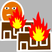
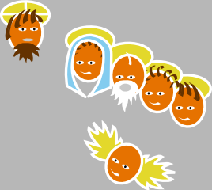

[(in het Nederlands)](/page/gods-scheppingsplan/ "Het Scheppingsplan")

[Order a printed copy of this poster](http://www.peecho.com/print/en/24228 "Order a printed copy of this poster") or [download as PDF](https://storage.googleapis.com/geloven-leren/printerboekjes/theplanofcreation.pdf "The plan of creation")

# Holy Trinity

## The Holy Trinity is God Father, Son and Holy Spirit

The Christian doctrine of the Trinity defines God as three divine persons or hypostases: the Father, the Son (Jesus Christ), and the Holy Spirit; "one God in three persons". The three persons are distinct, yet are one "substance, essence or nature". A nature is what one is, while a person is who one is. The Trinity is considered to be a mystery of Christian faith.

# The Old Testament

## The creation of heaven and earth

The Genesis creation narrative is the creation myth of both Judaism and Christianity. It is made up of two parts, roughly equivalent to the first two chapters of the Book of Genesis. In the first part, Genesis 1:1 through Genesis 2:3, Elohim, the generic Hebrew word for God, creates the world in six days, then rests on, blesses and sanctifies the seventh day. God creates by spoken command ("Let there be..."), suggesting a comparison with a king, who has only to speak for things to happen, and names the elements of the cosmos as he creates them

## Adam and Eve, the first men

Adam and Eve, according to the creation myth of the Abrahamic religions, were the first man and woman. In the Book of Genesis, chapters one through five, there are two creation narratives with two distinct perspectives on woman. In the first, Adam and Eve were created together in God's image and jointly given instructions to multiply and to be stewards over everything else that God had made. In the far more detailed second narrative, God fashions Adam from dust and places him in the Garden of Eden where he is to have dominion over the plants and animals.

## The original sin commited by Adam and Eve

Original sin, also called ancestral sin, is, according to a Christian theological doctrine, humanity's state of sin resulting from the fall of man, stemming from Adam's rebellion in Eden. This condition has been characterized in many ways, ranging from something as insignificant as a slight deficiency, or a tendency toward sin yet without collective guilt, referred to as a "sin nature", to something as drastic as total depravity or automatic guilt of all humans through collective guilt.

## Noach's flood

The Genesis flood narrative is a flood myth in the Hebrew Bible, comprising chapters 6-9 in the Book of Genesis. The narrative indicates that the God of Israel intended to return the universe to its pre-Creation state of watery chaos and then remake it using the microcosm of Noah's ark. Thus, the flood was no ordinary overflow but a reversal of creation. The narrative discusses the evil of humanity that moved God to destroy their universe by way of the flood, the preparation of the ark for certain animals, and for Noah and his family, and God's guarantee for the continued existence of life under the promise that he would never send another flood.

## Noah

Noah was the tenth of the pre-Flood Patriarchs. In his five hundredth year Noah had three sons, Shem, Ham and Japheth. In his six hundredth year God, saddened at the wickedness of mankind, sent a great deluge to destroy all life, but because Noah was "righteous in his generation" God instructed him to build an ark and save a remnant of life. After the Flood, Noah offered a sacrifice to God, who promises never again to destroy all life on Earth by flood and creates the rainbow as the sign of this "everlasting covenant between God and every living creature of all flesh that is on the earth", also known as the Noahic covenant.

## The destruction of the cities of Sodom and Gomorrah

Sodom and Gomorrah were cities mentioned in the Book of Genesis and throughout the Hebrew Bible, the New Testament and Deuterocanonical sources. Divine judgment by Yahweh was passed upon Sodom and Gomorrah along with two other neighboring cities that were completely consumed by fire and brimstone.

## Abraham

Abraham is the founding father of the Israelites, with a prominent role in Judaism, Christianity and Islam. The story of Abraham is told in chapters 11:26-25:18 of the book of Genesis.It is essentially the history of the establishment of the covenant between Abraham and God: God calls Abraham to leave his land, family and household in Mesopotamia in return for a new land, family and inheritance in Canaan, the promised land

## Moses

According to the Book of Exodus, Moses was born in a time when his people, the Children of Israel, were increasing in numbers and the Egyptian Pharaoh was worried that they might help Egypt's enemies. Moses' Hebrew mother, Jochebed, hid him when the Pharaoh ordered all newborn Hebrew boys to be killed, and the child was adopted as a foundling by the Egyptian royal family. After killing an Egyptian slavemaster, Moses fled across the Red Sea to Midian, where he encountered the God of Israel in the form of a "burning bush". God sent Moses back to Egypt to request the release of the Israelites. After the Ten Plagues, Moses led the Exodus of the Israelites out of Egypt and across the Red Sea, after which they based themselves at Mount Sinai, where Moses received the Ten Commandments. After 40 years of wandering in the desert, Moses died within sight of the Promised Land.

# The New Testament

## The Virgin Mary

The New Testament begins its account of Mary's life with the Annunciation, when the angel Gabriel appeared to her and announced her divine selection to be the mother of Jesus. Church tradition and the Gospel of James AD 145 state that her parents were an elderly couple, Saint Joachim and Saint Anne. The Bible records Mary's role in key events of the life of Jesus from his conception to his Ascension. Apocryphal writings tell of her subsequent death and bodily assumption into heaven. Christians of the Catholic Church, the Eastern Orthodox Church, Oriental Orthodox Church, Anglican Communion, and Lutheran churches believe that Mary, as mother of Jesus, is the Mother of God and the Theotokos, literally "Bearer of God". Mary has been venerated since Early Christianity. Throughout the ages she has been a favorite subject in Christian art, music, and literature.

## The Nativity of Jesus

The Nativity of Jesus, also The Nativity, refers to the accounts of the birth of Jesus, primarily based on the two accounts in the gospels of Luke and Matthew, and secondarily on some apocryphal texts. The word is anglicized from Latin De nativitate Iesu, a section title in the Vulgate. The canonical gospels of Luke and Matthew describe Jesus being born in Bethlehem, in Judea, to a virgin mother. Luke features the Christmas story, in which Joseph and Mary, as part of a census, travel to Bethlehem, where Jesus is born and laid in a manger. Angels proclaim him a savior for all people, and shepherds come to adore him. In Matthew, wise men follow a star to Bethlehem to bring gifts to Jesus, born the King of the Jews. King Herod massacres all the toddler boys in Bethlehem to kill Jesus, but the family flees to Egypt and later settles in Nazareth.

## Jesus Christ

Most Christians believe that Jesus was conceived by the Holy Spirit, born of a virgin, performed miracles, founded the Church, died sacrificially by crucifixion to achieve atonement, rose from the dead, and ascended into heaven, from which he will return. The majority of Christians worship Jesus as the incarnation of God the Son, who is the Second Person of the Holy Trinity.

# The Sacraments

## Baptism

Baptism is a Christian rite of admission (or adoption), almost invariably with the use of water, into the Christian Church generally and also a particular church tradition. Baptism has been called a sacrament and an ordinance of Jesus Christ.

## Confirmation

Confirmation is a rite of initiation in Christian churches, normally carried out through anointing, the laying on of hands, and prayer, for the purpose of bestowing the Gift of the Holy Spirit. In Christianity, confirmation is seen as the sealing of the covenant made in Holy Baptism. Confirmation "renders the bond with the Church more perfect", because a baptized person is already a full member.Roman Catholics, Eastern Orthodox, Oriental Orthodox Churches, and many Anglicans view Confirmation as a sacrament. In the East it is conferred immediately after baptism. In the West, this practice is followed when adults are baptized, but in the case of infants not in danger of death it is administered, ordinarily by a bishop, only when the child reaches the age of reason or early adolescence. Among those Catholics who practice teen-aged confirmation, the practice may be perceived, secondarily, as a "coming of age" rite.

## Eucharist

The Eucharist, also called Holy Communion, the Sacrament of the Altar, the Blessed Sacrament, the Lord's Supper, and other names, is a Christian sacrament or ordinance. It is reenacted in accordance with Jesus' instruction at the Last Supper, as recorded in several books of the New Testament, that his followers do in remembrance of Him as when he gave his disciples bread, saying, "This is my body", and gave them wine saying, "This is my blood." Roman Catholicism, Eastern Orthodoxy, Oriental Orthodoxy, and the Church of the East teach that the reality (the "substance") of the elements of bread and wine is wholly changed into the body and blood of Jesus Christ, while the appearances (the "species") remain. Transubstantiation is the term used by Roman Catholics to denote what is changed, not to explain how the transformation occurs, since the Catholic Church teaches that "the signs of bread and wine become, in a way surpassing understanding, the Body and Blood of Christ".

## Confession

In Catholic teaching, the Sacrament of Penance is the method of the Church by which individual men and women may confess sins committed after baptism and have them absolved by a priest. Although it is not mandatory, the Catholic rite is usually conducted within a confessional box, booth or reconciliation room. This sacrament is known by many names, including penance, reconciliation and confession. While official Church publications always refer to the sacrament as "Penance", "Reconciliation" or "Penance and Reconciliation", many laypeople continue to use the term "Confession" in reference to the Sacrament. For the Catholic Church, the intent of this sacrament is to provide healing for the soul as well as to regain the grace of God, lost by sin. It is the only ordinary way to receive the forgiveness of God for serious (mortal) sins which if unforgiven condemn a person to Hell. The Church teaches that Catholic priests have been given the authority by God to exercise the forgiveness of sins here on earth and it is in God's Name by which the person confessing is forgiven. In theological terms, the priest acts in persona Christi and receives from the Church the power of jurisdiction over the penitent.

## )Matrimony

Marriage in the Catholic Church, also called matrimony, is a "covenant by which a man and a woman establish between themselves a partnership of the whole of life and which is ordered by its nature to the good of the spouses and the procreation and education of offspring. It has been raised by Christ the Lord to the dignity of a sacrament between the baptised." In the Roman Rite, it is ordinarily celebrated in a Nuptial Mass. Marriage is recognized in the New Testament scriptures, in the words of Jesus and of Saint Paul regarding the sacred and divine state of marriage. Jesus forbade divorce and stated that in the state of marriage "the two become one flesh". Saint Paul wrote one of the most often quoted descriptions of the proper behavior of spouses in the ideal sacramental marriage in the New Testament book of Ephesians, Chapter 5, referencing the words of Jesus. Many theologians and early Church fathers have observed that the first recorded miracle of Jesus is at a wedding feast, thus, many believe, signifying his approval of the institution of marriage as well as his recognition of the importance of the public celebration of a wedding.

## Holy Orders

The term Holy Orders is used by many Christian churches to refer to ordination or to those individuals ordained for a special role or ministry. In the Roman Catholic (Latin: sacri ordines) churche Holy Orders comprise the three orders of bishop, priest and deacon, or the sacrament or rite by which candidates are ordained to those orders. The churche regards ordination as a sacrament (the sacramentum ordinis). The ministerial orders of the Catholic Church include the orders of bishops, deacons and presbyters, which in Latin is sacerdos. The ordained priesthood and common priesthood (or priesthood of the all the baptized) are different in function and essence.

## )The Anointment of the sick

Anointing of the Sick is a sacrament of the Catholic Church that is administered to a Catholic "who, having reached the age of reason, begins to be in danger due to sickness or old age", except in the case of those who "persevere obstinately in manifest grave sin". Proximate danger of death, the occasion for the administration of Viaticum, is not required, but only the onset of a medical condition considered to be a possible prelude to death. The sacrament is also referred to as Unction, and in the past as Extreme Unction, and it is one of the three sacraments that constitute the Last Rites (together with the Sacrament of Penance and Viaticum). The sacrament is administered by a priest, who uses olive oil or another pure plant oil to anoint the patient's forehead and perhaps other parts of the body while reciting certain prayers. It is believed to give comfort, peace, courage and, if the sick person is unable to make a confession, even forgiveness of sins.

# Heaven, hell and purgatory

## )Heaven

Traditionally, Christianity has taught Heaven as a place of eternal life and the dwelling place of Angels and the Throne of God. In most Christian denominations, belief in the afterlife is professed in the major creeds, such as the Nicene Creed, which states: "We look for the resurrection of the dead, and the life of the world to come." In the Christian Bible, concepts about the future "Kingdom of Heaven" are also professed in several scriptural prophecies of the new (or renewed) Earth said to follow the resurrection of the dead—particularly the books of Isaiah and Revelation and other sources of Christian eschatology. The resurrected Jesus is said to have ascended to heaven where he now sits at the Right Hand of God and will return to earth in the Second Coming. Mary, his mother, according to Catholic (Christianity's largest denomination) tradition is also said to have been assumed into heaven and is titled the Queen of Heaven.

## Hell

Christian views on hell generally hold it to be place or a state in which the souls of the damned suffer the consequences of their sins. Hell is generally defined as the eternal fate of unrepentant sinners after this life. Hell's character is inferred from biblical teaching, which has often been understood literally. Souls are said to pass into hell by God's irrevocable judgment, either immediately after death (particular judgment) or in the general judgment. Modern theologians generally describe hell as the logical consequence of the soul using its free will to reject union with God. It is considered compatible with God's justice and mercy because God will not interfere with the soul's free choice.

## Purgatory

Purgatory is, according to Roman Catholic teaching, the state or place of purification or temporary punishment by which those who die in a state of grace are believed to be made ready for the Beatific Vision in Heaven. Only one who dies in a state of grace can be in Purgatory, and therefore no one who is in Purgatory will remain there forever or go to Hell. This theological notion has ancient roots and is well-attested in early Christian literature, but the poetic conception of Purgatory as a geographically existing place is largely the creation of medieval Christian piety and imagination.
