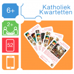
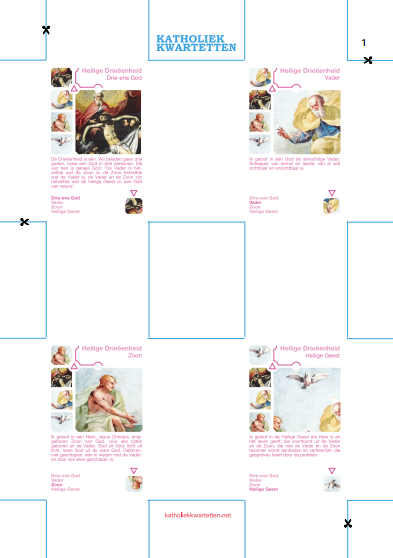
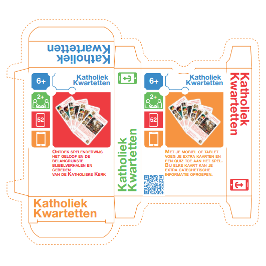
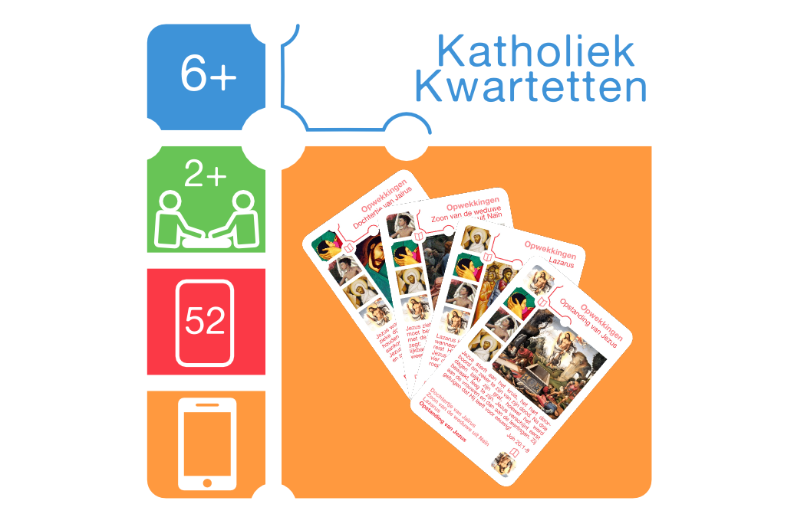

Katholiek Kwartetten is een **klassiek kwartetspel** met als thema het katholieke geloof. Het spel is gekoppeld aan een [**website**](http://kwartet.gelovenleren.net/ "Katholiek Kwartetten") via een unieke QR-code op de rugzijde van elke kaart. De website bevat **catechetisch materiaal** om het onderwerp van de kaart te verdiepen. Bovendien kan je op de website de [**online spelvariant**](/blog/katholiek-kwartetten-met-online-kwis "Kwatholiek Kwartetten met online kwis") activeren om God in je spel te betrekken!

### Het kwartetspel zelf afdrukken

Het kwartetspel kan je zelf afdrukken. Download de nodige PDF-bestanden en volg de instructies die hieronder worden opgelijst.

<table class=""><tbody><tr><td><figure></figure></td><td><a href="https://storage.googleapis.com/geloven-leren/kwartet/kwartet-om-zelf-af-te-drukken.pdf" target="_blank" rel="noreferrer noopener" aria-label=" (opent in een nieuwe tab)">KATHOLIEK KWARTETTEN - DUBBELZIJDIG</a> Download deze PDF als je de kaarten met rugzijde wil afdrukken.&nbsp;Een bedrukte rugzijde heb je nodig als je de online spelvariant wil spelen.</td></tr><tr><td><figure></figure></td><td><a href="https://storage.googleapis.com/geloven-leren/kwartet/kwartet-om-zelf-af-te-drukken-enkelzijdig.pdf" target="_blank" rel="noreferrer noopener" aria-label=" (opent in een nieuwe tab)">KATHOLIEK KWARTETTEN - ENKEL SPEELZIJDE</a> Download deze PDF als je de rugzijde van de kaarten blanco houdt.</td></tr><tr><td><figure></figure></td><td><a href="https://storage.googleapis.com/geloven-leren/kwartet/katholiek-kwartetten-doosje.pdf" target="_blank" rel="noreferrer noopener" aria-label=" (opent in een nieuwe tab)">KATHOLIEK KWARTETTEN - DOOSJE</a> Download deze PDF als je in een creatieve bui bent en ook een doosje wil voor je kaarten.</td></tr></tbody></table>

Gebruik deze tips om de beste kwaliteit te bekomen:

1. Druk af op A4 en laat je afdruk van de PDF **NIET aanpassen aan de pagina**. Anders wordt het formaat van de afdruk verkleind en vallen speel- en rugzijde niet mooi samen. Het zal zowiezo van je printer afhangen of die voor- en achterzijde mooi uitlijnt.
2. Ga na of je printer toelaat om **op dikker papier af te drukken**. Echte speelkaarten gebruiken karton met een gewicht van 250 tot 320 gr/m2. De kans is echter klein dat je printer dat slikt, laat staan dat je dit tweezijdig kan afdrukken.
3. Een alternatief is de kaarten samen te stellen door **voor- en rugzijde enkelzijdig af te drukken** op lichter karton (bv. 125 gr/m2) en op mekaar te lijmen. Dat is trouwens de traditionele methode om speelkaarten te produceren, met nog een zwarte tussenlaag om te voorkomen dat de belettering doorschijnt, maar dat laatste is voor ons kwartet niet echt nodig :)
4. Om twee stukken karton te **verlijmen** stel ik voor dat je je lokale leverancier van materiaal voor hobby of kunstambacht om hulp vraagt om een goeie spuitbuslijm aan te raden. Voor nauwkeurige verlijming van voor- en rugzijde kan je op een lichtbak werken. Een andere truuk is om de hulplijnen even in te snijden aan de rand van het blad en vervolgens de twee bladen uit te lijnen op basis van deze insnijdingen. Zorg dat de juiste rugzijde op de juiste speelzijde terechtkomt, anders zal de QR-code niet juist zijn. Om daarbij te helpen, is elke set van vier kaarten voorzien van een nummer dat je vindt op speel- zowel als rugzijde.
5. Het geheim van een kaartspel is een goede **coating**. Die zorgt voor een bescherming tegen vocht en vuil en maakt de kaarten "handelbaar", dat wil zeggen dat door de coating de kaarten gemakkelijk over mekaar schuiven om ze te kunnen delen en in de hand te houden. Vraag je hobbyleverancier weer om advies, want kaartenfabrieken houden de formule voor hun coating graag geheim. Of ga zelf wat experimenten met spuitbusvernis, haarlak, bijenwas en gelijkaardige huis-, tuin- en keukenproducten, maar hou het veilig!
6. **Versnijden** doe je met met papiersnijder of gewoon met je alledaags breekmesje. Als je de hulplijnen gebruikt, en als de verlijming in stap 3 gelukt is, kan er niet veel misgaan met deze stap.
7. Om **ronde hoeken** te maken, kan je op zoek gaan naar een speciale tang. Speelkaarten worden afgerond met een straal van 5 mm. Anders moet het met de schaar en een dosis _fingerspitzengefühl_ ook wel lukken.

### Het kwartetspel online bestellen

Is het bovenstaande je allemaal teveel, kan je  kwartetspel kan je ook online bestellen bij [DriveThruCards.com](http://www.drivethrucards.com/product/146547/Katholiek-Kwartetten "Katholiek Kwartetten"). Dat is een leverancier van print-on-demand-artikelen die zich specialiseert in kaartspelen. Spijtig genoeg is dit een niche-markt en moeten de kaarten geleverd worden vanuit de VS, waardoor je al snel moet rekenen op bijna 10 euro verzendkosten. Deze optie wordt wel interessant als je meerdere exemplaren nodig hebt. Vraag dus eens na bij je lokale catechesegroep of je geen groepsaankoop kan organiseren! Als je bijvoorbeeld 7 exemplaren bestelt en dan uitrekent wat je betaalt inclusief verzendkosten, kom je op 7 euro per kwartetspel, en dat is de prijs die je ook voor een gemiddeld "Dinosaurussenkwartet" in de speelgoedwinkel neertelt.

<table class=""><tbody><tr><td><figure></figure></td><td><a href="http://www.drivethrucards.com/product/146547/Katholiek-Kwartetten" target="_blank" rel="noopener noreferrer">KATHOLIEK KWARTETTEN</a> Bestel een of meer kwartetten bij de online winkel van DriveThruCards.</td></tr></tbody></table>

_Dit is een non-profit-project en de prijzen van het afgedrukt materiaal dekken enkel de kostprijs van de print-on-demand-leverancier._
