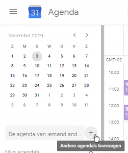
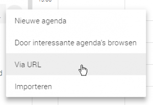
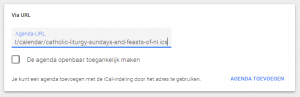
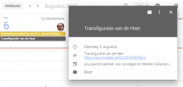

Met de koppelingen op deze pagina, kan je aan je electronische agenda de liturgische kalender toevoegen. De kalender is ingevuld tot 2030.

<!--more-->

Je kan kiezen tussen de gewone vorm van de liturgie of de buitengewone vorm (tridentijse ritus).

Je kan ook kiezen of je alleen de zondagen en feestdagen wil, of ook de weekdagen.

## Zondagen en feesten (Latijnse ritus)

URL: `https://www.missale.net/calendar/catholic-liturgy-sundays-and-feasts-of-nl.ics`

<a href="webcal://www.missale.net/calendar/catholic-liturgy-sundays-and-feasts-of-nl.ics">Voeg catholic-liturgy-sundays-and-feasts-of-nl.ics toe aan je agenda</a>

<a href="https://www.missale.net/calendar/catholic-liturgy-sundays-and-feasts-of-nl.ics">Download catholic-liturgy-sundays-and-feasts-of-nl.ics</a>

<iframe id="open-web-calendar" 
    src="https://calendar.google.com/calendar/embed?src=pckkfq5q6lv4glooftqjl2ruo3rs455i%40import.calendar.google.com&ctz=Europe%2FBrussels"
    sandbox="allow-scripts allow-same-origin allow-popups"
    allowTransparency="true" scrolling="no" 
    frameborder="0" height="600px" width="100%"></iframe>

## Weekdagen (Latijnse ritus)

URL: `https://www.missale.net/calendar/catholic-liturgy-weekdays-of-nl.ics`

<a href="webcal://www.missale.net/calendar/catholic-liturgy-weekdays-of-nl.ics">Voeg catholic-liturgy-weekdays-of-nl.ics toe aan je agenda</a>

<a href="https://www.missale.net/calendar/catholic-liturgy-weekdays-of-nl.ics">Download catholic-liturgy-weekdays-of-nl.ics</a>

<iframe id="open-web-calendar" 
    src="https://calendar.google.com/calendar/embed?src=4jdild8efoa6flo10vendgoianskv3al%40import.calendar.google.com&ctz=Europe%2FBrussels"
    sandbox="allow-scripts allow-same-origin allow-popups"
    allowTransparency="true" scrolling="no" 
    frameborder="0" height="600px" width="100%"></iframe>

## Zondagen en feesten (Tridentijse mis)

URL: `https://www.missale.net/calendar/catholic-liturgy-sundays-and-feasts-eo-nl.ics`

<a href="webcal://www.missale.net/calendar/catholic-liturgy-sundays-and-feasts-eo-nl.ics">Voeg catholic-liturgy-sundays-and-feasts-eo-nl.ics toe aan je agenda</a>

<a href="https://www.missale.net/calendar/catholic-liturgy-sundays-and-feasts-eo-nl.ics">Download catholic-liturgy-sundays-and-feasts-eo-nl.ics</a>

<iframe id="open-web-calendar" 
    src="https://calendar.google.com/calendar/embed?src=7uikt9h67trm58g6g9kvoi8h8dnchb2k%40import.calendar.google.com&ctz=Europe%2FBrussels"
    sandbox="allow-scripts allow-same-origin allow-popups"
    allowTransparency="true" scrolling="no" 
    frameborder="0" height="600px" width="100%"></iframe>

## Weekdagen (Tridentijnse mis)

URL: `https://www.missale.net/calendar/catholic-liturgy-weekdays-eo-nl.ics`

<a href="webcal://www.missale.net/calendar/catholic-liturgy-weekdays-eo-nl.ics">Voeg catholic-liturgy-weekdays-eo-nl.ics toe aan je agenda</a>

<a href="https://www.missale.net/calendar/catholic-liturgy-weekdays-eo-nl.ics">Download catholic-liturgy-weekdays-eo-nl.ics</a>

<iframe id="open-web-calendar" 
    src="https://calendar.google.com/calendar/embed?src=qmms7u8658io97moj78gtdjn5v01b39m%40import.calendar.google.com&ctz=Europe%2FBrussels"
    sandbox="allow-scripts allow-same-origin allow-popups"
    allowTransparency="true" scrolling="no" 
    frameborder="0" height="600px" width="100%"></iframe>

## Installatie

Agenda-toepassingen zitten standaard op elke _smartphone_. Je kan ook een online app installeren, zoals _Google Calendar_. Een kalender kan je op twee manieren opladen:

- ofwel door de URL (https:// . . .) te kopieren en je in je agendatoepassing daarop te abonneren,
- ofwel door het ICS of ICAL-bestand binnen te halen en te importeren in je agenda.

De eerste optie is de beste, dan wordt de kalender automatisch up-to-date gehouden. In Google Calendar doe je dat als volgt:

De agenda van iemand anders toevoegen

Via URL

Plak de URL in het tekstvak

De kalender is nu zichtbaar in jouw agenda

## Vertalingen

Ook beschikbaar in het [Engels](/page/liturgical-calendars/).
