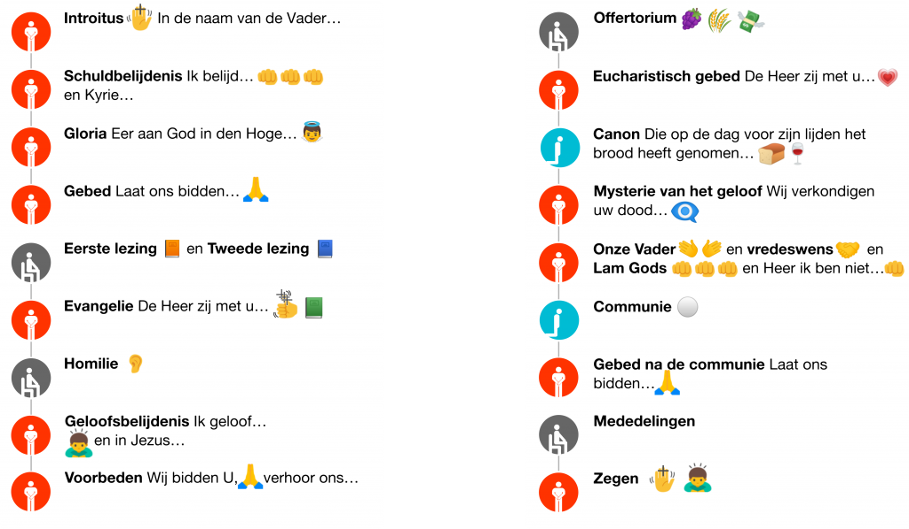

Hoe zit het precies met die liturgische gebedshoudingen? Ik vermoed niet dat die nog worden uitgelegd in catechese of godsdiensles, dus is het voor de meeste gelovigen iets wat ze zelf moeten ontdekken. 

<!--more-->

Het kan best verwarrend zijn om in Vlaanderen in verschillende parochies naar de mis te gaan als het erop aankomt de juiste gebedshouding aan te nemen tijdens de verschillende delen van de mis. In veel parochies zijn er gewoontes ontstaan die afwijken van wat er in het missaal wordt voorgeschreven, niet alleen afwijkingen van de teksten, maar ook van de voorgeschreven gebedshoudingen. Veel heeft, denk ik, te maken met de opgang van de horizontalistische geloofsvisie. Gelijkheid is het grote ideaal dat in de jaren zestig komaf heeft gemaakt met de standenmaatschappij waarin het gewoonte was dat men met voorgeschreven eerbied een meerdere tegemoettrad. Mensen zijn gelijk en het is niet omdat de één toevallig koning, bisschop of directeur is dat de ander moet knielen of rechtstaan om hem te begroeten. En Jezus wordt in dat verhaal meegsleurd omdat hij per slot van rekening ook maar een mens was. Geloof, dat zit vanbinnen en hoeft geen uiterlijk vertoon. Tot zover mijn beknopte analyse van de reden waarom er in de Vlaamse kerken nog nauwelijk geknield of rechtgestaan wordt. En toch…

Toch lijkt het me zinvol om juist in het geloof vast te houden aan die uiterlijke tekenen van eerbied in de omgang met God. God, die heeft geen eigen gestalte zoals elke mens die heeft, dus dat maakt het net iets lastiger om Hem te ontmoeten. Gelovigen kunnen God gestalte geven door in hun dagelijks leven hun naaste te beminnen, maar zelfs dat blijft, hoewel het noodzakelijk is, tamelijk abstract. God krijgt echter concreet gestalte in de liturgie, en om ons te helpen, schrijft de kerk voor dat we Gods gestalte in de liturgie beantwoorden met een expressieve gebedshouding. Dat is gewoon een hulp om God te (h)erkennen in ons gebed zodat het niet gewoon iets tussen mensen onderling wordt. Een hulp om het [sacrale](http://fr.didoc.be/nl/papers/23-de-zin-van-het-sacrale-terugvinden) in de liturgie te brengen.

Een goed missaal beschrijft de gebedshoudingen, maar wie beschikt er vandaag nog over een missaal? Je kan te rade gaan op internet, maar de proef op de som genomen levert dat slechts fragmentarische informatie op:

- [_Me__neer, waarom knielt u?_](https://meneergodsdienst.wordpress.com/2013/04/18/meneer-waarom-knielt-u/) leert dat gelovigen knielen wanneer ze in de kerk voor het tabernakel staan of erlangs passeren (dus ook buiten de liturgie)
- Een antwoord op een vraag op de Thomaswebsite over [_Gebaren en lichaamstaal_](http://www.kuleuven.be/thomas/page/vraag-antwoord/view/63825/) in de eucharistie geeft een overzicht van de verschillende gebedshoudingen
- [_Eucharistisch gebed_](http://nl.wikipedia.org/wiki/Eucharistisch_gebed) op wikipedia leert dat gelovigen rechtstaan bij het begin van het eucharistisch gebed (de priester zegt: "Verheft uw hart" --- hee, dat was niet zo moeilijk!) en knielen na het sanctus (niet helemaal juist)
- [_Knielen_](http://nl.wikipedia.org/wiki/Knielen) op wikipedia leert dat gelovigen (soms) knielen tijdens de consecratie, voor het ontvangen de communie en tijdens het persoonlijk gebed na de communie
- [_Om te groeien in de kunst van het vieren_](http://www.gebedsschool.be/Leonard/eucharistie2.html), een reeks bijdragen van mgr. Léonard in het tijdschrijft Pastoralia, leert onder het kopje "Liturgische opstelling" wat het is om 'actief' deel te nemen aan de liturgie

Echt veel om op terug te vallen is dat niet, toch? Daarom deze poging om het een beetje overzichtelijk te maken:

**Regel 1**: we staan recht bij de intrede.

**Regel 2**: we staan recht om deel te nemen aan het gebed. Dat wil dus zeggen dat we rechtstaan telkens als de priester zegt "Laat ons bidden", en ook tijdens de schuldbelijdenis, tijdens het gloria, tijdens de geloofsbelijdenis, tijdens de voorbeden, tijdens het eucharistisch gebed (behalve tijdens de consecratie, zie verderop) en tijdens het onze-vader.

**Regel 3**: we staan recht voor het evangelie.

**Regel 4**: we staan recht om de zegen te ontvangen. Dat is helemaal aan het einde van de mis.

**Regel 5**: we knielen om Christus' aanwezigheid op het altaar te eren. Dat is dus van voor het begin van de consecratie, minstens tot voor de verkondiging van het mysterie van het geloof.

Knielende gelovigen tijdens de heilige Mis

Wanneer kunnen we dan nog gaan zitten? Niet veel meer :) Zitten kan je tijdens de lezingen en tijdens de homilie en wanneer er verder nog liederen worden gezongen of teksten gelezen die niet worden ingeleid met een "Laat ons bidden".

Of nog eens netjes volgens het verloop van de mis:

- Introitus "In de naam van de Vader…" **\[staan en kruisteken maken\]**
- Schuldbelijdenis "Ik belijd voor de almachtige God…" en "Heer, ontferm U over ons…" **\[staan en driemaal op de borst kloppen\]**
- Gloria "Eer aan God in den Hoge…" **\[staan, ga samen met de celebrant zitten als het koor het gregoriaans of een orchestraal gloria vertolkt\]**
- Gebed "Laat ons bidden…" **\[staan\]**
- Eerste lezing **\[zitten\]**
- Tweede lezing **\[zitten\]**
- Evangelie "De Heer zij met u…" **\[staan en drie kruisjes maken\]**
- Homilie **\[zitten\]**
- Geloofsbelijdenis "Ik geloof in God…" **\[staan en buigen bij _Hij heeft het vlees aangenomen_ in de 'lange' geloofsbelijdenis of bij _En in Jezus Christus zijn enige zoon_ in de 'korte' geloofsbelijdenis, ga samen met de celebrant zitten als het koor het gregoriaans of een orchestraal credo vertolkt\]**
- Voorbeden "Wij bidden U, verhoor ons…" **\[staan\]**
- Offertorium **\[zitten\]**
- Eucharistisch gebed "De Heer zij met u…" **\[staan\]**
- Canon "Die op de dag voor zijn lijden het brood heeft genomen…" **\[knielen; merk op dat het hoofd buigen mag, maar vergeet niet dat de priester de hostie en de kelk opheft om in aanbidding het lichaam en bloed van onze Heer te aanschouwen!\]**
- Vervolg van het eucharistisch gebed vanaf het mysterie van het geloof "Heer Jezus, wij verkondigen uw dood…" **\[staan\]**
- Onze Vader **\[staan\]**
- Vredeswens **\[staan en met mate rondlopen voor de vredeswens\]**
- Lam Gods **\[staan, eventueel nadien terug knielen\]**
- Communie **\[naar voor treden en vóór het ontvangen van de communie knielen, buigen of een kruisteken maken\]**
- Gebed na de communie "Laat ons bidden" **\[staan\]**
- Mededelingen **\[zitten\]**
- Zegen **\[buigen\]**

Een hele boterham, maar eigenlijk is het allemaal redelijk logisch al je de gebaren in verband brengt met wat er werkelijk gebeurt.

Of voorgesteld als een infografiek:

Gebedshouding in de mis

Waarom ik dit hier publiceer? Eigenlijk vooral omdat de informatie dan toch ergens toegankelijk is. Niet in de verwachting dat iedereen die het leest het volgende zondag in zijn eigen parochie 'volgens het boekje' gaat doen. Ook in de kerk geldt immers de regel:  _when in Rome, do as the Romans do_, of bij uitbreiding: _when in Flanders, don't do as the Romans do_… Maar wat je wel kan doen zonder iedereen aanstoot te geven door onverwachts te gaan rechtstaan en knielen, is deze houdingen geestelijk aannemen.

De infografiek kan worden gedownload in verschillende formaten:

[SVG](https://storage.googleapis.com/geloven-leren/printerboekjes/houdingen-in-de-mis2.zip) (bronbestand om wijzigingen aan te brengen, gezipt)

[PDF](https://storage.googleapis.com/geloven-leren/printerboekjes/houdingen-in-de-mis2.pdf) (ideaal om af te drukken)

[PNG](images/houdingen-in-de-mis2-HR.png) (hoge resolutie bitmap)
