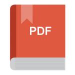
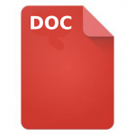

Nederlandstalige katholieke bijbelvertaling, uitgave 1939

<!--more-->

 EPUB

 Google Play Books

 Amazon

* * *

De Heilige Schrift, vertaling uit de grondtekst in opdracht van de Apologetische Vereniging 'Petrus Canisius' ondernomen met goedkeuring van de hoogwaardige bisschoppen van Nederland

Oorspronkelijke uitgave 1939

Lees [meer over deze publicatie op de blog](/blog/bijbelvertaling-petrus-canisius-studiebijbel-gratis-downloaden/).
