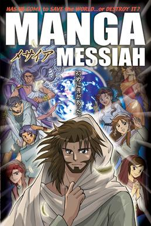

We hebben thuis bijbels in alle soorten en maten, maar onlangs heb ik een bijzonder exemplaar toegevoegd, dat ik op internet op de kop tikte: de [Manga Messiah](http://en.wikipedia.org/wiki/Manga_Bible_%28series%29). Het is een stripverhaal in de bekende Japanse cartoonstijl dat het ganse Evangelie verhaalt.

Als ik er de eerste keer in las, sprongen me herhaalde malen de tranen in de ogen van ontroering. De verhalen zijn me natuurlijk bekend, maar de  de emotionaliteit van de karakters wordt zo treffend weergegeven dat je werkelijk meemaakt hoe de openbaring zich aan Jezus' leerlingen en landgenoten moeten hebben voltrokken, wanneer ze stap voor stap te weten kwamen wie Hij werkelijk was.

Ik heb geen hoog petje van de zogenaamd 'historisch-kritische' bijbellezing, want die schept alleen maar meer [afstand](http://www.meerdanikzelf.nl/2011/03/woorden-veranderen-over-bijbellezen-1/comment-page-1/#comment-52) tussen het verhaal en de lezer. Dat soort bijbellezing gaat niet zelden gepaard met de vaststelling (of zelfs: het uitgangspunt) dat de verhaalde feiten geromantiseerd zijn. Het laat me koud: ik voel meer voor een ander soort van 'historisch-belevende' bijbellezing, waarbij de manier waarop de gebeurtenissen zijn verhaald, in het perspectief wordt gesteld van de verbazing waarmee de vertellers deelgenoot worden aan Christus' openbaring. Een verbazing die zo groot is dat de vertellers met de nodige terughoudendheid de wondere gebeurtenissen voortvertellen of op schrift stellen. Deze lezing leidt tot een heel andere vaststelling: dat het nuchtere en veelal afstandelijke relaas van de evangelies slechts een flauw afkooksel moet zijn van de werkelijke feiten en hun impact.

Zelfs de evangelisten waren immers nog niet in staat alles wat er was gebeurd te bevatten en de betekenis ervan in te schatten. Het is pas in de Traditie dat -op basis van de bijbel- de waarheid van het geloof naar boven is gehaald en in de Kerk als leer verspreid. Die leer en traditie is een belangrijke sterkte van het katholieke geloof! Telkens als ik lui hoor argumenteren 'dat we terug moeten gaan naar de geloofsbeleving van de eerste christenen', omdat die veel zuiverder zou zijn, bedenk ik bij mezelf dat die eerste christenen nog niet de helft wisten van wat wij nu weten en prijs ik me gelukkig te kunnen bogen op twee millennia geloofsverdieping.

Maar de leer en traditie heeft ook zijn minpunten. Omdat de geloofswaarheden ons voorgeschoteld worden als gesneden koek, is het moeilijker geworden om de bijbel te lezen op een onbevangen manier. En dan bedoel ik niet op een 'kritische' manier, maar wel op een 'belevende' manier. Daarom is Manga Messiah absoluut een aanrader, voor klein en groot!
