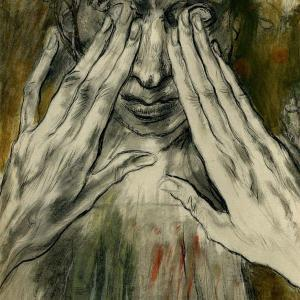

Vandaag leerde ik weer iets bij tijdens het voorlezen aan de kinderen. In het bijbelverhaal uit het lectionarium geneest Jezus een man die blind was vanaf zijn geboorte door zijn ogen met slijk in te smeren. Ik heb nooit begrepen wat dat slijk erbij kwam doen. Bij andere genezingen kwamen er toch geen hulpmiddelen aan te pas? Wat is er dan bijzonder aan dit verhaal?

 Legrand Edy La Bible- Nouvelle traduction de François Amiot et Robert Tamisier Illustrée par Edy Legrand \_ Club bibliophile de France et club du livre -1950

Het is om te beginnen een lang verhaal. De pastoor suggereerde zelfs dat we tijdens de lezing mochten gaan zitten, als het te vermoeiend zou zijn recht te blijven staan. De genezing is niet zozeer de kern van het verhaal, wel de _va-et-vient_ die zich bij het huis van de farizeeën voltrekt. Zij willen van iedereen gehoord hebben wat er nu precies is gebeurd met die blinde man, maar willen niet aannemen dat Jezus een man van God is, terwijl iedereen dat juist wel beweert. Uiteindelijk zetten ze ook de man die blind was aan de deur, en wel met de beschuldiging dat hijzelf een zondaar is, omdat zijn blindheid -volgens hen- een straf van God moet zijn.

In _Ons Dagelijks Brood_, de voorleesbijbel voor de veertigdagentijd, vond ik een interessante verklaring waarom Jezus dat slijk gebruikte. Het zou een directe verwijzing zijn naar het scheppingsverhaal, waarin God aarde gebruikt om de mens te boetseren. Door de blinde met slijk te genezen, maakt Jezus duidelijk dat zijn blindheid geen straf van God is, maar een fout in het boetseerwerk. Een foutje van de natuur, zouden wij zeggen. Goed om in het achterhoofd te houden als het vraagstuk over de rol van God bij zinloos lijden weer eens op tafel komt.

En dan maakte ik me nog een fijne bedenking. Emma snapte wel dat de blinden terug zagen, maar niet waarom Jezus zei dat degenen die zagen, blind zouden worden... “Zijn die farizeeën dan blind?” Niet echt blind natuurlijk, maar ze wilden niet zien. Je kan dat vergelijken met ‘horen’ en ‘luisteren’ (een heel vatbaar voorbeeld voor kinderen :)). Als het lijkt alsof iemand je niet hoort, zijn er twee mogelijkheden: ofwel is hij doof, ofwel luistert hij niet. ‘Horen’ en ‘luisteren’ zijn twee. In de context van ‘zien’ is er zo niet meteen een analoog begrip voor ‘luisteren’. Ik kan wel een goeie kandidaat bedenken, en dat is ‘waarnemen’. ‘Waarnemen’ is voor ‘zien’ wat ‘luisteren’ is voor ‘horen’.

En zo is het inderdaad, want hoewel de farizeeën nog goed konden zien, konden ze niet waarnemen (‘voor-waar-aannemen’) wat er zich voor hun ogen had afgespeeld.
