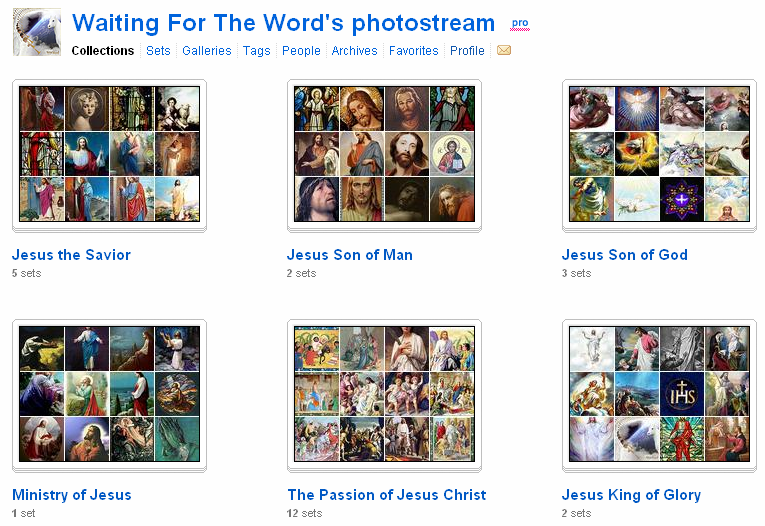
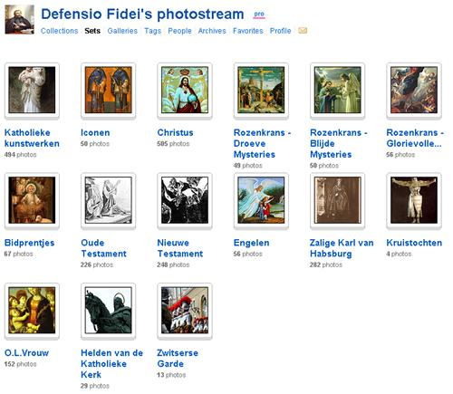
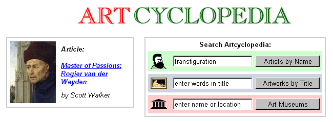
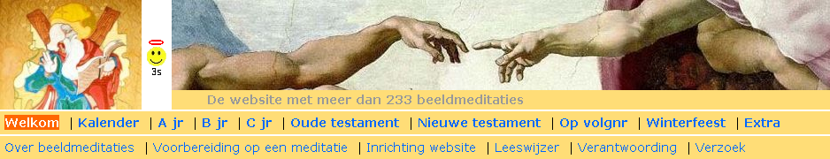

Katholiek geloof en beeltenissen zijn onafscheidelijk. Onze kinderen sparen en ruilen vandaag Pixarkaarten of Disneykaarten of Smurfenkaarten, die in de supermarkt worden uitgedeeld. Onze ouders spaarden en ruilden 'beelekes', vaak heiligenkaartjes, die ze kregen (thuis? op school? van de pastoor?) als ze flink waren geweest. Als het de geloofsopvoeding vandaag aan iets ontbreekt, dan is het beeldcultuur. Katholieke beeldcultuur strekt van Kunst tot kitch, maar inspiratie vanuit oprechte devotie doet dit onderscheid vervagen.

Enige tijd geleden stootte ik in Flickr op de _photostream_ "[Waiting for the Word](http://www.flickr.com/photos/waitingfortheword/collections/)". Wonderwel blijft deze collectie katholieke beelden steeds maar aangroeien (RSS). De beelden zijn efficiënt gecatalogeerd volgens onderwerp. Hoewel een groot deel van de prenten geen 'Kunst-met-grote-K' is, mag dit materiaal niet ontbreken in de digitale kast van elke catechist.

Waiting for the Word

\[update 20110602\] Een gelijkaardige collectie wordt opgebouwd als _offspin_ van de webstek [Defensio Fidei](http://defensiofidei.wordpress.com/):

Defensio Fidei

Liefhebbers van de grote-K-Kunst, kunnen elders terecht:

Art Cyclopedia

Beeldmeditaties

Sacred Art Meditations

Web Gallery of Art

WikiArt
