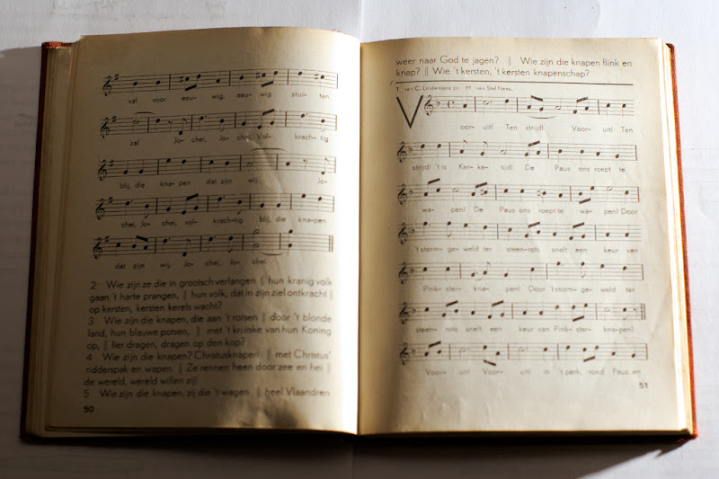

Trots bracht Toon de kaft mee van school met de liedjes die hij dit jaar van de zangjuf had geleerd. Dertig liedjes in een eerste leerjaar, is niet min. Ik heb echter niet de indruk dat de zangcultuur van mijn zoon er veel baat bij heeft gehad. De juf is vergeten dat zangcultuur slechts gedijt als je samen met anderen kan zingen en ze heeft een heel repertoire mooie liedjes bijeengezocht, die op zich heel aardig zijn en ongetwijfeld van grote muziek-pedagogische vernuftigheid getuigen, maar het grote nadeel hebben dat ze nieuw zijn. Ik kan me best voorstellen dat de muziekjuf het niet hoog opheeft met de liedjes die ze zelf op school heeft geleerd, maar dat zijn wel de liederen die de ouders en grootouders van haar leerlingen misschien ook kennen vanuit hun jeugd, de mensen dus met wie haar leerlingen het meest in contact komen. Zeker de generatie van de grootouders, die net op het randje van de rock-cultuur balanceert, is nog opgegroeid met een echte Vlaamse samenzangcultuur en zou die perfect op hun kleinkinderen kunnen overdragen, mochten ze vanuit de school enige aanknopingspunten aangereikt krijgen. Quod non.

")

En neen, dat hoeven daarom niet per se allemaal katholieke en Vlaamse strijdliederen te zijn, hoewel die geen minachting verdienen. In het kader van de her-katholicisering van het katholiek onderwijs past in de godsdiensles een ferme scheut katechese, in het schoolritme past tijd en ruimte voor gebed en bezinning, en waarom zou in de muziekles geen vroom liedjesboek passen? Zei ik liedjesboek? -sorry, juf, dat gaat natuurlijk niet, we gaan toch geen liedjesboeken uitgeven met vrome liedjes uit grootvaders tijd!

Tja, weer een gemiste kans in de onderwijssector, waar alles dwangmatig vernieuwd en veranderd wordt, ten koste van... het onderwijs.

 

Vooruit! Ten strijd! 't is Kerketijd! De Paus ons roept te wapen! Door 't stormgeweld ter steenrots snelt een keur van Pinksterknapen! Vooruit! Vooruit! In 't perk, rond Paus en Kerk! Vooruit! Vooruit! Wie volgt de Pinksterknapen?

(_Wij zingen 'n nieuw Lied,_ Caritas Studenten/KSA Oost-Vlaanderen, 1936, ex libris Cyriel Houben)
