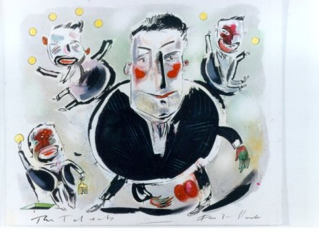
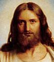

Op zoek naar een prent voor het feest van het Heilig Hart, vond ik een mooi tafereel waarop een groep mensen, “uitgeput en onder lasten gebukt”, “rust en verlichting” vinden bij Christus. Ze nestelen zich in Zijn schoot, zoals een droevig en vertroosting zoekend kind dat zou doen bij zijn ouders. De afbeelding lijkt sterk geinspireerd door de lezing van het feest van het Heilig Hart (Matteüs 11: 25-30), die aanheft met de dankzegging van Jezus “Ik dank U, Vader, Heer van hemel en aarde, omdat U dit verborgen hebt voor wijzen en verstandigen en het onthuld hebt aan eenvoudigen.” De [Statenvertaling](http://www.statenvertaling.net/bijbel/matt/11.html) gebruikt zelfs het woord ‘kinderkens’ in plaats van ‘eenvoudigen’.

Voor kinderen is dit een normale manier om troost te zoeken. Zij zijn dan ook niet zo verwonderd over deze afbeelding, zelfs al zijn het hier ‘grote mensen’ die bij Jezus komen ‘knuffelen’.

Merk trouwens op dat er zich op het tafereel ook een kind bevindt. Gek genoeg is het kind niet naar Jezus toegewend, zelfs niet schroomvol, zoals de gevangene. Waarom? Hoeft het kind niet vertroost te worden, omdat het zich nog onder de hoede van zijn moeder stelt? Kijkt het kind de toeschouwer uitdagend aan, omdat Christus het ons als voorbeeld voorhoudt? Of is het gewoon de onschuld die wordt verbeeld?

Dit beeld van de oneindig barmhartige Christus, lijkt echter in schril contrast te staan met de oneindig strenge Heer, zoals Jezus die ons zelf voorhoudt in de parabel van de talenten (Matteüs 25,14-30). Daar is Hij onverbiddelijk voor de dienaar die zijn talent in de grond verborg. “En werpt die onnutte knecht buiten in de duisternis; daar zal geween zijn en tandengeknars.” Misschien kwam de lering in Jezus’ tijd anders over, maar vandaag lijkt het uiterst onrechtvaardig iemand zo streng te straffen, die -ogenschijnlijk- niks heeft misdaan.

Bijzonder de woorden die Jezus de Heer van de talenten in de woord legt bij de veroordeling van de “slechte en luie” dienaar, passen helemaal niet in ons beeld van rechtvaardigheid. Christus toont zich hier oneindig streng, want terwijl Hij de goede en trouwe dienaren laat “binnentreden in de vreugde van de Heer” waarmee Hij ongetwijfeld het rijk der hemelen bedoelt, sluit Hij de slechte dienaar, van wie Hij op voorhand wist dat hij de “minst bekwame” was, buiten in de duisternis en onderwerpt hem aan de straffen van de hel, na hem alles wat hij heeft gekregen, te ontnemen. Toevallig vanmorgen nog werd in [De Morgen](http://www.demorgen.be/dm/nl/2462/Standpunt/article/detail/1286284/2011/07/01/Achterpoortjes.dhtml) uitgehaald naar de manier waarop in ons land ondernemingen belast worden. Wat de Heer van de Talenten verkondigt, is precies een verwoording van het economisch liberalisme dat door Steven Samyn en consorten dagelijks wordt aangeklaagd: “Want aan ieder die heeft, wordt gegeven, zelfs in overvloed gegeven; maar wie niet heeft, hem wordt nog ontnomen zelfs wat hij heeft.”

Het blijft een moeilijk verhaal en om het te begrijpen moet je je helemaal losweken van de social(istisch)e ideeen die in de materiele wereld wel hun verdienste hebben, maar ook de wereld van de ziel dreigen te overwoekeren. Op materieel vlak is Jezus’ prediking heel compatibel met socialisme (met als enige verschil de boutade dat Jezus leert dat “alles wat van mij is, ook van jou is”, terwijl socialistische praktijk leert dat “alles wat van jou is, ook van mij is”), maar op vlak van het zieleheil is Hij een vlijmscherp liberaal. In deze parabel wordt iedereen voor de verantwoordelijkheid gesteld zijn eigen hemel te verdienen.

De zonde waarvoor de slechte dienaar zo gruwelijk wordt gestraft, is de traagheid. De nalatigheid het goede te doen. Het is geen gemakkelijke zonde om uit te leggen. Andere zondes bedrijf je wanneer je slechte dingen doet, maar deze zonde gebeurt wanneer er niets gebeurt. De dienaar is traag, want hij wist dat zijn Heer “een hard mens is, die oogst waar hij niet gezaaid heeft en binnenhaalt waar hij niet heeft uitgestrooid”, maar hij handelt er niet naar, met het excuus bang te zijn.

We verwijten nogal snel mensen dat ze lui zijn, of traag. Maar je moet dan eens nagaan of die persoon traag is op materieel vlak, dan wel op geestelijk vlak. Het is niet aan ons om anderen te beoordelen, maar bij het volgende gewetensonderzoek stelt zich de vraag: zal de Heer ook in onze tuin kunnen oogsten wat Hij niet heeft gezaaid?

En toch begrijp ik het nog niet helemaal. Het is duidelijk dat de slechte dienaar, hoewel hij met een veel kleiner kapitaal aan de start kwam, van de Heer evenveel kans krijgt op een even grote beloning als de twee andere dienaren. Ik vraag me echter af of Jezus het verhaal niet meer kracht had kunnen geven door de dienaar met vijf talenten ze te laten begraven, en de dienaar met het ene talent het te laten verdubbelen om zo, ondanks zijn kleine bekwaamheid, maar dankzij zijn grote trouw, zijn hemel te verdienen... En waarom zou de Heer nog liever de dienaar het Talent naar de bank zien brengen? Da’s toch ook lui (net als de renteniers die volgens Stevan Samyn veel te weinig belasting betalen)?

Een ding steek ik dus wel op: als christen heb je nooit gedaan in je leven. Je moet voortdurend woekeren met je genadegaven en ze nooit afwijzen of veinzen bang te zijn van God, want onwetendheid is ons deel en onze genade is Zijn troost.

