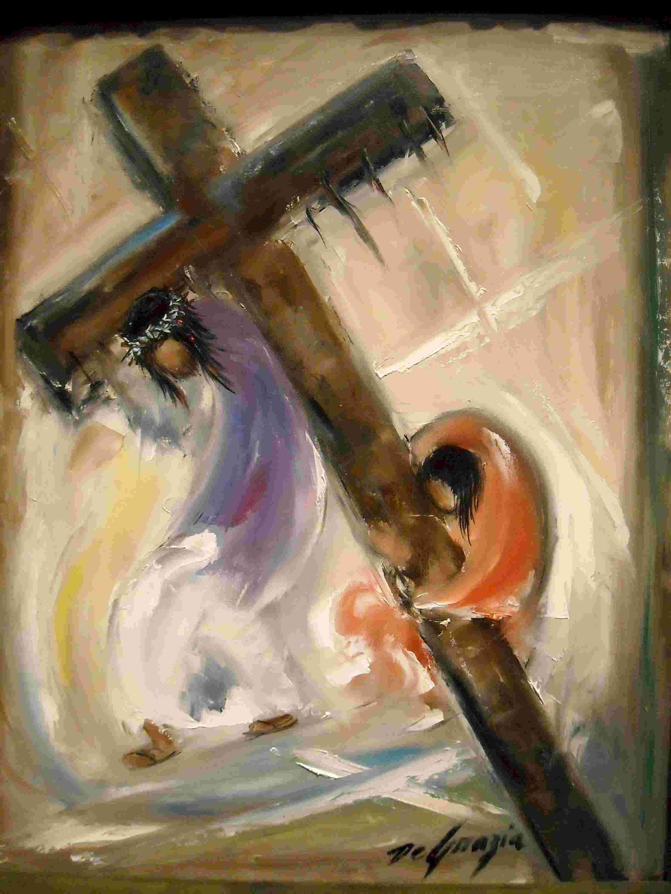

Bidden met kinderen en de vragen die ze erbij stellen, leert wat bidden echt is. Een les die ook voor veel ‘grote mensen’ leerzaam is.

Om maar meteen een open deur in te trappen: kinderen vinden bidden niet altijd leuk. Je probeert het natuurlijk interessant te houden door de keuze van gebeden aan te passen en door ze zelf gebeden te laten kiezen en door ze zelf te laten voorbidden. Maar dat is nog geen voldoende motivatie om het dagelijks avondgebed met volharding op te dragen, zoals Jezus het ons heeft gevraagd.

Dus komt onvermijdelijk het moment waarop je moet uitleggen waarom het toch belangrijk is dat je aan het gebed deelneemt, ook wanneer je er niet direct ‘goesting’ voor hebt. Dan moet je heel eerlijk zeggen: bidden is niet leuk.

Dat is een verrassende uitspraak, want geen haar op je hoofd dat eraan denkt om zomaar vrijwillig iets te gaan doen dat niet leuk is, toch? Ook ‘grote mensen’ zijn haast dwangmatig op zoek naar alles wat ‘leuk’ is. Kijk maar op Facebook: iedereen vindt mekaars belevenissen ‘leuk’. En als iets uit zichzelf niet ‘leuk’ is, moeten we het ‘leuk’ maken (‘opleuken’ heet het dan, of ‘verleuken’ - klinkt als ‘ver\*euken’).

Gelukkig is er nog een activiteit die we met recht en reden mogen vrijwaren van ‘leuk’ te zijn: bidden. Daarmee is niet gezegd dat bidden ‘saai’ of ‘flauw’ of ‘stom’ zou (moeten) zijn, maar wel dat bidden iets is waarop deze categorieën niet van toepassing zijn, tenminste als je wil aanvaarden wat bidden echt is.

"Heer, haast U mij te helpen!"

Als jij bidt, ga je dan in je beste zetel zitten, met een glaasje wijn, lekker achterover, om zachtjes kreunend aan te heffen “Heer, haast u mij te helpen”? Nee toch! Bid jij wanneer je toevallig even tijd hebt en niets om handen om de tijd te doden? Nee: voor bidden maak je tijd.

Simon van Sirene helpt Jezus' kruis dragen

Bidden is moeilijk, want het lijkt op een offer dat je brengt aan God, of op een tegemoetkoming aan het offer van zijn Zoon. Knielen is daarom een uitstekende gebedshouding, niet alleen omdat we ons nederig willen opstellen tegenover God, maar vooral omdat we ons tijdens het bidden even alle gemak willen ontzeggen, oog in oog met het lijden van Jezus. Het is niet alleen een lichamelijk offer, maar ook een geestelijk offer. Nadat we een hele dag zijn bezig geweest het voor onszelf en andere mensen ‘leuk’ te maken, ruimen we een stukje tijd vrij en zetten we onze verlangens opzij om bezig te zijn met God, met Hem te spreken. Een offer brengen, dat is niet 'leuk', en dat valt ook niet 'op te leuken'. Het is immers niet zoals een cadeautje voor zomaar een vriend, dat je in de winkel gaat kopen en waarvoor je zelf niks hoeft te laten.

Vorige zondag mochten we in onze kerk weer genieten van pater Guido, een Scheutist op rust die invalt als de pastoor afwezig is. Hij is een geweldig prediker: hij vertrekt vanuit de lezing of het feest van de dag, hij geeft concrete aanwijzingen, hij spreekt eenvoudig en zonder omhaal, voor de vuist en vanuit het hart, kortom, zoals een preek moet zijn. Hij liep al vooruit op het feest van de Kruisverheffing, dat op 14 september wordt gevierd en hij maande ons aan om, wanneer we bidden, het kruisteken met zorg te maken. Het kruis is immers voor alle christenen het teken van hun christen-zijn en het tekent keer op keer ons bewustzijn dat we zelf mee het kruis van Christus helpen dragen als we zijn hulp aanvaarden in ons leven. Het kruisteken is het begin en het einde van elk gebed, het tekent dus onze ontmoeting met God. Het kruisteken is een belangrijk teken dat we offervaardig willen zijn, niet alleen in ons gebed, maar bij alles wat we doen.

Paus Benedictus XVI

Ook de paus erkent in deel I van “Jezus van Nazareth” dat het niet eenvoudig is om goed te bidden. Bidden mag geen “praatzucht zijn, de woordenvloed waarin de geest verstikt”, want dan prevelen we gebeden terwijl onze geest heel ergens anders is. Het meest present zijn we als we uit innerlijke nood om iets vragen, of God blij gestemd danken voor het goede dat ons overkwam. Dan lijkt het alsof je geen gebed meer nodig hebt, want dan is de gerichtheid op God verankerd in je ziel en de dragende grond van je bestaan. Maar kan dat wel, zeggen “mijn leven is mijn gebed”? De paus zegt: nee! Ook die gerichtheid op God heeft voeding nodig en aanknopingspunten in gebedsformuleringen waarin de Kerk als geheel of individuele gelovigen hun ontmoeting met God hebben neergelegd. “Want zonder die hulp bij het gebed wordt ons eigen bidden, en ons Godsbeeld, subjectief. Dan zegt het tenslotte meer over onszelf dan over de levende God.”

Jezus met de Samaritaanse vrouw

Om te leren bidden, moet je niet direct op zoek gaan naar wat je kan krijgen van God, maar eerst naar wat je kan geven aan God. En als je dat kan, iets toevertrouwen aan God, dan komt Hij naar jou op zoek.Jezug zei tegen de samaritaanse vrouw:

Maar er komt een tijd, en die tijd is nu gekomen, dat wie de Vader echt aanbidt, hem aanbidt in Geest en in waarheid. De Vader zoekt mensen die hem zo aanbidden. (Joh.4:23)
