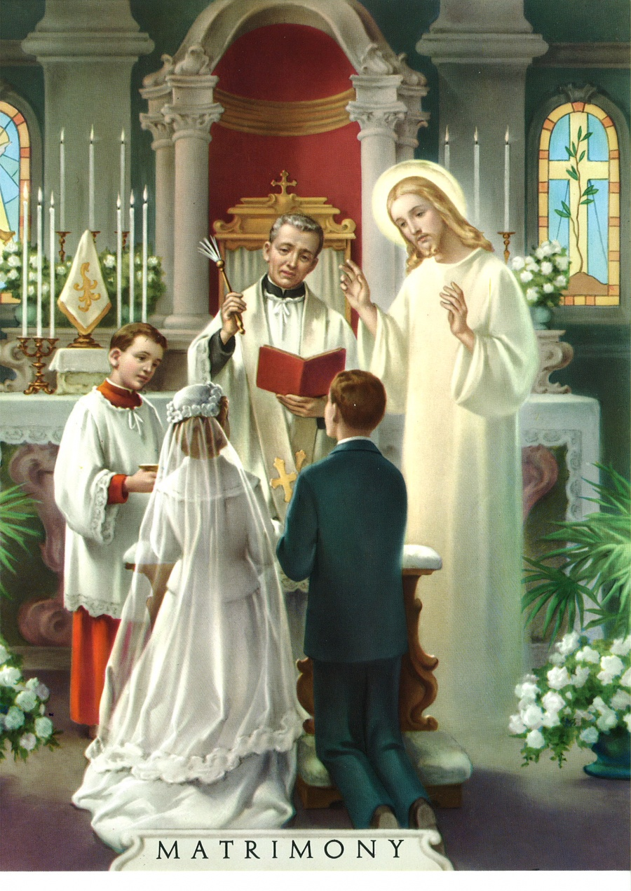

Recent zijn er enkele interessante verwijzingen verschenen op mijn diigo-blog onder de [tag ‘matrimony’](http://www.diigo.com/user/vicmortelmans/matrimony):

Mark van de Voorde onderzoekt in welke termen we over het huwelijk spreken. Economie bepaalt ons leven en we gebruiken dezelfde termen om over het huwelijk te spreken. Nu de economie in crisis is en als ‘waarde’ aan vertrouwen inboet, zien we hetzelfde gebeuren met het huwelijk. Hij pleit om het huwelijk als ‘waarde’ boven die retoriek uit te heffen.

Remco van Mulligen vraagt zich af of het geen tijd wordt om het huwelijk niet langer als (exclusieve) overheidstaak te zien, zoals dat in de negentiende eeuw onder de Franse secularisatie vastgelegd werd. Het huwelijk is (ook) een taak van de kerk, die er een eigen betekenis aan geeft die niet langer overeenstemt met de betekenis die het ‘burgerlijk’ huwelijk draagt. De ontkoppeling tussen huwelijk en staat is eigenlijk een logisch gevolg van de scheiding tussen kerk en staat. Merk wel dat deze discussie er niet eenvoudiger op wordt als dezelfde logica gevolgd wordt om het islamitisch (huwelijks-)recht een plaats te geven in de seculiere samenleving.

Enige dagen voordien trof me het [pijnlijk relaas van een vader](http://www.renewamerica.com/columns/abbott/110810) over hoe moeilijk het -ook binnen de kerk- is een echtscheiding vanuit geloof te beleven en hoe dubbelzinnig (of misschien eerder: eenzijdig) de kerk zich opstelt.

Ook in Vlaanderen weet de kerk de waarde van het (christelijk) huwelijk niet uit te dragen. [Mgr. Leonard kwam onlangs weer in een mediastorm](http://www.katholiekgezin.nl/index.php?option=com_content&task=view&id=2053&Itemid=1) omdat hij over deze problematiek een [artikelenreeks](http://www.rkdocumenten.nl/rkdocs/index.php?mi=600&doc=4324&id=6923) publiceerde en daarin de katholieke leer over het huwelijk verdedigde, die ‘niet wordt begrepen’ door andere katholieken, die de kerk in Vlaanderen willen hervormen om meteen van dit -ambetant- stukje leer af te raken.

Het is opmerkelijk dat op een paar weken tijd zoveel over het huwelijk wordt geschreven. Dat het huwelijk de jongste decennia in waarde aanzienlijk ‘gedevalueerd’ is (om in economische termen te blijven spreken), daarover zal iedereen het wel eens zijn. Dat we daar in de kerk een probleem mee hebben, omdat het huwelijk ook (en bij uitstek) een religieuze waarde heeft, ook daarover zullen vele (gelovigen) het eens zijn. Maar hoe pakken we dat aan?

De [katholiek leer](http://www.rkdocumenten.nl/rkdocs/index.php?mi=600&doc=1&id=1243) levert geen kant-en-klare oplossingen om het probleem van de echtscheidingen aan te pakken. Het is niet door hertrouwden de communie te weigeren of af te raden schooldirecteur te worden, dat hun -en ons- probleem wordt opgelost. Maar het tegendeel is nog minder waar, want het bestendigt de devaluatie _binnen_ het geloof. Als het huwelijk onder overheidshoede in crisis is geraakt, en als de kerk er voldoende waarde aan hecht, is de tijd inderdaad rijp dat de kerk opnieuw het ‘ownership’ opeist. Het laatste dat de kerk nu moet doen, is zich conformeren met het secularisme, want dan kunnen gelovigen die crisissituaties in hun huwelijk het hoofd trachten te bieden geen sterkte meer putten uit het geloof.

Dat betekent dat iedereen die hierin wil meestappen, bisschoppen, priesters of leken, in hun denken en spreken het seculier-economische referentiekader moeten inruilen voor een expliciet geloofskader. Enkel dan kan het christelijk huwelijk geopwaardeerd worden en als vanzelf zal de kerkelijke leer haar aura van wereldvreemdheid en liefdeloosheid verliezen.
