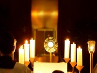

Ik schrik ervan hoeveel ondertekenaars de petitie ["Gelovigen nemen het woord"](http://www.de-living.be/smf_forum/index.php?topic=4022.0) nu al heeft (mede dankzij [heel](http://www.standaard.be/artikel/detail.aspx?artikelid=ED3INFKC) wat mediageweld). Gisteren sprak ik op een klasreunie met een oud-leraar pater jezuiet die zich erover verbaasde dat ik de standpunten uit de petitie niet onderschrijf. Op de vraag waarom niet, kon ik geen heel duidelijk antwoord formuleren. Het argument dat de standpunten niet stroken met de leer van de kerk, heeft geen overtuigingskracht, want precies die leer is het, die in twijfel wordt getrokken. Expliciet wat betreft het priesterschap, maar impliciet daarmee ook wat betreft sacramenten en huwelijksethiek. Het gaat niet op te zeggen "Ik onderteken niet want 'de kerk' leert zus en zo...". De ondertekenaars zijn immers 'de kerk'.

Veel restte er me niet dan een buikgevoel om te beargumenteren dat de voorgestelde maatregelen geen goede zaak zijn voor de kerk.

Ik zeg: geen goede zaak. Ik zeg niet: een slechte zaak. Ik twijfel er geen moment aan dat de ondertekenaars het goed menen met de kerk en dat de kerk die ze zouden opbouwen een goede kerk zou zijn, waarin mensen zorgen voor mekaar, van mekaar houden, vertellen over Jezus en zijn voorbeeld trachten te volgen. En dus zal die kerk ook bijdragen tot het heil van de kerkgemeenschap.

Waarom voel ik me er dan zo slecht bij?

Stijn van den Bossche heeft het goed verwoord door te zeggen: gelovigen moeten in de cultuur van vandaag 'op weg naar' het geloof. Men spiegelt zich graag af aan de eerste christenen en alhoewel ik eerder al schreef dat dit prille christendom voor mij geen referentie hoeft te zijn, probeer ik me soms ook te verplaatsen in de wereld van de eerste christenen. Welnu: het kerkbeeld van Van den Bossche komt me in dat perspectief meer natuurlijk over dan het kerkbeeld van de petitie, dat me eerder doet denken aan 'de kerk van de laatste christenen'. En daarom voel ik me er slecht bij.

Als onze kerk een minderheid is, en dat is ze, dan moeten we als gelovigen inderdaad 'op weg naar' het geloof, niet alleen op weg naar de kerk als centrale plaats waar de gemeenschap bijeenkomt, die niet meer de uitgestorven lokale dorpskerk zal zijn, maar ook op weg naar de kerk waar het geloof in zijn volle leerstellige en sacramentele inhoud beleden wordt, wat evenmin in diezelfde dorpskerk zal zijn. We moeten op weg door de woestijn, op zoek naar een oase. Ook in de woestijn zijn we samen en kan het goed zijn, maar we kunnen er ons niet laven.

Aanbidding

En begrijp me goed: er is natuurlijk niks op tegen dat gelovigen bijeenkomen om het [getijdengebed](http://nl.wikipedia.org/wiki/Getijdengebed) te bidden of het heilig sacrament te [aanbidden](http://nl.wikipedia.org/wiki/Eucharistische_aanbidding), integendeel, dat is uitstekend! En er is ook niks op tegen dat dit gebeurt in de lokale dorpskerk, integendeel, dat is immers het gebedshuis bij uitstek en daartoe perfect uitgerust! En er is ook niks op tegen als leken voor mekaar lezingen organiseren en elkaars kennis over Schrift, traditie en geloofsleer verdiepen, integendeel: verkondiging is de plicht van elke gelovige!

Maar "ik begrijp niet" waarom al deze activiteiten, die we als leken perfect kunnen ontplooien en die ongetwijfeld zullen bijdragen tot ons geloof, blijkbaar niet goed genoeg zijn en waarom per se de usurpatie nodig is van die andere katholieke activiteiten, die toch een bijzonder karakter en een buitengewone betekenis hebben in onze kerk: de eucharistie en de sacramenten, bediend door de handen van priesters.

En "ik begrijp niet" waarom onze bisschoppen gevraagd wordt troeven uit te spelen die ze zelf niet in handen hebben. Dat er meer aandacht kan gaan naar vorming en naar diocesaan personeelsbeleid, akkoord! Dat parochies, groot of klein, gemanaged kunnen worden door professionele leken, akkoord! Daar kunnen onze bisschoppen, als ze willen, allemaal voor zorgen. Maar waarom moet ook meteen de volledige sacramentologie van huwelijk, eucharistie en priesterschap worden herzien? Alsof onze bisschoppen ook dat zomaar te veranderen hebben!

Het doel is bereikt: wij zijn net geworden als de eerste christenen, die in hun tijd ook heel veel moeite en inspanning hebben moeten besteden aan het bestrijden van dwaalleren en die, vaak na vurige strijd, hebben getracht aan hun kinderen en aan de jongere generatie mede-gelovigen een kerk na te laten waarin niet hun eigen hand en de tekenen van hun eigen tijd herkenbaar waren, maar de hand van God en de tekenen van de eeuwigheid.
