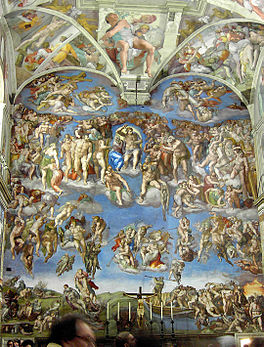

Eerder deze avond reed ik per fiets door de stad, met mijn zoontje voorop. De schemering begon. We kwamen net doorheen het stadspark wanneer een jongeman ons voorbijstak op zijn scateboard - ik wist niet eens dat die dingen zo’n vaart halen. Hij was ons zo’n tien meter voorgereden, wanneer hij in volle vaart een rechtse zijstraat kruist en daarbij gegrepen wordt door een auto die -ietwat roekeloos- uit die straat komt gereden, echter zonder dat er echt een ongeluk gebeurt.

Zoals enigszins te verwachten viel, begon die jongeman zijn verontwaardiging te uiten tegenover de automobilist. Als gevolg van de emotie valt dat best te begrijpen, hoewel het me voorkomt dat de scateboarder, die op de weg reed, voorrang had moeten verlenen aan de automobilist. Verder gevolg is er niet aan gegeven, de automobilist heeft wellicht niet eens gehoord wat de jongeman zei, en iedereen heeft zijn weg vervolgd. Maar wat de jongeman zei, verraste me wel, het was iets in de trant van: “stommeling, moet je niet uitkijken, je had bijna dat jongetje kunnen overrijden ”.

Dit alles voltrok zich echter in enkele luttele seconden! Ik ben geen psycholoog, maar wat zeggen zo’n -haast instinctieve- reacties eigenlijk over een mens? Zou die jongeman zo’n groot altruisme hebben dat hij zichzelf volledig wegcijfert en niet bezorgd is om zichzelf, hoewel hij net bijna overreden werd, maar wel over een -hem onbekende- fietser met zijn zoontje, en daarom de roekeloze automobilist daarover vermaant? (Wat niet echt nodig was, want ik ken die straat en hoed me wel die zonder kijken te kruisen).

Of herken ik in de reflex van de jongeman een typisch gedrag van schuldafwenteling? Natuurlijk wist hij dat hijzelf roekeloos was door niet te kijken naar verkeer dat voorrang heeft en dat die automobilist hem dat best eens zou kunnen verwijten, mocht er schade zijn aan de wagen. Haast automatisch heeft hij echter de reflex om zo snel mogelijk de schuld van zich af te wentelen, en daarbij maakt hij heel handig gebruik van het -toevallige- feit dat we net achter hem fietsen. Wij worden zijn excuus om de automobilist een schuldgevoel te bezorgen en zichzelf vrij te pleiten... het lijkt wel een truuk van een volleerd assisenpleiter!

Zo moeilijk is het iemands beweegredenen in te schatten!

En toch heb ik -misschien ietwat pessimistisch ingesteld over het menselijk instinct- het gevoel dat de tweede analyse de juiste is. Waarschijnlijk juist omdat de reflex van schuldafwenteling zo alomtegenwoordig is. Hoeveel mensen kan je er niet op betrappen dat ze, wanneer er iets onverwachts misloopt, al dan niet buiten hun wil om, binnen een fractie van een seconde een verklaring gereed hebben, waarbij een ander de schuld krijgt van wat gebeurde, zelfs al was het gewoon “pech”, een speling van het lot die ons zo vaak overkomt, waaraan per definitie niemand schuld heeft? In de psychologie zijn daarover ongetwijfeld bibliotheken volgeschreven.

Wat het thema voor mij interessant maakt, is dat schuldafwenteling ook een tegenovergestelde heeft: de schuldbekentenis. En nu wil ik even op godsdienstige toer gaan, want als er iets is wat het christendom de mensheid heeft bij te brengen, is het de erkenning van persoonlijke schuld. Ik was getuige van dit bijna-ongeluk op het feest van Christus Koning, wanneer het evangelie wordt gelezen van het Laatste Oordeel en de werken van barmhartigheid. Volgens de Schrift zal de Mensenzoon ons oordelen op basis van heel eenvoudige daden die we verrichten in ons leven. Niet op basis van groot geloof of van diep wijsgerig of theologisch inzicht, maar op basis van de hulp en bijstand die we leveren -of niet leveren- aan ‘de minsten’.

Een oordeel gaat ook daarover: over schuld. Wie gelooft in het Laatste Oordeel, beseft dat schuld, zelfs in alledaagse dingen, niet zomaar kan worden afgewenteld. Een ander de schuld geven in een zaak, terwijl je er zelf middenin zit, lost dan ook helemaal niks op! Of het nu een futiele ruzie is tussen broer die per ongeluk zijn zusje ten val brengt, of een juridisch geschil in de nasleep van een rockconcert dat door onweer wordt getroffen en waar ettelijke doden vallen, wat goeds levert de schuldvraag uiteindelijk op? De samenleving zou er veel baat bij vinden, mochten mensen wat vaker durven erkennen dat ze zelf mee schuld hebben aan dingen die misgaan, of erkennen dat dingen misgaan waaraan niemand schuld heeft. Dat er ongelukken gebeuren waarvoor niemand verantwoordelijk hoeft worden gesteld. Dat we ook maar mensen zijn, en niet alles onder onze controle hebben. Dat we niet voortduren schuldigen moeten zoeken.

Met het Laatste Oordeel in gedachte is het veel voordeliger schuld te bekennen dan schuld af te wentelen. Afgewentelde schuld blijft immers wegen, maar schuld waarop berouw volgt, wordt vergeven en niet gewogen. En het is al helemaal niet aan ons om over de schuld van anderen te oordelen, want -wie weet- was die jongeman op het scateboard echt heel oprecht bezorgd over wat mij en mijn zoontje had kunnen overkomen, en heeft hij in ogen van de Mensenzoon een daad van barmhartigheid gesteld door de automobilist op zijn roekeloosheid te wijzen...
