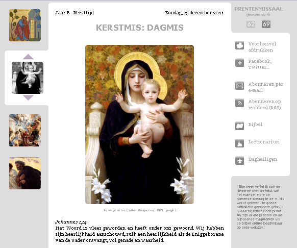

**UPDATE**

**de website Prentenmissaal.com is gestopt, maar de inhoud is volledig overgenomen op de nieuwe website:**

**[MISSALE.NET](http://www.missale.net/nl "Missale")**

* * *

**Prentenmissaal.com is een nieuwe webstek gebaseerd op het lectionarium van de rooms-katholieke kerk. Voor elke zondag of feestdag is er een pagina met een stukje uit het evangelie dat die dag in de kerk gelezen wordt, samen met een bijhorende prent.**

De prenten verzamel ik om door de week 's avonds iets over het evangelie aan de kinderen te vertellen zonder gebonden te zijn aan de courant beschikbare kinderbijbels. Qua ver-taling zijn dat vaak nuttige instrumenten, maar qua beeldmateriaal stellen ze niets voor (_sic_).

En dat terwijl er zo'n enorme [schat](/2011/05/16/beelekes/) aan katholieke ver-beelding te vinden is, neem maar alleen het repertorium van de christelijke kunst door de eeuwen heen. Komt daar nog bij dat de meeste van die werken geproduceerd zijn met een pedagogische functie! Ideaal materiaal dus om als illustratie bij een bijbelvertelling te dienen.

De webstek heeft een knop "voorleesvel afdrukken", om de prent plus bijbelcitaat op papier te krijgen. Voor wie met z'n tijd mee is, zou de webstek moeten bruikbaar zijn op gangbare smartphones en tablets, maar die feature is slechts rudimentair getest...

Wie elke week de volgende prent in zijn e-postbus of nieuwslezer wil, kan zich abonneren.

De stek biedt zowel de lezingen volgens de kalender van de gewone vorm van de romeinse ritus (de 'mis van 1969', na het concilie) als de lezingen volgens de kalender van de buitengewone vorm (de 'mis van 1962', voor het concilie), zoals die nu beide gebruikt worden in de katholieke kerk. De volledige kalender is echter op dit ogenblik nog niet ingevuld.

Graag uw feedback op info@prentenmissaal.com... Al uw opmerkingen en aanvullingen zijn welkom! Niet alleen technisch ("het werkt niet!"), maar ook inhoudelijk ("kan je dit kunstwerk niet gebruiken voor die lezing?"). Intussen dromen/werken we verder aan uitbreidingen van de prentenverzameling, implementatie in andere talen, toevoeging van meditatief tekstmateriaal, interactieve toevoeging van prenten, publicatie via print-on-demand, … teveel om op te noemen... En wie weet komer er ooit een goede ziel voorbij die voor een aantrekkelijker layout kan zorgen.

Met dank aan [Amazon web services](http://aws.amazon.com/), [Google app engine](http://code.google.com/appengine/) voor de hosting en [eXist](http://exist-db.org/) voor de open-source databank.

