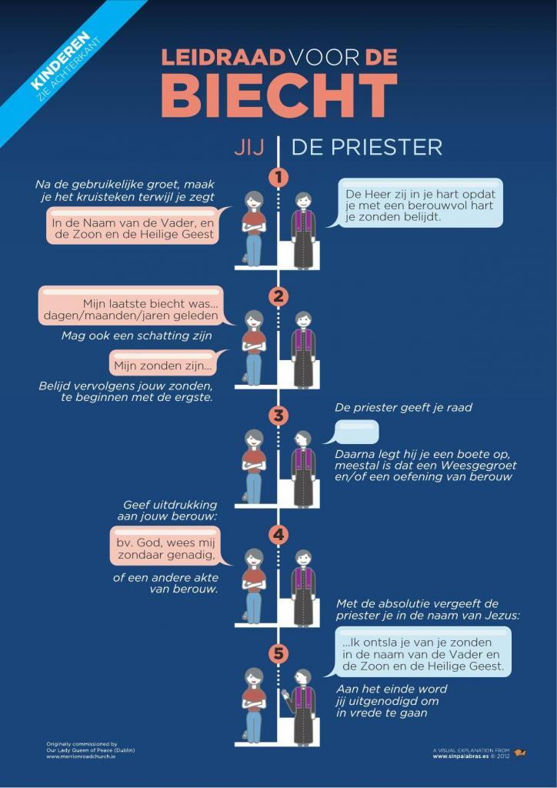
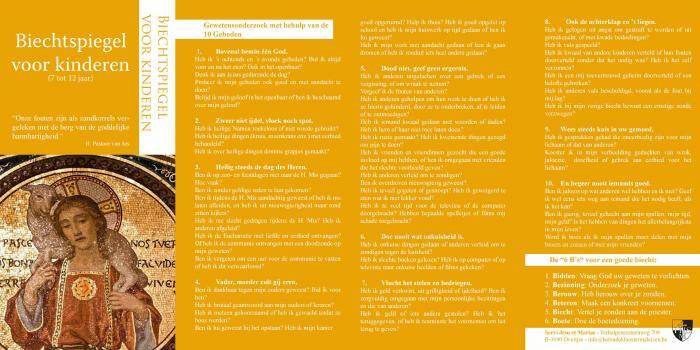
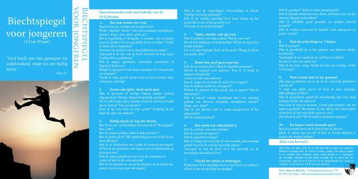
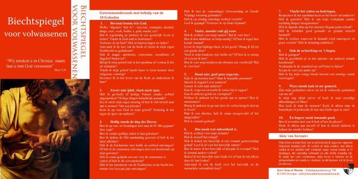

Een klein artikeltje wijden aan de biecht kan geen kwaad, net voor het begin van de vasten. De biecht is immers het kneusje onder de sacramenten. Biechten is ook het moeilijkste van alle sacramenten, want het vraagt nederigheid en overgave.

Andere sacramenten worden beleefd als een sociale gebeurtenis waarbij de geloofsgemeenschap of het gezin bijeenkomt, maar de biecht is een individueel engagement. Dat is ook niet zo gek als je bedenkt waar het feitelijk over gaat: door je zonde heb je je buiten de gemeenschap met God geplaatst, dus moet je Hem in eenzaamheid tegemoettreden om verzoening te vragen. Het is pas nadat je je met God verzoend hebt, dat je terug volwaardig lid wordt van de gemeenschap en bijvoorbeeld het gemeenschapssacrament van de eucharistie kan ontvangen. Dat is te zeggen: in het geval dat je [doodzonde](http://www.rkdocumenten.nl/rkdocs/index.php?mi=600&doc=1&id=1294 "De zwaarte van de zonde: doodzonde en dagelijkse zonde") hebt begaan.

Een tweede moeilijkheid is dat de biecht zo goed als in onbruik is geraakt, en dat de perceptie ervan heel diffuus is geworden. Moet het nu wel of niet? Bestaat het überhaupt nog? Moet het in een biechtstoel of gewoon bij mij of de pastoor thuis? is het niet genoeg naar een biechtviering te gaan? Welke zonden moet je biechten? enz... Niet dat er op alle vragen een eenduidig antwoord hoeft te zijn, maar ietwat concrete informatie helpt wel om een mens keuzes te laten maken.

Iemand die voor de eerste keer zou willen biechten, moet minstens drie hordes overwinnen. De eerste horde is de noodzaak van de biecht te beseffen. De tweede horde is zichzelf voor te bereiden om het sacrament te ontvangen. De derde horde is een priester te vinden die het sacrament kan toedienen.

Voor je naar een priester stapt, moet je eerst de keuze maken hoe je wil biechten. Dat ligt veel aan je persoonlijkheid en aan de relatie die je wil opbouwen met je biechtvader en wie je daarvoor kiest. Je kan kiezen voor een heel open biechtgesprek, van aangezicht tot aangezicht, waarin de voltrekking van het sacrament haast spontaan wordt verweven, of voor een klassieke biecht, waarbij bepaalde vormelijkheden het sacrament ondersteunen.

## Biechtstoel

Evenement-biechtstoelen

Beide vormen hebben hun voor- en nadelen en geen van beide doet iets af aan de waarde van het sacrament. Ik maak echter graag een bedenking waarom het gebruik van het meubelstuk 'biechtstoel' een zekere waarde heeft, hoewel het misschien in eerste instantie afschrikwekkend overkomt. De biechtstoel is uiteraard niet wezenlijk voor het sacrament, maar wel speciaal gebouwd voor dit sacrament en hij biedt een kader dat helpt om het sacrament te beleven, op meerdere manieren:

1. Als boeteling moet je in het meubel plaatsnemen door te knielen. Als je gaat biechten ben je zowiezo in staat van berouw en wil je je in de tegenwoordigheid van Christus stellen. Knielen is dus een heel aangewezen lichaamshouding om te biechten. Het lijkt me heel tegennatuurlijk om lui wegzakkend in de zithoek een biechtgesprek aan te gaan.
2. De biechtvader is afgeschermd van de boeteling door een roostertje. Ik heb al veel wilde verhalen gehoord over de reden daarvan, maar het helpt wel om als het ware abstractie te maken van de persoon van de priester, vermits het eigenlijk Christus is die je biecht opneemt en van Wie je uit de mond van de priester vergiffenis zult krijgen.
3. De biechtstoel is afgesloten met een gordijntje. Dat geeft natuurlijk privacy tegenover andere aanwezigen in de kerk, maar schept ook een duistere omgeving, die de zonde eigen is. Na de biecht kan je uit het duister treden, de kerk in, waar het licht door de ramen binnenvalt of waar de offerkaarsen hun licht verspreiden.

## Welkom?

Wat echter gedaan als je werkelijk wil gaan biechten? Weten dat je ergens welkom bent, zoals ook de verloren zoon dat was, is de grootste hulp, maar hoe kom je te weten waar dat is? In de biechtstoelen van de meeste kerken heeft al sinds decennia geen priester meer zitten wachten op een boeteling. En niet elke priester heeft evenveel ervaring met biechthoren of is daartoe gedreven.

Het beste ben je af als je in je kennissenkring iemand hebt van wie je vermoedt dat hij of zij biecht: hoor die uit. Vraag het anders aan iemand in de parochie of aan je pastoor. En je kan natuurlijk ook te rade op het internet.

Op de [officiële site](http://kerknet.be/) van de Kerk blijft de aandacht voor dit sacrament tamelijk beperkt. Zeker in de vastenperiode zou deze pagina een eervolle vermelding verdienen op de welkompagina van Kerknet! Kerknet heeft tegenwoordig heel wat [lokale pagina's](https://www.kerknet.be/zoeken/artikels?text=verzoening+biecht) die onderhouden worden door parochies en federaties, en daar kan je -met wat geluk- informatie vinden over lokale biechtgelegenheid. Zoek op Kerknet op de termen 'biechtspiegel' of 'gewetensonderzoek', en je vindt weinig praktische houvast. Niet nodig dus? Toch is het nog steeds zo dat de Kerk van elke gelovige (die tot de jaren van verstand is gekomen) [vraagt](http://rkdocumenten.nl/rkdocs/index.php?mi=600&doc=663&al=432) om minstens éénmaal per jaar te biechten, bij voorkeur als voorbereiding tot Pasen...

Biechtgelegenheid in Nederland en Vlaanderen: [Overzichtskaart met biechtgelegenheid in Vlaanderen](http://naar-de-mis.maptiming.com/51.065390,4.370084,9z,676px/all/biecht)

Verderop vind je nog heel wat websites met informatie over de biecht en over het gewetensonderzoek, maar beknopt geeft [volgende leidraad](http://opusdei.nl/nl-nl/article/biechten-made-easy-een-leidraad/) de meeste informatie weer, met aangepast gewetensonderzoek voor kinderen, jongeren en volwassenen:

## Leidraad voor de biecht

Algemene informatie over de biecht:

- [Het sacrament van de verzoening vieren: hoe doe je dat?](https://www.kerknet.be/iclz/artikel/het-sacrament-van-de-verzoening-vieren-hoe-doe-je-dat#sthash.lmFxmY5q.dpuf)
- [Biechten, zo had je het nog nooit bekeken](https://www.kerknet.be/kerknet-redactie/artikel/biechten-zo-had-je-het-nog-nooit-bekeken)
- [5 vragen over de biecht: wat, wie, wanneer, hoe en waarom?](https://www.kerknet.be/kerknet-redactie/artikel/5-vragen-over-de-biecht-wat-wie-wanneer-hoe-en-waarom)
- [Waarom we toch moeten biechten, ook al lijken we allerlei redenen te hebben dit niet te doen](https://www.kn.nl/verdieping/achtergrond/waarom-we-toch-moeten-biechten-ook-al-lijken-we-allerlei-redenen-te-hebben-dit-niet-te-doen/)
- [Het sacrament van de verzoening vieren, hoe doe je dat?](https://www.kerknet.be/sites/default/files/Het%20sacrament%20van%20de%20verzoening%20vieren.docx) (docx)
- [Vensters op katholiek geloven](http://www.venstersopkatholiekgeloven.nl/subartikelen/persoonlijke-of-gemeenschappelijke-biecht/ "Persoonlijke of gemeenschappelijke biecht")
- [de voorbereiding op een goede biecht](https://www.agneskerk.org/2019/04/de-voorbereiding-op-een-goede-biecht.html)
- [Mercèdès Vossenberg biecht](https://www.parochiepetruspaulus.nl/mercedes-vossenberg-biecht/)
- Bewust Katholiek:



Heel concreet over een goed gewetensonderzoek en over het verloop van de biecht:

- [Gewetensonderzoek](/blog/gewetensonderzoek-2/)
- [Interkerk - boetesacrament.nl](http://www.boetesacrament.nl/)
- [Het gewetensonderzoek, algemeen en bijzonder](https://trouwkatholiek.wordpress.com/2019/08/15/het-gewetensonderzoek-algemeen-en-bijzonder/)
- [RK Studentenpastoraat Amsterdam](http://www.rkspa.nl/?Read-Some/How-To-Go-To-Confession "De Biecht, sacrament van Verzoening")
- [Biechtspiegel op basis van de Zaligsprekingen](http://www.biddeniseenweg.nl/visie/verootmoediging-en-berouw/167-kijk-eens-in-de-biechtspiegel)
- [Biechtspiegel aan de hand van je gelaat](https://www.lambertuskerk-rotterdam.nl/biechtspiegel.html)
- [Gewetensonderzoek bij boeteviering op 25 maart 2022 in Vaticaanstad](/blog/gewetensonderzoek-voor-de-boeteviering-voorafgaand-aan-de-toewijding-van-rusland-en-oekraine-aan-het-heilig-hart-van-maria/)

Biechtspiegel voor kinderen

Biechtspiegel voor jongeren

Biechtspiegel voor volwassenen

## Verloop van de biecht 

Dit is het [verloop](http://boetesacrament.nl/de-viering-van-het-boetesacrament/) van een biecht. De woorden van de boeteling staan vet. Als dit je allemaal veel hocus-pocus lijkt, geen probleem, biechten is zo al moeilijk genoeg, en het volstaat om samen met de priester het kruisteken te maken en de priester te zeggen wanneer je laatst gebiecht hebt en dan te vertellen waarvan je spijt hebt, de rest volgt dan wel vanzelf zonder teveel plichtplegingen.

- Kruisteken: **In de naam van de Vader, de Zoon en de Heilige Geest. Amen.**
    - De priester spreekt een welkom uit en kan een tekst uit de Heilige Schrift lezen
    - Algemene schuldbelijdenis: **Ik belijd voor de almachtige God en voor U, Vader, dat ik heb gezondigd in woord en gedachte, in doen en laten, door mijn schuld door mijn schuld, door mijn grote schuld. Daarom smeek ik de heilige Maria, altijd maagd, alle engelen en heiligen, en U, vader, voor mij te bidden tot de Heer, onze God.**
- De boeteling zegt wanneer hij de laatste keer heeft gebiecht en belijdt één voor één zijn zonden en zegt erbij hoe vaak hij elke zonde heeft begaan
- De priester geeft raad, zet aan tot berouw en stelt een boete voor
    - Akte van berouw: **Barmhartige God, ik heb spijt over mijn zonden, omdat ik Uw straffen heb verdiend, maar vooral omdat ik U, mijn grootste weldoener en hoogste Goed, heb beledigd. Ik verfoei al mijn zonden en beloof met de hulp van Uw genade, mijn leven te beteren, niet meer te zondigen, Heer, wees uw zondaar genadig.**
- De priester geeft de absolutie.
- De boeteling antwoordt: **Amen.**
    - Lof aan God: Brengt dank aan de Heer, want Hij is genadig. **Zijn genade duurt in eeuwigheid.** De Heer heeft uw zonden vergeven. Ga in vrede. Amen.

\[uit de bezoekersstatistieken van deze blog kan worden afgeleid dat veel mensen op zoek zijn naar concrete informatie over de biecht, daarom wordt dit artikel voortdurend aangepast met actuele informatie en verwijzingen\]
