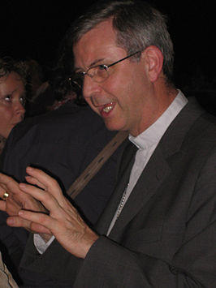
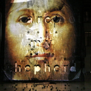
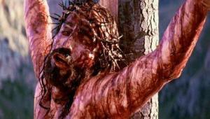
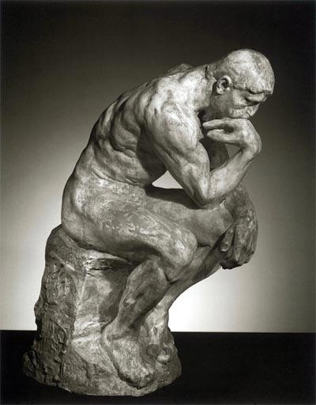

Eigenlijk  kan ik er niet omheen om op mijn blogje ook iets te schrijven over het toneelstuk _"On the concept of the face, regarding the Son of God"_ van Castelluci, vorige week vertoond in Antwerpen, want het gaat over geloofsverbeelding (of juist niet?). Maar eigenlijk ga ik het ook hebben over een vorm van elitair en lui denken.

**Ergernis**

Mgr. Bonny bezocht het toneelstuk en schreef er een lovende recensie over. Terwijl de bisschop binnen in de pluche zetels van De Singel neerzat, hoogstens geplaagd door de kunstmatige windstoten die bij het stuk horen, stonden buiten in de ijzige kou gelovigen van zijn bisdom verzameld om biddend te protesteren tegen de vertoning van dit stuk, omdat het blasfemische scenes bevat.

Mgr. Bonny

Heel vreemd allemaal. De bisschop die anders in alles zo uiterst voorzichtig en fijngevoelig te werk gaat, en er zich angstvallig voor hoedt iemand met onbevangen uitspraken of beslissingen te ergeren, heeft ditmaal geen boodschap aan de les van 1 Kor 10,28: omzichtig te zijn bij het gebruiken van de intellectuele vrijheid die christenen eigen is, wanneer dat leidt tot ergernis in de gemeenschap. Als enscenering van de crisis in de kerk is dit tafereel exemplarisch.

**Beeldtaal**

Over naar de inhoud echter. Mgr. Bonny schrijft over het stuk in de nationale media: _"Dat vind ik sterke beeldtaal."_ Hiermee heeft hij mijn aandacht, want wie dit blog volgt weet dat ik veel van beeldtaal hou. De bisschop vervolgt: _"Hier voert de kunstenaar ons naar de tweesprong van het geloof. Ofwel zullen van deze wereld ooit alle gezichten verdwijnen en zal er slechts een duisternis zonder gelaat overblijven. Ofwel zal er van deze wereld ooit één gezicht overblijven, een gezicht waarin we elkaar zullen herkennen en terugvinden: het gelaat van de verrezen Christus. De laatste mogelijkheid drijft het verlangen dat ik geloof noem."_

Mgr. Bonny verwoordt hiermee heel zuiver de kern van het katholieke geloof, of althans 'het verlangen ernaar'. Als het dat is waar het toneelstuk om draait, wie kan er dan tegen zijn?

On the Concept of the Face, Regarding the Son of God

Dat het stuk sterke beeldtaal bevat, is zeker niet gelogen. En op zich is sterke beeldtaal iets wat we nodig hebben! Neem bijvoorbeeld het lijdensverhaal. De gecanoniseerde voorstellingen van het lijden van Christus geven me soms het gevoel afgeschermd te worden van de volheid van de ervaring van Jezus' laatste uren, zo zakelijk als de evangelies zijn en zo sereen als menig schilderij de passie verbeeldt. In de kerk op Palmzondag of Goede Vrijdag durf ik bekennen nauwelijks tot in mijn ziel bewogen te worden door het lijdensverhaal.

Soms krijg ik echter wel koude rillingen als ik de _Mattheuspassion_ beluister. Ook de emotionaliteit en rijke contrasten van de rockopera _Jezus Christ Superstar_ hebben me inzichten in het lijdensverhaal geopenbaard die ik anders niet had gevonden. En enkele jaren geleden kreeg ik het even benauwd bij het bekijken van _The Passion of the Christ_.

**Net omgekeerd**

The Passion of the Christ

Ik herinner me nog dat bij het verschijnen van de film _The Passion_ een debat woedde tussen voor- en tegenstanders van dit heel expliciete verslag van het lijdensverhaal. Gek genoeg waren de rollen toen omgekeerd. De film viel beter in de smaak in kringen die ik nu even gemakkelijkheidshalve conservatief noem (lees: die in De Singel op straat stonden), terwijl wat zichzelf progressief noemt de film vulgair vond en de bloedige scenes 'er ver over'... dit blijkbaar in tegenstelling tot stront en granaten.

Waar zit hem het verschil? Heel eenvoudig: _The Passion_ is een getuigenis die gemaakt is vanuit het geloof in Gods werkelijkheid en die wil voeren tot geloof in Gods werkelijkheid. Deze film verbeeldt het geloof. _On the concept of the face_ is een getuigenis die gemaakt is vanuit de twijfel en die uitmondt in twijfel. Het stuk mag dan wel bijbels geinspireerd zijn en heel diep-menselijke sensaties losweken bij de individuele toeschouwer, in relatie tot het geloof van een gemeenschap brengt het geen lafenis.

**Elitair, nutteloos en blasfemisch**

Kort door de bocht: deze vorm van kunst is te eenzelvig en dus eigenlijk te elitair om nuttig te zijn voor het geloof. De toeschouwer krijgt de verbeelding van een aller-individueelste gewaarwording van geloofs_twijfel_, niet van geloof. Vanuit zijn verantwoordelijkheid voor de verkondiging van het geloof doet de bisschop dan nog een dappere poging om zijn kudde op de bijbelse referenties te wijzen. Da's allemaal al heel wat in deze tijd, zal u zeggen... Ja, maar niet genoeg.

Twijfel kan je niet in gemeenschap brengen, twijfel is individueel en wordt in gemeenschap juist opgelost en overwonnen. De beeldtaal van het toneelstuk is dan wel krachtig, ze overstijgt de individuele interpretatie niet. Geloof heeft beelden nodig die de individuele interpretatie overstijgen, die een gemeenschappelijk begrip van het transcendente mogelijk maken. Vanuit cultureel perspectief is _On the concept of the face_ misschien niet onverdienstelijk, maar vanuit gelovig perspectief is het een nutteloos stuk, en juist door die nutteloosheid wordt op de eindbalans de grens tussen de smakeloosheid van de beeldtaal en blasfemie heel klein.

**Twijfel kan geen doel zijn en ook geen middel, hoogstens een aanleiding tot denken**

Mark van de Voorde schreef deze week een stukje over de rol van twijfel in geloof. Hij zegt precies het tegenovergestelde als ik. Volgens hem is het juist de twijfel die gemeenschap vormt en de zekerheid die individualiseert. Hij ziet _"nieuwe traditionalisten"_ op de been, die _"het denken willen verbieden en daarom de twijfel des duivels noemen"_. Van de Voorde trekt 'weten' in twijfel. In zijn hoofd is 'denken' dus een proces dat voert van weten naar twijfel.

De twijfelaar

Het filosofische getwijfel van Van de Voorde en de nutteloze beeldtaal aangeprezen door mgr. Bonny zijn twee uitingen van een elitair denken dat gekenmerkt is door gemakzucht. Dit denken is gemakzuchtig, omdat het het bestaan van de waarheid ontkent, of tenminste de zoektocht ernaar voorstelt als quasi zinloos. Daarom valt er ook niets te argumenteren. Dit denken is ook elitair, omdat het steevast gepaard gaat met de afwijzing van duidelijk te identificeren andersdenkenden: iedereen die meent dat nadenken, met de hulp van een zekere overlevering, wél kan leiden tot zekerheid en kennis van de waarheid.

En nu zal ik jullie een geheim verklappen: ik heb proefondervindelijk vastgesteld dat twijfelen en denken niet hetzelfde zijn! Ik twijfel natuurlijk ook, maar in mijn hoofd is 'denken' een proces dat voert van twijfel tot weten, en weet je: het werkt! Kan het dat dit bij sommige mensen opgehouden heeft te werken?
