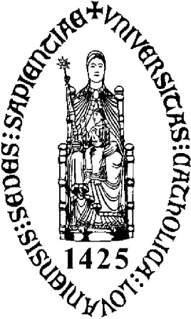

\[caption id="attachment\_2037" align="alignleft" width="254"\] Belofte\[/caption\]

In tegenstelling tot Chiro, is Scouts en Gidsen Vlaanderen wel [gewonnen voor een allochtone jeugdbeweging](http://standaard.be/artikel/detail.aspx?artikelid=DMF20120202_141&word=chiro). Wil de Chiro dan niet dat allochtonen naar de jeugdbeweging gaan? Natuurlijk wel, maar ze willen gewoon dat ze naar de Vlaamse jeugdbeweging komen.

Niet zo'n goed idee, en ik ben blij dat de Scouts de boot afhoudt. Wij hebben ook een jongen bij de scouts, en -gelukkig- een groep waar nog heel wat discipline heerst en regelmatig de H. Mis wordt bijgewoond. Hoewel we in een multiculturele stad wonen, zie ik geen enkele meerwaarde in een multiculturele scoutsgroep.

Even een kleine anecdote. Een Turks klasgenootje was ook geïnteresseerd en is enkele maanden lid geweest, maar bleef dan plots weg. Waarom? Naar ik vernam hadden zijn ouders het moeilijk met de discipline die van de jongens wordt geëist...

Jeugdbewegingen letten best op, want hoelang zou het duren voor deze goed werkende maar 'cultureel verrijkte' scoutsgroep (1) last zou krijgen met meisjes als leiding voor jongensgroepen, (2) last zou krijgen om op kamp niet-halal te koken, (3) last zou krijgen met jongens die menen zich aan geen gezag te moeten onderwerpen, (4) -nog meer- last zou krijgen om in groep de H. Mis bij te wonen? Kortom: last zou krijgen met zowat alles dat de werking van deze scoutsgroep eigen is, behalve 'buske stamp' spelen?

Als je in je vrije tijd jezelf al niet meer kan zijn!

‘We moeten ons blijven inspannen voor een multiculturele maatschappij waarin we echt samenleven’ Het klinkt mooi uit de mond van de Chirodirecteur, maar wat levert het op voor de kinderen en hun cultuur? Multiculturele ijveraars lopen niet over van respect voor eigen noch vreemde cultuur, want ze zijn blind voor het culturele relativisme dat nodig is om hun project te doen slagen. Netto-effect: nog meer vervreemding.

Een jeugdbeweging is een vrijwilligersbeweging en berust op het engagement van de leden. Zullen er veel leiders gevonden worden voor zo'n multicultureel project? Of is het precies dat wat de directeur bekent als hij zegt: ‘Alleen is er meer nood aan structurele middelen om \[multiculturele\] Chirogroepen te begeleiden.’ Kan dus de 'multiculturele' jeugdbeweging niet meer zonder professionalisering? Dan doet ze zichzelf de das om! Deze jeugdbeweging is geen vrije 'jeugd'-beweging meer, maar een verkapte overheidsinstelling die geld en personeel krijgt om een slechte oplossing te bieden aan het migratiesamenlevingsprobleem.

Teveel tijd, teveel geld

De Vlaamse overheid heeft teveel geld én teveel tijd (of te weinig bevoegdheden voor de beschikbare budgetten en mankracht). Heel het middenveld wordt versmacht onder de voortdurende druk van de overheid om te 'professionaliseren' (lees: de werking zo ingewikkeld maken dat vrijwilligers er de brui aan geven) en heel subtiel ideologisch gemuteerd door aan erkenningen en subsidies allerhande politiek correcte criteria te koppelen. Elk probleem in de samenleving wordt te lijf gegaan in minstens een handvol gesubsidieerde programma's, ondersteund door nieuwe of ingelijfde vzw's.

Vanuit een verleden van verzuiling, met het katholiek middenveld als belangrijkste poot, is het verklaarbaar dat enorme geldstromen van de staat doorvloeien naar alles wat van ver of nabij katholiek is: kerken, onderwijs, jeugdbewegingen, noem maar op! Intussen is dat katholieke Vlaanderen vervangen door een seculier Vlaanderen. Ook de andere zuilen vervluchtigen. Je zou verwachten dat die geldstromen stilaan opdrogen? Integendeel echter! Vlaanderen werpt zich nu op als de suikernonkel van alle religies, hoewel de politieke band onbestaande is.

Imamfaculteit

Iedereen mag mee uit de pot eten, met een nieuwe imamfaculteit als laatst opgediende schotel. Maar al die begunstigden moet wel netjes binnen de lijntjes kleuren van de 'waarden van de verlichting'... want Vlaanderen vindt dat zo'n faculteit nodig is omdat de 'import'-imams niet voldoen aan de ideologische inzichten van... het Vlaamse parlement.

\[caption id="" align="alignleft" width="97"\] Alma Mater\[/caption\]

Ik zeg: droogleggen, die handel! Laat religies, culturen en aanverwante verenigingen zelf hun boontjes doppen en hun eigen cultuur verrijken. Het zal voor de katholieke 'zuil', het verwende nest, ook een lesje zijn. Schaf de faculteit van 'theologie en religiewetenschap' aan de KU Leuven gewoon af, want hoe kan je nu het geloof -vanuit het geloof, en dat is theologie- bestuderen aan een universiteit die zelfs geen banden met de kerk wil? Of was dat misschien de doorslaggevende reden om de 'K' te bewaren: het dreigende verlies van een faculteit (en bijhorend overheidsgeld)? Kerkelijke seminaries zijn immers veel geëigender plaatsen om theologie te onderwijzen, en dat geldt analoog vanzelsprekend ook voor een imamfaculteit.

Dus laat alsjeblief lui met een andere cultuur in onze stad zelf het initiatief en de verantwoordelijkheid nemen een eigen jeugdbeweging te beginnen! En geef hen daarvoor desnoods het geld en een 'professioneel kader' en alle tralala die men nodig acht, maar belast de werking van de traditionele jeugdbeweging er niet mee.

...onder het motto: "wat ze zelf doen, doen ze beter!".
