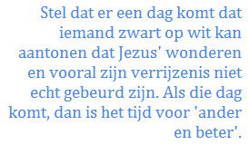
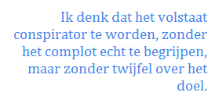
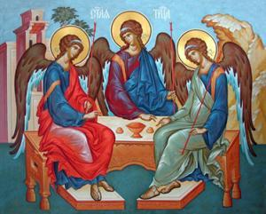

Stellen dat geloven niet vanzelfsprekend is, is een open deur intrappen. Voor een kritische, rationele geest—en dat zijn we toch allemaal?—zijn er redenen genoeg om het geloof in Jezus als de verrezen Zoon van God in vraag te stellen, en heel wat van die redenen komen uit de bijbel zelf naar voren. Wanneer ik Jezus' wonderverhalen lees, word ik soms bekropen door twijfel. Dat kan toch echt allemaal niet zo gebeurd zijn?

Je wil geloven en je twijfelt, wat nu?

Men zegt en schrijft wel eens dat geloof niet kan bestaan zonder twijfel. Dat klopt, want twijfel kan een aansporing zijn tot nadenken, tot gebed of tot vertrouwen en bereidt zo het pad naar nieuwe zekerheden, naar geloof. Die zekerheden kunnen op hun beurt weer aanleiding zijn voor nieuwe twijfels, maar ze kunnen ons**—**ook al beseffen we het misschien zelf niet**—**een glimp gunnen van de _Waarheid-met-grote-W_. Twijfel is een nuttige stap in een proces, maar het is geen statisch gegeven. Twijfel is een middel waarmee je aan de slag moet en dat vormt tot geloof. Als je twijfel laat bestaan zonder er iets mee te doen, gaat die de plaats innemen van het geloof.

Hoe zit dat nu met die bijbelverhalen die zoveel twijfel opwekken omdat ze stijf staan van onwaarschijnlijke gebeurtenissen en onderlinge tegenstrijdigheden? Zijn ze het werk van fantasierijke auteurs? Zijn ze propagandamateriaal van een sekte die zichzelf moet bewijzen? Zijn het metaforen en beelden waarmee de auteurs eigenlijk helemaal geen feitenrelaas willen geven? Zijn het mythische verhalen die in de overlevering aan de persoon van Jezus werden opgehangen? Of is het toch het eerlijke en nuchtere relaas van de wonderlijke wedervarendheden van een kleine groep vissers, die zelf maar amper konden begrijpen wat ze hadden meegemaakt? Ik weet het niet, maar de vraag is wel belangrijk.

Stel dat er een dag komt dat iemand zwart op wit kan aantonen dat Jezus' wonderen en vooral zijn verrijzenis niet echt gebeurd zijn. Of stel dat er een dag komt dat de twijfel over die feiten in mijn geest zodanig vastgeroest is dat hij het gloof heeft vervangen. Op die dag is er geen reden meer om aan te nemen dat Jezus de Zoon van God is, als die ueberhaupt al zou bestaan. Dan is er ook geen reden meer om lid te zijn van een Kerk die mensen fabeltjes opspeldt en die zich bezighoudt met inhoudsloze sacramentele hocus-pocus. Wat er dan nog overblijven zijn enkele morele waarden uit het evangelie en gezellige kerken waar je 's zondags koffie kan gaan drinken. Maar het heeft dan geen zin meer om te bidden, of ter communie te gaan, of om te biechten, of om in iets te geloven. Als die dag komt, dan is het tijd voor 'ander en beter'.

Tot nu toe heeft echter niemand de bijbel ontegensprekelijk kunnen ontkrachten, maar een sluitend bewijs voor Gods openbaring levert het boek evenmin. Wie soms een krant leest, weet dat het werkelijkheidsgehalte van een gemiddeld artikel bedroevend laag is. Waarom zouden zo een aantal verhalen uit de bijbel dus ook niet aangedikt of geromantiseerd zijn en zou er zelfs hier en daar geen hoax tussenzitten? De stelling dat de bijbel louter een historisch relaas biedt is onhoudbaar. De stap naar de volldige ontkenning van de historiciteit van het evangelie is echter bijzonder groot. Wie in vraag stelt of Jezus werkelijk door God gezonden is en verrezen is en opnieuw verschenen is aan zijn leerlingen, haalt het fundament onder het hele christelijke geloof vandaan.

Er zijn genoeg theologische en exegetische strekkingen die Christus zodanig proberen te benaderen dat Hij kan worden losgeweekt van zijn God-zijn en waardoor zijn verrijzenis en zijn rol in het goddelijk heilsplan meer op mensen-maat kan worden ingevuld, al dan niet met behulp van een dosis geschiedkunde, psychologie, sociologie etc. Dat kan best heel interessant zijn, maar het geeft mij, als niet-theologisch geschoolde gelovige geen soelaas in mijn twijfel en kan die alleen maar bevestigen.

Vanuit meer populistische invalshoeken zijn er eveneens tal van theorieen die het opstandingsverhaal ontkrachten, weliswaar op iets explicietere wijze, maar in effect identiek aan de voornoemde theologische benadering. Het zou een of andere vorm van opgezet spel kunnen zijn, of een collectieve zinsverbijstering zijn, of een combinatie van (on)gelukkige toevalligheden waardoor gebeurtenissen die op zichzelf verklaarbaar zijn, een ongelofelijke impact hebben gekregen.

Het is eigenlijk best boeiend zo'n theorie te proberen uitwerken, want dat kan geraffineerde plots opleveren. Ik durf me wel eens amuseren met de complottheorie. Als het opgezet spel was, wie zat er bijvoorbeeld allemaal mee in het complot? Zat Jezus in het complot? Waarschijnlijk niet, want ook al zou hij niet echt zijn gestorven, liep hij daartoe toch alle risico. Hij is misschien een 'nuttige idioot' geweest, die werd opgeofferd terwijl de samenzweerders een dubbelganger in petto hadden.  Het is denkbaar dat zelfs Thomas een goeie dubbelganger in de donkere bovenkamer niet kon ontmaskeren. En het verklaart waarom Jezus niet vaker en met meer spektakel is verschenen.  Wellicht zat Judas dan ook in het complot en is zijn zelfmoord geënsceneerd, en Lazarus is ook een goeie kandidaat, zoniet het meesterbrein. Of kwam het complot pas tot stand wanneer de leerlingen verder moesten na de dood van hun charismatisch leider? Of...

Al die theorieen zijn best vermakelijk, maar met welke bedoeling hebben die mannen (en vrouwen) hun meesterlijk complot dan opgezet? Met de bedoeling voor de grap een kerk te stichten? Lijkt me nogal sterk.

Samenzweerders konkelfoezen hun complot

Geen complot dus? En toch! Hoe langer je erover nadenkt, hoe duidelijker de contouren van de uitwerking van een compot zich aftekenen. En wel een complot, niet beraamd door de apostelen, maar door het Meesterbrein zelf, zijn Zoon, hun gevleugelde helper en de obligatoire femme fatale, die**—**zoals het een goed plot betaamt**—**tegelijk dochter, moeder en bruid is van de drie mannelijke complottanten (God vergeve me de onkiese _casting_). En waarom is dat zo? Het antwoord is eenvoudig: zoek het motief. God is de Enige die baat vindt bij het opzetten van zo'n grotesk complot, want Hij smacht naar verzoening met zijn volk.

Hoe ze het allemaal geflikt hebben, is me een raadsel. Er had immers zoveel kunnen mislopen en de inzet was bijzonder groot. Per slot van rekening kon God maar één enige Zoon hebben en kreeg Hij dus geen tweede kans om zijn reddingsoperatie voor de mensheid tot welslagen te brengen. Wat als Jezus bijvoorbeeld op jonge leeftijd een natuurlijke dood was gestorven, zonder daarbij onze Verlossing te kunnen bewerkstelligen? Of wat als het politieke klimaat omsloeg en er geen hogepriesters en farizeeen waren om tegen Jezus te complotteren? Geen kruisiging = geen opstanding! En wat met zijn leerlingen? Het zijn uiteindelijk de leerlingen die de geloofsgemeenschap gesticht hebben. Jezus koos er twaalf, maar met welke garantie dat zij genoeg charisma  hadden om te verkondigen? Zonder de tussenkomst van de Heilige Geest was er van die geloofsgemeenschap helemaal niks in huis gekomen en waren de leerlingen terug brave vissers geworden, en was Jezus' dood en opstanding nog geen voetnoot in de geschiedenis geweest. Daarom heeft God de touwtjes van de voorzienigheid stevig in handen genomen om zijn plan te doen lukken. Wanneer de twaalf ondanks de hulp van de Helper niet zo goed blijken te scoren**—**van hoevelen van de twaalf hebben we uiteindelijk nog iets gehoord achteraf?**—**, komt Paulus als een _deus ex machina_ op het toneel, die wel daadkrachtig genoeg is om de christengemeenschap letterlijk op de wereldkaart te zetten. En tot op heden kunnen we de hand van de voorzienigheid herkennen in veel gebeurtenissen in de geloofsgeschiedenis.

Nog andere vragen rijzen op. Waarom koos God juist _die_ tijd, _die_ plaats, en _die_ vrouw om zijn Zoon te ontvangen? Heeft Hij, die het begin en het einde van alles is en dus alle tijden overziet, het ogenblik gekozen waarop zijn volk het meest ontvankelijk was voor een verlosser? Of zocht Hij juist een vijandige omgeving, want zijn Zoon moest immers door het eigen volk veroordeeld worden! Of is de keuze eerder gebonden aan Maria, die als meest zondeloze Maagd onder alle vrouwen en van alle tijden, de _trigger_ was om de Mensenzoon op de wereld te zetten? Een beetje zoals een singuliere energiecondensatie die de big bang in gang zette.

Allemaal vragen waarop we geen antwoord zullen krijgen, want God laat niet in zijn kaarten kijken. Het hele verhaal van Jezus' leven, dood en verrijzenis zit vol van wendingen die in de context van het plot, hetzij zo onwaarschijnlijk wonderlijk, hetzij zo onwaarschijnlijk banaal zijn, dat ze wel door de hand van God gestuurd moeten zijn.  Het plot is een vreemde mengelmoes is van Goddelijke voorzienigheid en menselijke stunteligheid, van schijnbare toevalligheden en van doordachte willekeur.

En daarvoor moeten we kiezen: of we bereid zijn alle twijfels die dit verhaal opwerpt om te zetten in geloof. Ik denk dat het volstaat te kijken naar de schoonheid, de eenvoud, de edelmoedigheid**—**en soms de grappigheid**—**van Gods complot en er gewoon mee in te stappen. Conspirator te worden, zonder het complot echt te begrijpen, maar zonder twijfel over het doel.
