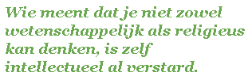
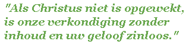

Ik ga nog een beetje voortborduren op de verhouding tussen geloof en rede en tussen waarheid en twijfel.

## Intellectuele ingesteldheid

Welke intellectuele ingesteldheid moet je hebben om te kunnen geloven?

Om te geloven moet je een **logisch** verstand hebben. Je kan niet ten volle geloven in iets dat je zelf niet kan beredeneren. Geloven is immers niet meer dan een speciale vorm van weten. In Vlaanderen gebruiken we vaak zinsnedes als "ik geloof dat het buiten regent", misschien is dat in Nederland ook courant? In elk geval is dat 'ik geloof' geen hypothetische veronderstelling, maar een logische gevolgtrekking uit een empirische vaststelling (bijvoorbeeld: je vriend die druipnat binnenkomt). Geloven in God verschilt daar eigenlijk niet zo veel van.

Om te geloven moet je ook **eenduidig** kunnen denken. Geen denken dat elk fenomeen in vijf verschillende theoretische denkkaders gaat analyseren en overal van zegt "het is een beetje van dit, en ook een beetje van dat". Iets is wat het is, en anders niet, en bij gebrek aan uitsluitsel gebiedt het gezond boerenverstand aan te nemen wat het meest voor de hand liggend is, want daarmee kan je tenminste verder.

Om te geloven moet je **onafhankelijk** kunnen denken. Hoewel er sprake is van een geloofsgemeenschap, is de geloofsdaad in essentie individueel.(1) Maar dat wil niet zeggen dat je je geloof zelf moet uitvinden! Geloof baseert zich op een openbaring en op getuigenis, die elke gelovige voor zichzelf moet toetsen en aannemen. Daarom kan je maar onafhankelijk geloven bij gratie van de traditie, want als de openbaring niet correct wordt overgeleverd, is een onafhankelijke benadering onmogelijk. Niet verwonderlijk dus dat de Kerk van bij het begin de apostolische traditie heeft ingesteld om de traditie te bewaken. De waan van de dag die vanuit de media het denken is gaan overheersen, is vandaag de grootste bedreiging voor onafhankelijk denken.

Om te geloven moet je denken **vrij** zijn van bijbedoelingen. Je kennis moet natuurlijk ten dienste staan van alles wat je onderneemt, maar omwille van een bepaalde doelstelling mag kennis niet 'gekneed' worden.

Om te geloven mag je denken **niet verstard** zijn. Je zal moeten vaststellen dat een aantal bekende 'waarheden' onjuist of onvolledig zijn. Op dat moment moet je genoeg nederigheid hebben om even door het stof te gaan en toe te geven dat je je kennis van wat waar is, moet bijstellen. Een verstarde geest kan zo'n proces van bekering niet aan.

En _last but not least_ moet je **_out of the box_** kunnen denken. Het verstand kan de werkelijkheid niet bevatten en mag dan ook de werkelijkheid niet inperken tot het domein dat het in staat is te bevatten. En dit is precies de grootste redeneringsfout van het rationalisme.

Zijn dat intellectuele kwaliteiten die u ook heeft? Nou, proficiat dan!

## Rolmodellen

Oms ons verder te helpen heeft Jezus ons ook rolmodellen gegeven.

- Om te beginnen de **apostelen**, van wie de meesten eenvoudige vissers waren, ruwe maar eerlijke werklui, en niet gespeend van een dosis gezond verstand.
- Ook heel expliciet heeft Jezus ons gewezen op de **kinderen** of 'eenvoudigen van geest', Daarmee bedoelde Hij geen kinderlijke naiviteit, maar wel kinderlijke openheid, waarin ook het onverwachte of onalledaagse een plaats kan krijgen.

 De ideale gelovige: eenvoudig van geest en met een breed denkraam

- Met het standje dat **Martha** krijgt, maakt Jezus duidelijk dat men zich niet moet verliezen in het materiële, maar zich evengoed moet openstellen voor het puur geestelijke.
- Verder treden er in de evangeliën nog tal van mannen en vrouwen op wiens geloof Jezus roemt, en die zich daardoor genezen weten van allerlei kwalen. Van de meesten worden geen intellectuele kwaliteiten onthuld anders dan hun grenzenloos vertrouwen in Jezus, maar Jezus 'gebruikt' hun genezing wel om de intellectuele gebreken van anderen aan het licht te brengen, zo ging het bij de genezing van de lamme eigenlijk over het dispuut met de farizeeën dat Jezus geen zonden zou kunnen vergeven, en was de genezing van blinde Bartimeüs eigenlijk geen steek onder water naar de leerlingen toe, die maar niet wilde zien (geloven) wat voor koning Jezus wilde zijn?
- En tenslotte zijn er natuurlijk de archetypische tegenpolen van de intellectuele geloofshouding: de **farizeeën en schriftgeleerden**. Jezus heeft voor hen geen goed woord over, want ze hebben wel de kennis die nodig is voor het geloof, maar ze passen die selectief toe op anderen, en niet op zichzelf en ze zijn intellectueel niet bereid of bekwaam in te zien dat de Vervulling van 'hun' Schrift hen in het gezicht aankijkt.

Ik vermoed dat we in die rolmodellen de voornoemde intellectuele ingesteldheid wel kunnen herkennen. Richten we ons op deze rolmodellen en meten we ons de noodzakelijke intellectuele instelling aan, dan is het mogelijk te geloven. Maar waarom kost het ons zoveel moeite?

## Oefeningen

Ook gebed helpt ons om de juiste intellectuele positie te vinden waarin geloof mogelijk wordt. In twee heel bekende gebeden, de oefening van geloof en van hoop, is me opgevallen hoe expliciet wordt ingegaan op de intellectuele grondslag van dat geloof en die hoop.

De [oefening van geloof](http://www.katholiekgezin.nl/index.php?option=com_content&task=view&id=723&Itemid=31):

> Mijn Heer en mijn God, ik geloof: dat Gij zijt één God in drie Personen: de Vader, de Zoon en de Heilige Geest.
> 
> Dat de Zoon voor ons is mens geworden en aan het kruis gestorven.
> 
> Dat Gij het goede loont en het kwade straft.
> 
> **Ik geloof alles, wat Gij hebt geopenbaard, en door de Heilige Kerk ons leert.**
> 
> **Dat geloof ik vast, omdat Gij het hebt gezegd, die alles weet en altijd waarheid spreekt.**
> 
> Heer, vermeerder mijn geloof.
> 
> Amen

De [oefening van hoop](http://www.katholiekgezin.nl/index.php?option=com_content&task=view&id=723&Itemid=31):

> Oneindig goede God, door de verdienste van Jezus Christus
> 
> hoop ik van U de eeuwige zaligheid te verkrijgen
> 
> en alle genaden die ik daarvoor nodig heb.
> 
> **Dat hoop ik met een vast vertrouwen, omdat Gij het hebt beloofd,**
> 
> **die almachtig zijt, oneindig goed, en getrouw in Uw beloften.**
> 
> Heer, versterk mijn hoop!

Beide gebeden gaan natuurlijk eerst in op de inhoud van geloof en hoop, maar beklemtonen vervolgens heel sterk de reden, de noodzakelijke vaste grond van geloof—de openbaring—en van hoop—de verbondsgedachte.

## Verlichting

Misschien is het wat kort door de bocht, maar het kan toch geen toeval zijn dat twee pausen, Benedictus XIII en Benedictus XIV, beiden uit de eeuw van de Verlichting, grote pleitbezorgers waren voor het bidden van de oefeningen van geloof, hoop en liefde? Beide pausen waren zo'n fan van deze gebeden, dat ze in het [Enchiridion Indulgentiarum](http://nl.wikipedia.org/wiki/Aflaat#Herstel) aflaten voorzagen voor wie deze gebeden bad.

Gedurende een half millennium dicteert reeds de Verlichting ons denken. Haar rationalisme, haar determinisme en haar ge-ideologiseerde mensbeeld belemmeren ons gelovig denken. Zij laat hoogstens nog plaats om te geloven in "iets" waarvan je eigenlijk in je binnenste weet dat het niet bestaat. Ik vraag me af welk boerenverstand daar nu zijn tijd aan gaat verspelen... en toch loopt het tegenwoordig binnen en buiten de kerk dik van 'iets-isten'.

De Verlichting compliceert het denken, waardoor er een ogenschijnlijke tegenstrijdigheid wordt opgeroepen tussen rede en geloof, maar juist deze twee gebeden beklemtonen dat ons geloof wel degelijk empirische en rationele grondvesten heeft.

## Geen conflict tussen geloof en wetenschap

Is er dan geen werkelijk conflict tussen geloof en rede?

Bij het begin van het artikel heb ik heel wat intellectuele kwaliteiten opgesomd die nodig zijn om—vanuit een hedendaags, eenzijdig 'verlicht' denkraam—tot geloof te kunnen komen. Logica, eenduidigheid,  onafhankelijkheid, vrijheid, onverstardheid, out of the box-denken... Verrassend genoeg zijn dat net dezelfde kwaliteiten die—vanuit een middeleeuws, eenzijdig 'religieus' denkraam—grote wetenschappelijke inzichten hebben mogelijk gemaakt. Gelovig denken of wetenschappelijk denken is dus in wezen niet verschillend, alleen werk je met een andere set axioma's en stellingen. Waarom hebben we dan zo'n probleem met de combinatie van religie en wetenschap?

Het probleem met geloof en wetenschap is niet zozeer dat het ene het andere belemmert, maar dat we niet de juiste intellectuele ingesteldheid hebben om de _mind-switch_ te maken tussen religieus en wetenschappelijk denken. Wie meent dat je niet zowel wetenschappelijk als religieus kan denken, is zelf intellectueel al verstard.

Een katholiek hoeft zich dus niet te schamen of van de wereld uitgesloten te voelen omdat hij hetgeen hij 's zondags in de kerk tijdens het credo mee reciteert, ook daadwerkelijk gelooft, en omdat hij aan de werkelijkheid van de scheppende, mensgeworden, verrezen en rechtvaardige drie-ene God ook de logische consequenties koppelt in zijn religieus en dagelijks leven.

Iemand die die schaamte overwonen heeft, is de bioloog Vincent Kemme die als Biofides publiceert en uitgezonden wordt op Radio Maria. In een recente lezing "[Opstaan uit de dood](http://soundcloud.com/biofides/opstaan-uit-de-dood?utm_source=soundcloud&utm_campaign=share&utm_medium=raw&utm_content=http://soundcloud.com/biofides/opstaan-uit-de-dood)" duidt hij hoe de wetenschap en het geloof in de werkelijke opstanding van Jezus—noodzakelijk voor het geloof—niet tegenstrijdig moeten zijn.

En ook onze paus is erg bezorgd over de dialectiek tussen geloof en wetenschap. Zijn visie komt goed tot uiting in het hoofdstuk over de opstanding in zijn tweede Jezusboek. Ik zal daarom bij wijze van besluit schaamteloos enkele stukken uit het hoofdstuk citeren:

> "Als Christus niet is opgewekt, is onze verkondiging zonder inhoud en uw geloof zinloos. Dan blijkt dat wij als getuigen van God over hem heben gelogen, omdat we verklaard hebben dat hij Christus heeft opgewekt" (1 Kor 15,14-15). Met die woorden maakt de heilige Paulus heel drastisch duidelijk welke betekenis het geloof in de opstanding van Jezus Christus heeft voor de christelijke boodschap als geheel: het is de basis ervan. Het christelijke geloof staat of valt met de waarheid van het getuigenis dat Christus uit de doden is opgestaan.
> 
> Wanneer die wordt weggenomen, kunnen mensen vanuit de christelijke overlevering nog altijd een reeks interessante ideeën over God en de mens, en over bestaan en moraal samenbrengen, een soort religieus wereldbeeld, maar dan is het christelijke geloof dood. Dan was Jezus een religieuze figuur die in zijn opzet gefaald heeft en die ondanks zijn falen, groot blijft en ons tot nadenken kan aanzetten. Maar hij blijft dan in het puur menselijke en zijn gezag reikt maar zo ver als zijn boodschap voor ons te vatten is. Hij is niet meer de maatstaf; de maatstaf is dan alleen nog ons eigen oordeel dat uit zijn erfenis kiest wat voor ons nuttig lijkt. En dat betekent: dan staan wij er aleen voor. In laatste instantie telt alleen ons eigen oordeel.
> 
> In zijn kern is er maar één geloof, tot in zijn letterlijke verwoording—het verbindt alle christenen.
> 
>  Maar kan het echt zo gebeurd zijn? Kunnen wij—met name als moderne mens—geloof hechten aan zulke getuigenissen? Het verlichte denken zegt: nee.  Het lijkt evident dat 'de traditionele ideeën over de verrijzenis van Jezus gezien de omwenteling van het natuurwetenschapelijke wereldbeeld als achterhaald moeten worden beschouwd'. Maar wat is nu precies dat 'natuurwetenschappelijke wereldbeeld'? Hoe ver reikt de normativiteit ervan?  Natuurlijk kan er geen tegenspraak bestaan met wetenschappelijke bevindingen. In de verrijzenisgetuigenissen wordt echter over iets gesproken wat in onze ervaringswereld niet voorkomt. Er wordt over iets nieuws, toen eenmaligs gesproken—over een nieuwe dimensie van de werkelijkheid die zich toont. Het bestaande wordt niet bestreden.
> 
> Het lege graf als zodanig kan de verrijzenis niet bewijzen, dat is waar. Maar we kunnen de vraag omkeren: is verrijzenis te verzoenen met de aanwezigheid van het lijk in het graf? Kan Jezus verrezen zijn wanneer Hij in het graf ligt? Wat voor verrijzenis is dat dan? Tegenwoordig heeft men visies op de verrijzenis ontwikkeld, waarin het niet belangrijk is wat er met het lijk is gebeurd. Daarbij wordt echter de inhoud van het begrip 'verrijzenis' zo vaag, dat we ons moeten afvragen met welk soort realiteit we in dat christendom eigenlijk nog te maken hebben.
> 
> Theologische speculaties die stellen dat ontbinding en verrijzenis van Jezus verzoenbaar zouden zijn, zijn kenmerkend voor het moderne denken en druisen regelrecht in tegen de Bijbelse visie.
> 
> Voor mij is de viering van de dag van de Heer, die vanaf het begin deel uitmaakt van het leven van de christelijke gemeenschappen, een van de sterkste bewijzen dat op die dag iets buitengewons is gebeurd: de ontdekking van het lege graf en de ontmoeting met de opgestande Heer.
> 
> Wat kunnen wij nu op basis van al die Bijbelse verhalen echt zeggen over het specifieke van de verijzenis van Christus? Het is een historisch gebeuren dat echter door het historische kader breekt en erboven uitstijgt. Misschien mogen we ons van een analoge taal bedienen die in veel opzichten inadequaat blijft, maar toch een weg kan bieden tot begrip: we zouen de verrijzenis kunnen beschouwen als een soort radicale 'mutatiesprong', waarin een nieuwe dimensie van het leven, van het mens-zijn zich openbaart. De materie zelf wordt tot een nieuwe wijze van zijn omgevormd. De mens Jezus behoort nu, ook met zijn lichaam, helemaal de sfeer van het goddelijke en van het eeuwige toe.

* * *

(1) Evenzo is de Verlossing, die bewerkstelligd wordt door het geloof, in essentie een individueel gebeuren. Ik vind het mooi dat de kleine Mechelse Catechismus op de vraag "Voor wie heeft Jezus Christus geleden en is Hij gestorven?" als ietwat uitvoerig antwoord geeft: "Jezus Christus heeft geleden en is gestorven voor alle mensen en voor ieder in het bijzonder." Die schijnbaar overbodige toevoeging maakt duidelijk dat de verlossing zich individueel voltrekt. Het is geen collectieve verlossing.
