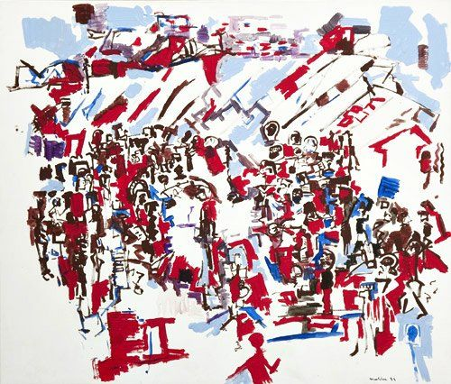
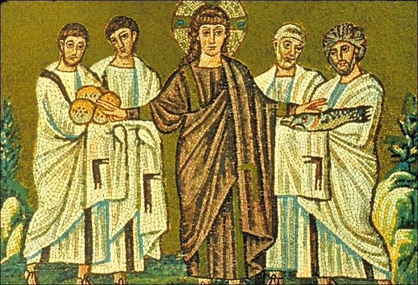

Komende zondag wordt het evangelie van de wonderbaarlijke broodvermenigvuldiging gelezen. Een populair verhaal in het lectionarium, wellicht omdat het zo nauw aansluit bij het sacrament van de eucharistie. Misschien zegt het verhaal wel meer over de eucharistie dan het verhaal van Witte Donderdag zelf, wanneer de eucharistie wordt ingesteld. Best de moeite waard om even bij stil te staan.

La multiplication des pains (Jacques Muller, 1992, © Jacques Muller)

Op missale.net verschijnt als illustratie bij de lezing een abstrakt werk "La multiplication des pains" van Jacques Muller. Ik ben zelf zo geen groot liefhebber van abstracte kunst, zeker niet als het gaat over geloofsverbeelding, maar in dit geval is het wel op zijn plaats: een wonder is abstract.

Maar zeggen dat een wonder abstract is, impliceert niet dat het onwerkelijk is, of dat concrete begrippen er niet op van toepassing zijn. Ik ben me beginnen afvragen hoe  het wonder van de broodvermenigvuldiging zich feitelijk heeft kunnen voltrokken. De bijbel verhaalt slechts twee toestanden: het voor en het na. Voor de vermenigvuldiging plaatsvindt, zijn er vijf broden en twee vissen, en duizenden hongerige mensen. Na de vermenigvuldiging zijn er twaalf manden overschot en duizenden voldane mensen. Wat is er intussentijd gebeurd?

Jezus spreekt een gebed uit en zegt aan zijn leerlingen dat ze het brood en de vissen moeten uitdelen, "zoveel men maar wil".  En later vraagt hij het overschot op te halen, "opdat er niets verloren gaat".

Hoe kan het wonder van de vermenigvuldiging zich fysisch voltrekken? Daarover zeggen de evangelisten niets. Maar er valt misschien wel een en ander af te leiden uit wat ze wel vertellen.

Allereerst: het brood en de vissen zijn niet uit het niets gekomen. Het is geen 'schepping', maar een 'vermenigvuldiging'. Er is brood en vis van bij het begin, maar te weinig. Uit dat weinige is voldoende brood en vis voortgekomen voor duizenden mensen. Het is niet zo dat er plotsklaps een hele berg voedsel ligt, maar er is een continue vermeerdering, een groei van wat  er al is.

Ook opmerkelijk: het is niet in Jezus' handen dat het wonder zich voltrekt. Jezus spreekt het dankgebed uit over vijf broden en twee vissen. Dat is duidelijk verhaald in het evangelie, en tot dan is er nog niets wonderlijks gebeurd. Jezus geeft vervolgens aan zijn leerlingen de opdracht het voedsel uit te delen. Het moet dus in de handen van de apostelen zijn, dat het wonder zich feitelijk voltrekt. Hoe? Dat wordt niet verteld. Breken zij het brood, en blijven de twee helften even groot als de oorspronkelijke homp? Dat zou kunnen -niet dat ik het kan verklaren, het blijft per slot van rekening een wonder, maar zo kan ik het me wel voorstellen. Zo kunnen ze blijven breken en uitdelen, totdat iedereen voldoende heeft, en wanneer ze de laatste hompen zonder te breken uitdelen, is het wonder voltooid.

Stel je nu in de plaats van een van de leerlingen. Je weet niet wat je moet verwachten als je de opdracht krijgt met zo weinig voedsel zoveel mensen eten te geven, maar je vertrouwt op Jezus. Wat doe je? Je gaat naar het eerste groepje, en je breekt een stuk van een brood en je geeft het hen. Maar bij het breken, en misschien zelfs zonder dat je het meteen merkt, zijn beide helften gegroeid en bij het volgende groepje kan je weer een stuk van een brood breken, zonder dat de voorraad in je mand vermindert. Na het tweede of het derde groepje krijg je het door: hier gebeurt een wonder! Hoe reageer je? Een wetenschappelijke geest zou stoppen met uitdelen, een weegschaal opstellen en proberen te verifieren hoe de broodmassa zichzelf bij het breken vermeerdert. De leerlingen echter laten zich niet van de wijs brengen, en delen voort uit, tot iedereen voldoende heeft.

Als het wonder zich op deze, haast vanzelfsprekende wijze voltrekt, zullen de meeste mensen zelfs niet in de gaten hebben dat er iets merkwaardigs gebeurt. Daarom vraag Jezus na afloop om opnieuw ronde te doen, ditmaal om het overschot op te halen. Pas dan, zo vertelt ook de evangelist, zien de mensen het wonder dat zich voltrokken heeft.

Hoewel het dus een groot wonder is, doet het zich heel subtiel voor, haast onmerkbaar. Het is daarom dat ik een abstract schilderij wel nuttig  vind om dit wonder te verbeelden, omdat een figuratief werk alleen maar de toestand voor of na het wonder kan weergeven, en een abstract werk de focus op het onzichtbare kan leggen.

Het verhaal vertelt veel over de eucharistie, een heel gelijkaardig wonder dat zich elke zondag voor onze ogen voltrekt, maar zonder dat we het zelf verifieerbaar kunnen zien gebeuren. Ook dat wonder vertrekt van 'iets': gewoon brood. Ook dat wonder voltrekt zich weliswaar door Jezus,  maar in de handen van zijn apostelen (in casu de priester, die de Mis opdraagt op last van de bisschop en dus vanuit de apostolische traditie). Ook dat wonder kennen we maar door een beschrijving van de toestand voor de consecratie (brood) en de toestand na de consecratie (lichaam), zonder evenwel de overgang (de 'transsubstantiatie') te kunnen bepalen. Ook dat wonder kunnen we niet verifieren met onze wetenschappelijke geest. Ook dat wonder zet zich continu voort: elke zondag opnieuw, in elke kerk in de wereld, vermenigvuldigt zich het eucharistisch brood.

Een mooie vergelijking, zal je zeggen, maar er blijft een wezenlijk punt openstaan. Waar zijn die twaalf manden overschot, waaraan ook wij het profetisch wonder zullen herkennen dat zich voltrekt in de Heilige Mis? Waar blijft onze voldaanheid?

Die 'overschot', dat zijn wijzelf. Door het eten van het brood, dat lichaam werd, worden wijzelf ook deel van  lichaam. Daarom is er in de eucharistie geen overschot aan brood: alles wordt bewaard in de mens. De uitwerking van de eucharistie is de eenheid van de Kerk in en door Christus' lichaam. Daardoor zijn we verbonden met gelovigen overal ter wereld en in alle tijden, die door hetzelfde brood te eten van hetzelfde lichaam deel uitmaken.

Wij zijn de broodkruimels die Jezus opnieuw verzameld wil zien, opdat er niemand zou verloren gaan. Wanneer Hij ons heeft verzameld, zullen we voldaan zijn en het wonder zien.
