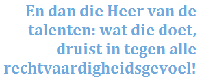
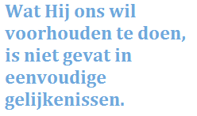

Jezus hield van parabels. Eenvoudige verhalen over mensen, maar die iets vertellen over God. We noemen ze soms ook 'gelijkenissen'. Maar ik denk niet dat die naam juist is. Veel van die parabels zijn verhalen die ergens niet kloppen, toch niet vanuit menselijk perspectief.

Een paar voorbeelden. Een herder laat zijn kudde aan de rovers over, om één verloren schaap te zoeken. Een vrouw die er geen boterham minder om hoeft te laten, gaat een halve dag lopen zoeken naar een verloren centje. Een vader wiens zoon al zijn geld heeft verbrast, richt een groot feest aan wanneer die zoon haveloos terugkomt, en zet daarmee zijn trouwe zoon te schande. Een bruidegom laat vijf bruidsmeisjes midden in de nacht in de kou staan, omdat ze te laat zijn. Een meester straft zijn dienaar, van wie hij wist dat hij tot weinig bekwaam was, terwijl hij zijn ene talent veilig en wel bewaard heeft, zoals hem was gevraagd!

We kunnen die parabels niet begrijpen als we ze proberen uit te leggen met "God is als de goede herder" of "God is als de vader van de verloren zoon" of "God is de bruidegom" of "God is de Heer van de talenten", want die verhalen kloppen langs geen kanten, en wat hoort dat dan te zeggen over God?

Een goede herder blijft immers bij zijn kudde. Een vrouw die een cent verliest, zorgt beter dat haar huishouden is gedaan, in plaats van tijd te verliezen met zoeken. De vader van de verloren zoon zal dan wel blij zijn dat zijn zoon terug is, maar zou hem beter de les spellen in plaats van hem op te hemelen. En dan die Heer van de talenten! Wat een onrechtvaardigheid om zijn kleinste dienaar, die al zo weinig toevertrouwd kreeg en er -op zijn manier- dan nog goed heeft voor gezorgd, alles af te nemen, te verdelen onder de grotere dienaars en hem aan de deur te zetten. Wat die doet, druist in tegen alle rechtvaardigheidsgevoel, om nog maar te zwijgen van barmhartigheid.

Wat is nu de boodschap van die parabels? Is God een roekeloze herder? Een huismoeder die haar tijd verliest? Een vader die zijn zoons ongelijk behandelt? Een bruidegom die de deur dichtslaat voor zijn bruidsmeisjes? Een meester die een arme alles afneemt en uitdeelt aan de rijken?

Als de parabels ons iets kunnen vertellen over God, is het dat God _niet_ is zoals de mensen, _niet_ oordeelt zoals mensen en _niet_ te begrijpen is zoals mensen mekaar (menen te) begrijpen.

Wanneer een mens het zou opgeven om een ander te redden, juist dan zet God door. Wanneer een mens alles op alles zou zetten om iemand bij zich te houden, juist dan zegt God: vertrek maar. Wanneer een mens radikaal zou willen veroordelen, juist dan toont God barmhartigheid. Wanneer een mens zou zoeken naar een goedhartige oplossing, juist dan kent God geen genade en oordeelt streng en definitief.

Zo is God: onafgebroken verwikkeld in een strijd met ons -menselijk- geweten, met ons -oh zo verheven- gevoel voor goed en kwaad. En wat Hij ons wil voorhouden te doen, is niet gevat in eenvoudige gelijkenissen, maar is een onderdeel te worden van die strijd.
