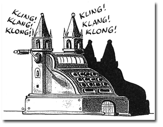

U heeft ervan gehoord: in Duitsland hebben de bisschoppen beslist dat wie geen _kirchensteuer_ betaalt, zich buiten de katholieke gemeenschap plaatst en als gevolg daarvan geen sacramenten meer kant ontvangen. Een [Amerikaanse](http://vox-nova.com/2012/09/25/is-it-church-discipline-or-simony/) commentator beschuldigt het episcopaat kortweg van simonie. In de Vlaamse pers hoorden we nog maar weinig commentaren, behalve de obligate [Rik Torfs](http://www.standaard.be/artikel/detail.aspx?artikelid=DMF20120925_00311109&utm_source=feedburner&utm_medium=feed&utm_campaign=Feed%3A+dso-meningen-opinie+%28De+Standaard+Opinie%3A+Opinie%29&utm_content=Google+Reader). Gelukkig is dit het thema waarin hij professioneel actief is, dus bleef het een keer niet bij _freewheelen_. Kerkrechterlijk hangt de beslissing volgens hem aaneen met haken en ogen, maar tot slot van zijn commentaar legt hij ook een filosofische contradictie bloot: "enerzijds slagen mensen er niet in de kerk te verlaten wanneer ze dat willen, anderzijds verbreken ze de gemeenschap zonder dat te willen."  In Duitsland komt de kritiek vooral van modernistische kant.

\[caption id="" align="alignleft" width="192"\] Kirchensteuer\[/caption\]

Een beweging als [Wir sind Kirche](http://www.wir-sind-kirche.de/?id=128&id_entry=4209) wil de kerk moderniseren en krijgt dan gemakkelijk van de kerkelijke overheid te horen dat die modernisering misschien in Duitse context wel wenselijk lijkt, maar dat ze ook de wereldkerk in rekening moet nemen. Op stek van een Duitse krant las ik een lezersbrief die terecht aanvoerde dat het nu de kerkelijke overheid zelf is, die zich terugplooit op de nationale context.

Hoe dan ook, we moeten hier in Vlaanderen niet teveel commentaar geven, want wij hebben gemakkelijk praten! Ook onze kerk wordt integraal bekostigd door de overheid, maar dan wel met belastinggeld van _alle_ burgers, ongeacht of ze daarvoor zouden kiezen of niet. Vanzelfsprekend kent de Vlaamse kerk dus dit soort problemen niet.

**Het Duitse systeem van kerkfinanciering rammelt, maar het is nog altijd heel wat rechtvaardiger dan het Vlaamse systeem, en dat geldt voor niet-gelovigen, maar ook voor gelovigen.**

Ik ben er nogal gerust in dat in Duitsland, in concrete gevallen, de barmhartigheid de overhand zal nemen op de strengheid van de reglementering. Zo gaat dat immers meestal als regels in de Kerk worden toegepast. Maar in Vlaanderen _lijkt_ het maar alsof de Kerk barmhartig is. Een gelovige die naar een mooi gerestaureerde kerk kan gaan en aan wie geen lastige vragen worden gesteld als hij de sacramenten wil ontvangen en die kan volstaan met wat kopergeld in de schaal te werpen, die heeft natuurlijk via zijn belastingen al substantieel bijgedragen in de loonkost van zijn pastoor en het onderhoud en de verwarming van zijn kerk, tot de aankoop van hostiebrood toe. Maar zijn ongelovige buurman eveneens! Het schaamrood komt me op de wangen, want ik zou het niet aandurven mijn ongelovige buurman te vragen bij te dragen in de kosten van mijn geloofsgemeenschap, maar toch doet hij het. Als er in deze iemand barmhartig is, is het wel mijn buurman...

De enige reden die ik kan bedenken waarom een sterk geseculariseerd Vlaanderen deze vetpotten nog niet heeft geleegd, is dat de politieke klasse er belang bij heeft om de Kerk niet alleen te vriend te houden, maar ook om de Kerk te laten evolueren naar een soort van staatskerk, een bijkomend kanaal om de heersende burgerlijke normen en waarden uit te dragen in de gemeenschap.

En de Vlaming, die laat het over zich heengaan. We zijn een samenleving die in een vicieuze cirkel zit van staatsusurpatie. Meer en meer domeinen van het openbaar leven worden gecontroleerd door de overheid, die daarvoor budgetten nodig heeft, waardoor de belastingdruk verhoogt. Als een privaat initiatief ergens geld voor nodig heeft, reageert de gepluimde burger spontaan: daar geef ik niks aan, die moeten maar subsidies vragen. Zo worden niet-gesubsidieerde organisaties weggeconcurreerd en krijgt de staat het monopolie om te bepalen welke initiatieven middels subsidie kunnen blijven bestaan. Wie in dit aanbod zijn gading niet vindt, moet op zoek naar niet-gesubsidieerde initiatieven, als die nog bestaan, maar die kosten dan weer geld, zodat de kritische burger uiteindelijk twee keer langs de kassa passeert.

**Ongelovigen moeten bijdragen in de kosten van een geloofsgemeenschap... En die geloofsgemeenschap is weinig meer dan een zoveelste subsidieapparaat van een aan obesitas lijdende overheid... Zowel gelovigen als ongelovigen worden bedrogen!**

Het is gemakkelijk om kritiek te geven op de onbehouwen aanpak van de Duitse bisschoppen, maar wanneer zal de kerk in Vlaanderen voor dezelfde verantwoordelijkheid geplaatst worden? Wanneer zullen onze bisschoppen, net als hun Duitse collega's, voelen wat het is hun gelovigen te responsabiliseren---en welke maatregelen zullen zij nemen? Wanneer zullen onze gelovigen, en onze niet-gelovigen, net als in de meeste andere landen, inzien dat de kerk teert op een helemaal niet vanzelfsprekende vorm van solidariteit---en zouden zij bereid zijn hun kerk op vrijwillige basis te financieren? Toch wel indringende vragen die je mag stellen alvorens kritiek te uiten op het Duitse episcopaat, dat eigenlijk niet meer vraagt dan wat me maar normaal lijkt als je je engageert in een gemeenschap...
