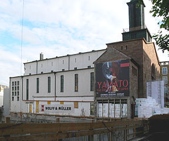
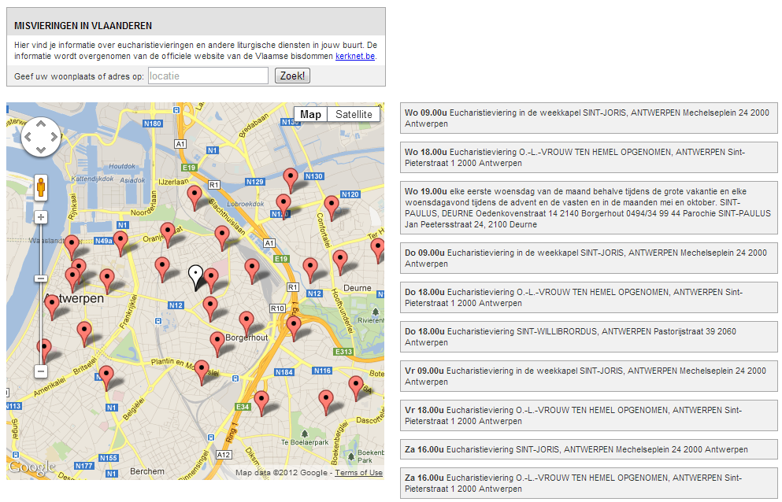

Enkele weken geleden bracht ik een weekend door in Stuttgart. We zaten op een zonnig terrasje toen mijn oog viel op een modern gebouw aan de overkant van de straat met een groot opschrift _"Haus der Katholischen Kirche"_... even binnenwippen. De ruime galerij was druk bevolkt en bood plaats aan enkele winkeltjes van religieuze boeken en andere artikelen en aan een gezellig cafetaria. Al vanop de straatkant kreeg je zicht op luchtige vergaderzalen waar men druk aan het werk was en het inlichtenbord verried de aanwezigheid van tal van conferentieruimtes. Aan de zijkant van de galerie bevond zich een kleine deur met het opschrift "Domkirche", wat een zijingang bleek van de kathedraalkerk van het bisdom die zelf haar hoofdingang heeft pal in de drukste winkelstraat van de stad, op vijf stappen van het grootste knooppunt van openbaar vervoer in de stad.

Met zo'n infrastructuur moet het een plezier zijn om actief kerkelijk te zijn en het is ongetwijfeld een trekpleister voor gelovigen uit de ganse stad en haar omgeving. Als de vraag rijst wat we met onze kerkgebouwen moeten doen, ligt in Stuttgart een mooi voorbeeld hoe de _kirchensteuer_ op een eigentijdse en efficiënte manier kan worden aangewend! Benieuwd of onze Antwerpse bisschop in zijn aangekondigd toekomstplan voor de kerk en haar gebouwen ook zo'n visionaire voorstellen op tafel zal leggen.

Ik heb natuurlijk ook even op de bijhorende [webstek](http://www.hdkk-stuttgart.de/index.php) rondgesnuisterd en wat ik dan vaak even doe is misschien een blijk van een slecht karakter, maar ik vraag me dan af of er naast het ruime aanbod van ontmoetingen en lezingen ook praktische informatie te vinden is voor de actieve gelovige, want daar durft het in zo'n onthaalcentrum dan wel eens aan schorten. "Waar kan ik op zondagavond nog naar de mis gaan", of "waar kan ik terecht voor de biecht?". Het komt me dan vreemd voor dat dit soort informatie vaak ver zoek is. Als je de zoektermen _"Sakrament der Versöhnung"_ of _"Beichte"_ ingeeft, is het resultaat inderdaad: _"Leider wurde mit Ihrer Suchangabe nichts gefunden."_ Toch jammer mocht er iemand op zoek gaan naar deze informatie, hoe klein die kans misschien ook is...

 Zijaanzicht van de Domkirche bij de bouw van het "Haus der Katholischen Kirche". De witte zijgevel is nu volledig ingevat in het nieuwe gebouw.

Nu gebiedt de eerlijkheid toe te geven dat wie wat doorklikt, toegang verkrijgt tot een andere kerkelijke [website](http://www.kath-kirche-stuttgart.de/gottesdienste/), waar wel gecentraliseerde informatie te vinden is over de agendering van misdiensten, biechtgelegenheid, rozenkransgebed en andere liturgische activiteiten in de Stuttgartse kerken. En dat is zelfs al een hele stap vooruit als je dezelfde data zoekt in Vlaanderen, waar je hoogstens de uren van de misdiensten kan vinden, en dan nog op een heel gebruiksonvriendelijke manier, door op kerknet.be één voor één al de parochies in de stad aan te klikken. Met de parochiale mobiliteit van de hedendaagse gelovige in het achterhoofd is de informatie op kerknet onbruikbaar, zeker in stedelijke context.

Ik vraag me af of de verdokenheid van dit soort informatie een bewuste strategie is om de website 'aantrekkelijk' te houden voor 'randkerkelijke zinzoekers', die men probeert aan te lokken met toegankelijke nevenactiviteiten, dan wel of het een zorgwekkende blinde vlek verraadt in het aandachtsveld van het kerkelijk communicatiemanagement, want voor mij blijven de sacramenten toch het centrum van het kerkelijk leven.

Wat wel volop aandacht krijgt op de website van het "Haus der Katholischen Kirche" is de "Raum der Stille", een stille gebedsruimte in de kelder van het Huis, waar men uitgenodigd wordt om in stilte meditatief te bidden. Ook heel mooi, maar dan vraag ik me weer af wat de meerwaarde daarvan is, onder het dak van de Domkirche zelf, die toch de locatie bij uitstek is om—in de aanwezigheid van het heilig Sacrament—tot gebed te komen? In die Domkirche was het trouwens óók heel stil, toen ik de deur van het cafetaria achter me sloot om even een kaarsje aan te steken...

PS. om niet alleen maar kritiek te uiten, heb ik de daad bij het woord gevoegd en is er nu een app beschikbaar waarop de agendering van de misvieringen zoals die beschikbaar is op kerknet.be op een meer gebruiksvriendelijke manier kan worden geraadpleegd.

http://misvieringen.my28msec.com/misvieringen.html

 Misvieringen in Vlaanderen

