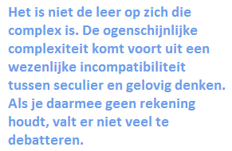

Katholieken en media... het blijft wringen. Discussies op sociale fora en zelfs debatten op tv, het zijn zo vaak dovemansgesprekken. Je zou evengoed kunnen proberen Kung en Williamson met mekaar in gesprek te brengen.

Vorige week was het weer hommeles na een debat met Katholiek-Nieuwsbladhoofdredacteur Mariska Dehaas-Orban over homo-ouderschap.

Het mag dan goedkoop zijn van [Erik van den Berg](http://katholiek.nl/asp/default.asp?t=weblog_detail&weblog_id=6660) om in het debat bij [Paul en Witteman](http://www.youtube.com/watch?v=USGqvQT3moM) weer eens een aanleiding te zoeken om zijn concurrente onderuit te halen (er kunnen immers geen twee 'spreekbuizen van katholiek Nederland' zijn), maar hij legt wel de vinger op de wonde: de katholieke leer en praxis is is niet te vatten in een tv-debat van 10 minuten, laat staan dat ze in tweets of facebookdialogen tot haar recht kan komen.

Hij vindt dat mediapriesters zoals Rodrerick Vonhoegen en Antoine Bodar het veel beter zouden doen. Lijkt dit op een vorm van post-conciliair klerikalisme? Ik ben er alvast niet van overtuigd dat de eerwaarde heren de katholieke leer beter zouden verdedigen, 't is te zeggen: toch niet in 10 minuten. Geef ze enkele sessies van een uur, en ze overklassen Mariska Dehaas-Orban zonder twijfel, maar daar gaat het nu niet over, want dat is ook niet het opzet van dit soort tv-debatten, of we moeten de discussie verleggen naar de zin van dat soort tv.

**Waarom is het dan zo moeilijk om kort en bondig over de katholieke leer standpunten in te nemen? De kerk stelt toch dat haar leer de waarheid bevat en waarheid kan toch geen waarheid zijn als ze niet eenduidig is?**

Het is niet de leer op zich die complex is. De ogenschijnlijke complexiteit komt voort uit een wezenlijke incompatibiliteit tussen seculier en gelovig denken. Als je daarmee geen rekening houdt, valt er niet veel te debatteren.

**Tijd**

Seculier denken is pragmatisch en speelt zich af in een nauw tijdskader. Seculier denken meet de publieke opinie of zoekt andere methoden om te bepalen wat mensen goed vinden, of wat 'goed is voor de mensen'. Al wat goed bevonden wordt, moedigt men aan, en wat slecht bevonden wordt, ontmoedigt of verbiedt men. De omgekeerde logica werkt doorgaans ook: iets dat niet verboden is, wordt als goed beschouwd, en iets dat niet mag als slecht. Zo tracht men het welzijn van de samenleving te verhogen.

Gelovig denken verschilt daarvan grondig. Wat daarin telt is de eeuwigheid, meerbepaald de zaligheid die we in die eeuwigheid kunnen verwerven. Het heden is daaraan ondergeschikt. Wat goed of slecht is, is dan ook  geen gegeven van het hier en nu, maar het is een eeuwig gegeven. Juist omwille van die eeuwigheidswaarde, zijn goed en kwaad in gelovige zin moeilijk te vatten in regeltjes. Dat lijkt contradictorisch, maar het is logisch dat de toepassing van een eeuwige waarheid op een steeds veranderende samenleving ook moet resulteren in steeds veranderende 'gelovige' regeltjes. Er zijn natuurlijk de tien geboden en de morele leer van de kerk, maar de confronterende wijze waarop Christus zelf met de religieuze regels van zijn tijd omging, mag ons erop attent maken dat er meer bij komt kijken dan louter het volgen van vast omlijnde richtlijnen, om van goed of kwaad te kunnen spreken. De farizeeën en schriftgeleerden waren de secularisten van hun tijd (zie maar hoe ze heulden met de Romeinen!); ook zij waren niet in staat Jezus' leer in hun denken in te passen.

**Recht**

Seculier denken is gebaseerd op _rechtvaardigheid_. Recht giet goed en kwaad in regels en zet een straf op overtredingen. Als organisatie van mensen kent de kerk ook zo'n rechtssysteem, maar dat is ondergeschikt aan de basis van het gelovig denken: de _rechtvaardiging_. De vraag is niet: hoe verantwoorden wij ons tegenover de samenleving?, de vraag is: hoe zullen wij ons verantwoorden tegenover God? De strafmaat die God voor onze overtredingen zal opleggen, is ons onbekend. Wat we wel weten is dat God oneindig barmhartig is en klaarstaat om op elk berouw in te gaan, en dat is in seculiere context haast ondenkbaar.

Wie seculiere regels overtreedt, wordt door de overheid gestraft. De kerk daarentegen kan geen straffen uitspreken. Let op, ze kan dat wel in ambtelijke kwesties, maar niet in de kwestie waar het eigenlijk om gaat: ons zieleheil. De overtreder, of 'zondaar' zoals die dan heet, straft zichzelf door Gods oordeel over zich af te roepen. Daarvoor wil de kerk ons behoeden, door in haar leer principes voorop te stellen die ons behoeden voor de weg naar de zonde. Je kan die leer, of elementen ervan zoals de heel concrete gezinsethiek, in discussie stellen, maar dat heeft enkel zin als je ook vanuit een gelovig denkkader vertrekt. Kardinaal Martini mag -volgens Van den Berg- gesteld hebben dat "duurzame en trouwe vriendschap van mensen van het gelijk geslacht zijn waarde heeft", dat doet niks af aan de leer dat een gezin vertrekt vanuit het ouderschap van een vader en een moeder, en dat mag dan ook het standpunt van een gelovige zijn als die gevraagd wordt naar zijn (of haar) mening over burgerlijke regularisering van homo-ouderschap.

**Onmogelijk**

Wordt het nu een beetje duidelijk waarom een gesprek over een ethisch thema zoals homo-ouderschap niet mogelijk is als je de kloof tussen seculier en gelovig denken niet kan overbruggen, al is het maar omdat je de tijd ervoor niet krijgt? Als je als katholiek wordt uitgenodigd op zo'n tv-programma, lijkt me de verstandigste keuze er niet op in te gaan, gezien de onmogelijkheid om een redenering op te bouwen vanuit gelovig denken. Als je er dan toch op ingaat, doe je er beter aan om in essentie de waarheid te zeggen, eerder dan je voor te doen als een zalvend voorbeeld van "christelijke waarden als respect en naastenliefde", zoals Van den Berg dat liever had gezien.
