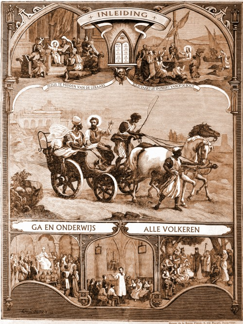

Op 12 oktober 2012 begint voor de katholieke Kerk in de hele wereld het '[Jaar van het Geloof](http://www.rkdocumenten.nl/rkdocs/index.php?mi=650&dos=354)'. Dit jaar staat in het teken van de 'nieuwe evangelisatie', waarmee de Kerk met name in de westerse,  geseculariseerde wereld nieuwe wegen zoekt om het geloof in Jezus Christus te doen herleven.

[Prentencatechismus.org](http://www.prentencatechismus.org) is een project dat voortkomt vanuit het initiatief van enkele jonge ouders en kadert zich met de goedkeuring van de aartsbisschop van Mechelen-Brussel in het wereldwijde kerkelijke jaarthema van de 'nieuwe evangelisatie'. Het project omvat een website die een prentencatechismus uit grootvaders tijd gebruikt als toegangspoort tot de actuele geloofsleer van de Kerk.

 Prentencatechismus

De catechismus is een belangrijk middel om het geloof van de katholieke Kerk uit te dragen. Het is -met de woorden van de paus- "een boek dat de kracht en schoonheid van het geloof voor alle gelovigen uiteenzet". De meest recente uitgave van de [_'Catechismus van de Katholieke Kerk'_](http://rkdocumenten.nl/rkdocs/index.php?mi=600&doc=1) is nu precies twintig jaar jong, met afgeleide publicaties, zoals de recent in meerdere talen verschenen jongerencatechismus [_'YouCat'_](http://rkdocumenten.nl/rkdocs/index.php?mi=600&doc=4005).

Honderdtwintig jaar geleden verscheen zo ook in Parijs _'Le Grand Catéchisme en Images'_, in twee varianten. De eerste variant was een set van zeventig kleurlithografieen op groot formaat, de tweede variant een boekdruk van de zeventig prenten met telkens een begeleidende tekst. Er bestonden zelfs glasdrukken voor lichtprojectie. State of the art in de sector van de multimedia, anno 1891! _'Le Grand Catéchisme'_ baseert zich op de _'Catechismus van het Concilie van Trente'_ uit de zestiende eeuw, die toen als officiële catechismusuitgave gold, maar dat hoeft geen afbreuk te doen aan de inhoud, de leer van de Kerk, die nog altijd even relevant is.

Deze catechismus is bedoeld als aanvullend hulpmiddel bij catechese en uniek in zijn soort door het prentenmateriaal, maar is ook een historisch document. Om de begeleidende teksten toegankelijk te maken, werden ze door een team van vrijwilligers hertaald naar hedendaagse taalnormen. De publicatie wordt aangevuld met historische en theologische reflecties.

[ – Die geboren is uit de maagd Maria")](http://prentencatechismus.org/2011/01/04/derde-artikel-die-geboren-is-uit-de-maagd-maria/) Derde artikel (vervolg) – Die geboren is uit de maagd Maria

[Prentencatechismus.org](http://www.prentencatechismus.org) biedt aantrekkelijk materiaal om kinderen van alle leeftijden over het geloof te vertellen. Elk van de zeventig prenten bevat verschillende bijbelse of allegorische taferelen die in begeleidende catechetische uiteenzetting worden verklaard. Naast de tekst verschijnen koppelingen naar overeenkomstige artikelen in de hedendaagse uitgave van Catechismus van de Katholieke Kerk en andere eigentijdse bronnen. Daarom zullen ook volwassen gelovigen door de ongewone invalshoek en door de toetsing aan de actuele leerpunten van de katholieke Kerk, aanknopingspunten vinden om de inhoud van hun geloof te verdiepen en in een breder perspectief te plaatsen.

Per week wordt een nieuwe prent gepubliceerd, wat ook te volgen is op [Twitter](https://twitter.com/catechismus) en [Facebook](http://www.facebook.com/Prentencatechismus). Al het digitale materiaal kan eenvoudig worden [afgedrukt](http://prentencatechismus.org/drukwerk/). Na publicatie van de volledige verzameling prenten zal de hertaalde versie opnieuw in boekvorm verschijnen.
