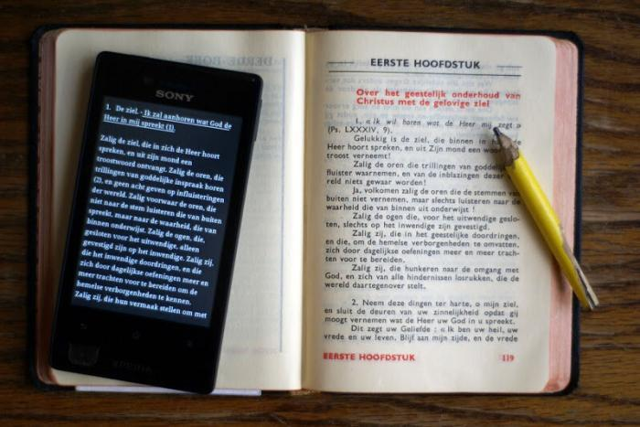

**Apps, apps, apps!**

Onder de kerstboom zal voor mij dit jaar een klein kadootje liggen: een _smartphone_. Hij is nog niet ingepakt, want het is belangrijk zo'n stuk consumentenelectronica goed te testen, kwestie dat er geen productiefouten inzitten :). Dat ben ik nu dus aan het doen.

Ik vond al apps voor mail, agenda, browser, regenverwachting, wegenkaarten, reistijden van het openbaar vervoer, bankieren, QR-codescanning, fotografie, RPN-rekenmachine, documentscannen, documenten in de 'cloud', etc...

**E-boeken**

Nu bedacht ik me dat je met zo'n ding toch ook e-boeken zou moeten kunnen lezen, en daar valt misschien nog wel een en ander interessants te rapen voor 'GelovenLeren'.

 Tweemaal "De Navolging van Christus" in zakformaat

Het voordeel van e-boeken in vergelijking met online content is dat e-boeken offline worden opgeslagen, dus je kan er ook bij als je geen netwerkverbinding hebt, en zo'n lezer houdt bovendien bij waar je met lezen geeëindigd bent, dus voor langere teksten is dat onmisbaar. Het is een ideaal concept voor een boek waarin je bv. elke dag een stukje wil lezen, zoals een gebedenboek, een lectionarium of een bijbel. Een echte app gaat nog een stapje verder: die kan automatisch worden up-to-date gebracht, bijvoorbeeld nuttig om elk jaar een update van de kalender te publiceren voor de gebruikers.

**E-boekenlezer**

Eerst moet je een goeie e-boeklezer vinden. Tot nu toe weerhoud ik [Moon+Reader](https://play.google.com/store/apps/details?id=com.flyersoft.moonreaderp), een Android-app, en Booki.sh, een browsergebaseerde lezer. Het voordeel van de app is dat die veel snellere gebruikerinteractie heeft, maar het voordeel van de webtoepassing is dat die online gesynchroniseerd wordt. Een boek dat je begint te lezen op je telefoon kan je dan later gewoon verder lezen op je PC, en tegelijk is het ook overal offline beschikbaar. Dat zit allemaal mooi in mekaar.

Nu de inhoud, en ik ga het nu even bij religieuze werken houden... en in eerste instantie gratis :).

**Geloofs-e-boeken**

Bijbel... Een gratis [versie](http://freebiblegospeltoallnations.blogspot.be/2012/06/dutch-holy-bible-heilige-bijbel-epub.html) gevonden, maar onbruikbaar. In de [boekhandel](http://www.ichthusboekhandel.nl/nl/catalog/4215/bijbel-als-e-boek.html) vind je er wel, maar ze zijn vergeten de drukkosten van de prijs af te trekken. Voor web heb je bijbelmobiel.nl. Er is ook de [YouVersion app](https://play.google.com/store/apps/details?id=com.sirma.mobile.bible.android&feature=search_result#?t=W251bGwsMSwyLDEsImNvbS5zaXJtYS5tb2JpbGUuYmlibGUuYW5kcm9pZCJd), maar die lijkt me niet erg gebruiksvriendelijk... een kale reis.

Catechismus... Youcat heeft een inkijkversie in epub-vorm, maar daarop crashen zowat alle lezers. Ik neem aan dat u ook niet op de Heidelbergse Catechismus zit te wachten? De website van [rkdocumenten.nl](http://rkdocumenten.nl/), die nochtans een ware schat een e-boekachtig materiaal bevat, is mobiel totaal onbruikbaar... ook 'gene vette'.

Misschien weet ik niet waar te zoeken. Ik probeerde al [Google Books](http://books.google.be/books?hl=nl), maar de [Android-app](https://play.google.com/store/apps/details?id=com.google.android.apps.books) is niet gesupporteerd door mijn (spiksplinternieuwe) Android-phone, en er schijnt geen mobiele web-interface te bestaan. Blijkbaar zijn ze bij Google hun Books aan hun Play aan het koppelen, maar is dat in Vlaanderen nog niet vrijgegeven.  Ook op [project Gutenberg](http://www.gutenberg.org/browse/languages/nl) is het aanbod quasi nihil.

**De navolging van Christus**

Op zo'n moment moet je zelf creatief zijn. Daar viel mijn oog op [DotEpub,](http://dotepub.com/) een Chrome-app die van een webpagina een epub-document maakt, dat je vervolgens in je (mobiele) e-boeklezer kan opladen. Voorwaarde is wel dat je volledige 'boek' op een enkele webpagina beschikbaar is. Kwam het toch wel zo uit dat ik tijdens het zoeken naar spiritueel materiaal ook op [De Navolging van Christus](http://www.holyhome.nl/NavolgingVanChristus.html) gestoten was bij heiligeteksten.nl. Een druk op de knop en hopsa: daar heb ik de eerste bruikbare en nuttige epub voor mijn mobiele lezer!

Nu zou ik dat boek natuurlijk graag met de drie lezers van mijn blog delen. Ik denk trouwens niet dat er nog auteursrechten op zitten, dus dat kan geen probleem zijn. Ware het niet dat er blijkbaar geen gevestigde sites zijn waar je je (eigen) epubs kan uploaden. Veel gedoe in de marge, op torrents, veelal om auteursrechten te omzeilen, maar niet veel echt bruikbaars. Ik gebruik vaak [issuu.com](http://issuu.com/vicmortelmans) om documenten te publiceren, maar dat blijkt geen epubformaat te ondersteunen. Voorlopig kan je **[De Navolging van Christus als e-book](https://storage.googleapis.com/geloven-leren/books/De-Navolging-van-Christus-Thomas-a-Kempis.epub "De Navolging van Christus (e-book)")** dus downloaden van mijn Dropbox Google Drive Google Cloud Storage.

**Verder**

Er valt nog een stapje verder te gaan. Ik heb ergens op mijn PC nog een XML-versie zitten van "Innerlijk Leven" van Grossouw. Als ik met wat XSLT daar nu een mooie HTML van maak, conform de [DotEpub-vereisten voor structuur en opmaak](http://dotepub.com/tips/?lang=en), valt daar ook weer een knap e-boek in de boekenkast (binnenkort meer!).

Voorts lijkt het e-boekformaat ook uitgelezen als complementair medium voor mijn [prentenmissaalprojectje](http://www.missale.net/)... Zeker als je dan ook nog AppOpus in overweging neemt, waarmee je van het e-boek een volwaardige Android-app kan maken! Een beetje in de lijn van deze discussie over ebooks and apps.

Wordt vervolgd...

