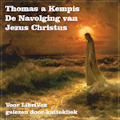

Zoals was te verwachten, volgen er enige aanvullingen op [vorig artikel](/2012/11/25/de-navolging-van-christus-als-e-boek/). Intussen is ook het concept 'luisterboek' (audio book) ten tonele verschenen en ook _De Navolging van Christus_ is weer van de partij. Kattekliek maakte enige tijd geleden een luisterboekopname voor Librivox. Die kan je op je _smartphone_ rechtstreeks beluiseren op de [Librivox-app](https://play.google.com/store/apps/details?id=biz.bookdesign.librivox.pro). Een alternatief is een andere audio book player te installeren, en het M4B-bestand te downloaden van de [Librivox-website](http://librivox.org/de-navolging-van-christus-by-thomas-a-kempis/). Ik gebruik voorlopig [Listen](https://play.google.com/store/apps/details?id=com.acmeandroid.listen) als speler..

**[De Navolging van Christus - Thomas a Kempis (Kattekliek - LibriVox)](http://www.archive.org/download/LibrivoxM4bCollectionAudiobooks_8/DeNavolgingVanJezusChristus.m4b) - Luisterboek**

Zo'n audio book player werkt trouwens hetzelfde als een e-booklezer: het boek is offline beschikbaar en de speler onthoudt waar je laatst stopte met luisteren.

En wat met de Bijbel? Ik vond een niet onaardige uitziende app van [bible.is](http://bible.is/), waar het volledige Nieuwe Testament in de Nieuwe Bijbelvertaling als luisterboek beschikbaar is, inclusief filmpjes over het leven van Christus. Het buitenlands accent van de voorlezer, het klef achtergronddeuntje en de knullige jaren-70-filmpjes moet je wel kunnen verdragen... Nog geen perfecte match met mijn verwachtingspatronen...

Dan maar weer aan de slag. Er zijn twee sites waar opnames beschikbaar zijn van lezingen uit de bijbel. Op de [downloadbijbel](http://www.downloadbijbel.nl/) (een spin-off van de [voorleesbijbel](http://www.voorleesbijbel.nl/)) lezen bekende en minder bekende Nederlanders elk een stukje voor. Op de webstek van Radio Maria Vlaanderen vind je opnames van de uitzendingen waar uit de bijbel wordt voorgelezen. [Chapter and Verse](http://lodensoftware.com/chapter-and-verse/) is een tool waarmee je een setje MP3-bestanden kan compileren tot een M4B-bestand, het formaat van een luisterboek. Net wat ik nodig heb, maar je moet er Apple's iTunes wel bijpakken en veel geduld hebben moet niet-intuïtieve instellingen. Na veel zwoegen zijn er uiteindelijk twee luisterboeken van de band gerold.

Hoe dat precies zit met auteursrechten, weet ik niet. Op de gebruikte bijbelvertalingen rusten waarschijnlijk nog auteursrechten, dus kunnen deze opnames niet zonder meer op [LibriVox](https://forum.librivox.org/viewtopic.php?f=18&t=881&sid=f3852dccfe8ed5efa5bb2f32c8b9e403) worden gepubliceerd... Voorlopig dus maar weer op mijn Dropbox Google Cloud Storage.

**[Het evangelie volgens Lucas (voorleesbijbel.nl)](https://storage.googleapis.com/geloven-leren/audiobooks/Het%20evangelie%20volgens%20Lucas-downloadbijbel.m4b) - Luisterboek**

**[Het evangelie volgens Lucas (radiomaria.be)](https://storage.googleapis.com/geloven-leren/audiobooks/Het%20evangelie%20volgens%20Lucas-radiomaria.m4b) - Luisterboek**

Een podcast is weer iets anders dan een luisterboek. Het is meer een luisterkrant, want al je je erop abonneert, laadt je smartphone elke dag automatisch een (kort) luisterartikel op, dat je dan in je podcast app kan beluisteren. Feedscribe lijkt me op het eerste zicht een uitstekende podcast app, die ook video-podcasts ondersteunt en gewone tekstberichten. Voor gewone newsfeeds gebruik ik echter gReader, een app die integreert met je Google Reader account. De jongerensite Krux heeft een podcast 'God op je iPod' waarop dagelijks een stukje van de Bijbel wordt voorgelezen uit de [Voorleesbijbel](http://www.voorleesbijbel.nl/). Noch Krux, noch de Voorleesbijbel hebben een mobiele website, wat te betreuren is...

Hieronder vind je een verwijzing naar een overzicht van alle besproken materiaal, waar ook bv. de mooie app [Evangelizo - Dagelijks Evangelie](https://play.google.com/store/apps/details?id=org.evangelizo) is toegevoegd.

 

**[Overzicht van de beschikbare luisterboeken](/luisterboeken/)**
