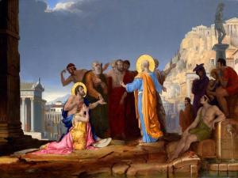

De pastorale strategie van de Paus in zijn voormalige rol van aartsbisschop was "[naar buiten te gaan](http://nikolaassintobin.blogspot.be/2013/03/de-pastorale-strategie-van-kardinaal.html)". Naar buiten, dat is waar de rand-gelovigen en de onverschilligen zijn. Een Kerk die op zichzelf geplooid is, wordt immers snel oud. Mooi zo. Maar wat moeten we daar dan zeggen of doen, als we buiten staan? Dat is nogal vaag...

 Saint Paul Preaching on the Areopagus (Leonoard Porter, 2010)

Een gebruiksklare handleiding voor evangelisatie is er niet. Als er één gouden regel is, dan is het in te spelen op de omstandigheden, maar toch direct _to the point_ te komen. De apostel Paulus was daar een krak in. Van hem vinden we in het boek _Handelingen van de apostelen_ ook het enige uitgeschreven verslag hoe de apostelen ongelovigen evangeliseerden. Veruit de meeste toespraken of brieven zijn immers gericht aan joden of aan reeds bekeerde christenen.

Wanneer wij vandaag naar buiten treden, staan we net als Paulus in Griekenland te midden van mensen die graag betrokken zijn met alles wat er in de wereld gebeurt, en daarover eindeloos debatteren op hun fora, waar elke godheid zijn eigen altaartje heeft, maar die de ware God niet kennen...

Vervang 'fora' door '_facebook_' en 'altaartje' door '_fan page_', en je zal het onderstaande al beter begrijpen. Lees zelf wat Paulus hen te vertellen had, en laat je niet van de wijs brengen door zjin ironische aanhef:

> _"Atheners, aan alles zie ik dat u buitengewoon godsdienstig bent. Toen ik rondliep en uw heiligdommen bezichtigde, trof ik ook een altaar aan met het opschrift: Aan de onbekende god. Welnu, wat u zonder het te kennen vereert, dat kom ik u verkondigen. De God die de wereld gemaakt heeft en alles wat die bevat, de Heer van hemel en aarde, woont niet in tempels die door mensenhanden gemaakt zijn. Ook laat Hij zich niet door mensenhanden bedienen, alsof Hij iets nodig had, want zelf geeft Hij aan allen leven en adem en alles. Uit één mens heeft Hij heel het mensenvolk gemaakt om overal op aarde te wonen. Hij heeft bepaalde tijden vastgesteld en hun woongebieden afgegrensd, met de bedoeling dat ze God zouden zoeken en Hem wellicht tastenderwijs zouden vinden; Hij is immers niet ver van ieder van ons. Want door Hem leven wij, bewegen wij en zijn wij; zoals ook enkele van uw dichters hebben gezegd: Wij zijn van goddelijke afkomst. Als we dus van goddelijke afkomst zijn, moeten we niet denken dat het goddelijke overeenkomt met goud, zilver of steen, met produkten van menselijk ambacht en menselijke verbeelding. Zonder te letten op die tijden van onwetendheid zegt God nu de mensen aan dat ze zich moeten bekeren, allemaal en overal. Want Hij heeft een dag vastgesteld waarop Hij de wereld rechtvaardig zal oordelen. Daar heeft Hij iemand voor aangewezen, en Hij heeft dit voor iedereen geloofwaardig gemaakt door Hem uit de doden te laten opstaan." ([Hand 17:22-31](http://www.willibrordbijbel.nl/index.php?p=page&i=68375,68394))_

Interessant om weten is dat [die 'onbekende God' van de Grieken](http://bible.org/seriespage/apostle-athens-preaching-philosophers-acts-1715-34) niet zomaar een fantasietje was. Als de Grieken kregen af te rekenen met tegenslag, schreven ze die toe aan een straf van een van hun goden. Op een goeie keer konden ze echter niet uitmaken welke god ze wel misnoegd hadden, en daarom besloten ze dat er nog een andere, onbekende god moest zijn die hen strafte, en richtten ze voor hem ook een altaartje op.

De Griekse fora zijn een mooi beeld van onze hedendaagse wereld, waar mekaar afwisselende politiek correcte mantra's van 'gender', 'culturele diversiteit', 'euthanasie', 'democratisering' en dies meer, goden zijn die op de publieke fora gunstig gestemd moeten worden om het vooruitgangsideaal te voeden. In deze wereld is de Kerk zelf het altaartje van de 'onbekende god', waarop we alle rampspoed kunnen afwenden, zolang we maar in de gunst blijven van onze 'bekende' goden. En wees nu eerlijk: hoe vaak worden die 'bekende' goden niet geëerd tot op de altaren van onze Kerk toe, en wordt God vergeten?

Kardinaal Bergoglio liet tijdens het [pre-conclaaf](http://nikolaassintobin.blogspot.be/2013/03/programma-van-paus-franciscus-door.html) verstaan dat de Kerk zich niet op zichzelf mag terugplooien. Als de crisis groot is en er langs alle kanten op de Kerk wordt ingebeukt, dan moet zij een houding van nederigheid aannemen. Een op zichzelf teruggeplooide Kerk is niet nederig, integendeel: zij wordt zelfgenoegzaam. Een teruggeplooide Kerk probeert wel licht te zijn op aarde, maar vergeet dat de bron van dat licht God is. Een teruggeplooide Kerk wil geen risico's nemen, om zoals Paulus met vuur te spreken over de opstanding en het oordeel.

God is inderdaad die onbekende god, vandaag evengoed als tweeduizend jaar geleden bij de Grieken, maar Hij wil zich bekend maken, door ons. Als we evangeliseren tegenover de onverschilligen, moeten we spreken zoals Paulus, over een God die niet gevoed moet worden, maar die voedt. Een God ook die nederigheid afdwingt. Geen nederigheid van een mens, teneerdrukt in de wanhoop van de rampspoed die niet kan worden afgewend, (want ook wanhoop is een vorm van trots --- dat las ik vandaag nog van de [heilige Theresia van het kind Jezus](http://dagelijksevangelie.org/main.php?language=NL&module=commentary&localdate=20130328)), maar nederigheid die [verheft](http://experimentaltheology.blogspot.be/2013/02/fridays-with-benedict-chapter-7-ladder.html) en hoopvol doet uitkijken naar de rechtvaardigheid van het oordeel van Hem die opgestaan is.
