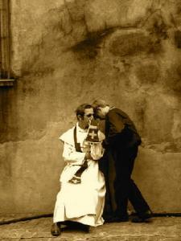

 Rara....

Ben jij ook zo'n gelovige die actief wil deelnemen aan de sacramenten? Die zelf wil bijdragen aan de inhoud en die niet zomaar alles aan de priester wil overlaten? Die wat meer spontaneïteit in de kerk wil? Vind je geen spirituele inspiratie in het 's zondags monotoon declameren van altijd dezelfde gebeden uit de groene losbladige kaftjes met groot-dankgebeden?

Er is een sacrament dat al sinds christenheugnis deze verzuchtingen kan invullen. Waar je het als gelovige zelf voor het zeggen hebt. Waarbij geen nodeloze gebedsformules uit een boekje afgelezen of uit het hoofd afgerammeld moeten worden. Waar er echt op je actieve inbreng gerekend wordt, meer zelfs: waar die essentieel is, in vorm en inhoud. Kortom: waarin jij centraal staat!

Ken je het al? Het is het sacrament van boete en verzoening, algemeen bekend als [de biecht](/blog/biecht/). Probeer het!
