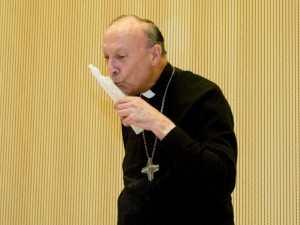

Op Radio Maria hoor ik vanmorgen een interview met prof. Jan Wouters over vaticanum II waar de hoofdstukken "[Enkele urgente problemen](http://www.rkdocumenten.nl/rkdocs/index.php?mi=600&doc=575&id=3101)" uit Gaudium et Spes over de houding van de kerk tegenover oorlog aan bod komen. De teksten zijn bovenal constructief en reiken hulpmiddelen aan waarmee ook christenen en hun kerk mee aan vrede kunnen werken. Gekaderd in de tijd van het concilie, maar ook vandaag best nog 'urgent', valt evenwel het realistisch besef op te tekenen, dat oorlog misschien wel nooit volledig zal verdwijnen:

 

> Laten wij ons zelf niet bedriegen met een valse hoop! Want als men de vijandschap en haat niet aflegt en geen duurzame en eerlijke verdragen sluit voor een universele vrede in de toekomst, zal de mensheid, die reeds in ernstig gevaar verkeert, misschien eens, ondanks haar ontzagwekkende wetenschap, het noodlottig ogenblik moeten beleven, waarop haar geen andere vrede meer overblijft dan de huiveringwekkende vrede van de dood. Maar terwijl de Kerk van Christus, die ten volle de angst van deze tijd meebeleeft, dit zegt, blijft zij toch vervuld van sterke hoop. Zij wil aan onze tijd telkens opnieuw, te pas en te onpas, de boodschap van de apostel voorhouden:“Dit is de gunstige tijd” voor een innerlijke omkeer, “dit is de dag van het heil”

Toevallig las ik in de bezinning uit Willem Grossouws "[Innerlijk Leven](/page/e-boeken/)" voor vandaag, vrijdag na de derde zondag na Pasen, iets gelijkaardigs:

> Innerlijk Leven (W. Grossouw)
> 
> In een tijd dat de mensheid, in haar leiders verdeeld door machtswellust en belangenstrijd, hunkert naar een vrede en een gemeenschap die de gehele wereld omvat, denken wij, christenen, allereerst aan Christus en zijn Kerk. Niet alsof wij menselijke pogingen beoordelen willen of veroordelen. God is de Meester der geschiedenis en Christus, de Rechter van levenden en doden, is de „Overste van de koningen der aarde” (Openb. 1, 5). Wel geloven wij, met rotsvaste overtuiging, dat alleen in Hem vrede en heil der mensheid gelegen kan zijn, al weten wij niet of Hij vóór zijn wederkomst ooit een ware vrede aan de mensheid geven wil of dat zij slechts door de verschrikkingen van oordeel en ondergang henen kan komen tot een rust en een vrede die dan tegelijkertijd de eeuwige rust en vrede der gelouterde mensheid zouden zijn (zoals ook de afzonderlijke mens slechts door de dood heen zijn zaligheid vindt).

Het volgende onderwerp dat op Radio Maria ter sprake komt, is de actie van Femen eerder deze week. Zonder de gruwel van het oorlogsgeweld te willen afwegen tegen een gewelddadige protestactie gericht op één persoon, is er wel een link te leggen, die iets leert over de verschillende vormen van vrede zoals die in bovenstaande teksten beschreven worden en hoe er toch vrede kan zijn, ook al is het geweld nog manifest aanwezig.

Ongewild hebben de Femen-activista's de gelegenheid geschapen waarin aartsbisschop Leonard ons kon tonen wat de vrede van Christus is, vrede die verder strekt dan de afwezigheid van geweld.

"Vrede laat Ik u; mijn vrede geef Ik u", klinkt het elke zondag in de kerk, en ik heb me al vaak afgevraagd waar die 'vrede' precies voor staat.

\[caption id="" align="aligncenter" width="300"\] "Nieuwsfoto van de dag" (Anton de Wit)\[/caption\]

In een wereld beheerst door vluchtige opinies lijkt de vrede bereikt te worden als de tegenstrijdigheid van opinies gesmoord kan worden in een compromis waarin iedereen min of meer zijn eigen positie kan handhaven. Of het gaat over een flauw debat in de krant, over politiek overleg of over oplossing van oorlogsconflicten: we zoeken een manier waarop iedereen een beetje kan scoren en beschouwen het conflict als van de baan. De mening is herleid tot marketing, maar toch levert deze eenpak een pragmatisch oplossing om tot een bepaalde vorm van vrede te komen, en wel op een beschaafde manier (wat sommige actiegroepen vreemd is).

Velen denken dat hetzelfde opgaat in zaken van geloof. Een beetje toegeven hier, daar wat mooipraten, over de rest van het geloof zwijgen, en de tegenstrijdigheid tussen geloof en wereld, die immers ook veel onvrede veroorzaakt, lost zich op. Sommige bisschoppen (die "afstand nemen" van de actie van Femen --- wie stelt daar de persmededelingen op?) bewandelen die weg en lijken veel vrede te kennen. Mgr. Leonard heeft echter niet de gewoonte het geloof tekort te doen en lijkt op het eerste zicht inderdaad weinig vrede te kennen, de gewelddadige tegenreactie ten bewijze. Maar spreken we hier over dezelfde vrede als die Christus ons toezegt?

"Let niet op onze zonden, maar op het geloof van Uw Kerk", zo vervolgt de liturgie. Nog boven de onvolmaakte vrede van het gesmoorde geweld (waarin de ergernis blijft sluimeren), waarmee velen genoegen nemen, staat de volmaakte vrede van het standvastig geloof, die zelfs kan bloeien onder al het geweld van de wereld en die geen ergernis kent.  En daarvan heeft mgr. Leonard ons een kleine glimp laten opvangen.
