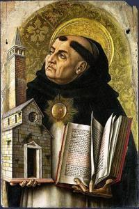
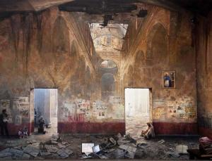

Ik wil iets zeggen over het 'waarheidsgehalte' van het geloof. Moeten we er ons druk over maken? Of maakt het niet uit of wat we geloven waar is? En als we er ons druk over maken, moeten we dan ook met argumenten over de brug komen?

Als referentiepunt even iets over logica. Logische redeneringen vallen uiteen in 'uitspraken', die al dan niet waar kunnen zijn. Logica is in beginsel binair. Een uitspraak is bijvoorbeeld "het wordt 's morgens licht en 's avonds opnieuw donker". Je kan dat waarnemen en daarom is deze uitspraak onloochenbaar en eenduidig 'waar'!

Niets is echter menselijker dan de subjectivering van de waarheid van uitspraken als die niet empirisch vaststelbaar zijn. Dan speelt interpretatie een rol en is de uitkomst van de evaluatie afhankelijk van wie de evaluatie uitvoert. Of er worden verschillende betekenissen gekoppeld aan begrippen. Het 'waarheidsgehalte' van de uitspraak wordt afhankelijk van wie ze uitspreekt of interpreteert.

Hoe zit dat nu met 'geloofsuitspraken'? Zijn ze eenduidig of subjectief? En als ze subjectief zijn,  betekent dit dat we er alle kanten mee uitkunnen?

## Kerkelijke leer

De kerkelijke leer is, net als elk kennisstelsel, gebaseerd op uitspraken, en de belangrijkste zijn gebundeld in de geloofsbelijdenis. Ik parafraseer er enkele:

- "God is Schepper van Hemel en aarde",
- "Jezus is de Zoon van God",
- "Jezus' moeder is Maria, die maagdelijk zwanger was van de Heilige Geest",
- "Jezus is gestorven en na twee dagen verrezen".

Als iemand je vraag: "Is dat waar?", wat antwoord je dan?...waar of onwaar?

\[caption id="attachment\_1458" align="alignright" width="200"\] Sint Thomas van Aquino, scholasticus\[/caption\]

De Kerk heeft een lange traditie waarin ze de betekenis van de uitspraken over geloof voor alle subjectivisme probeert te behoeden. Een traditie die zijn hoogtepunt kent in de 'scholastiek'. Die wetenschappelijke methodiek zoekt een eenduidige betekenis van het theologisch begrippenkader, zodat iedereen die deze begrippen en concepten gebruikt in uitspraken over het geloof, dezelfde betekenis hanteert. Door verschillende stellingen tegenover mekaar te plaatsen en logische afleidingen te maken, kon de scholastische methode achterhalen welke stelling waar was, en welke onwaar. Dat werkte goed, zolang de scholastiek als wetenschappelijke methode erkenning genoot en weinig concurrentie ondervond van de andere wetenschappen...

## Geloofsuitspraken zijn 'onwaar'

De klassieke wetenschappen hebben echter het scholastische eenheidsmodel afgeworpen en nieuwe wetenschappen zijn ontstaan. 'Geloofsuitspraken' uit de geloofsbelijdenis, uit de bijbel of uit de kerkelijke geloofsleer kunnen ermee op losse schroeven worden gezet.

Als je de nieuwe wetenschappen als referentiepunt neemt en consequent wil zijn in je denken over geloof, heb je twee alternatieven:

1. ofwel moet je bijna alle uitspraken uit de geloofsleer als 'onwaar' evalueren...
    
2. ofwel moet je ze onderwerpen aan een hoge mate van subjectiviteit.
    

De subjectieve benadering verandert de betekenis van de woorden en relativeert zo geloofsuitspraken tot metaforen of analogieën zonder eenduidige betekenis. De betekenis wordt omgebogen tot een interpretatie, zodat die niet meer in tegenstrijd is met de wetenschap.

In teveel theologische boeken, in allerhande debatten over geloof, tot zelfs in de zondagsmissen toe, word methode 2 toegepast, en gaat men bovendien nog een stap verder. De klassieke geloofsuitspraken van de geloofsbelijdenis en de canon worden niet meer uitgesproken, maar vervangen door nieuwe teksten, die een geinterpreteerde betekenis ervan uitdrukken. De subjectieve (=individuele) interpretatie vervangt de normatieve (=collectieve) leer (en dreigt op haar beurt opnieuw normatief te worden, maar da's een andere discussie). Reden genoeg om te spreken van een crisis van het geloof.

## Het modernisme de schuld geven

De klassieke analyse van de crisis van het geloof legt de schuld bij het modernisme en de Verlichting. En de oplossing is dan logischerwijze te vluchten uit die moderniteit en terug te keren naar de scholastiek, waar er maar één waarheid was waar alles op berustte. Maar is deze analyse niet te kortzichtig?

Mij komt het voor dat de geloofscrisis van alle tijden is en even oud is als het geloof. De crisis begon reeds bij de heilige apostel Thomas, die niet wilde geloven zonder tastbaar (empirisch) bewijs! Bovendien is het juist de methode van de [scholastiek](http://nl.wikipedia.org/wiki/Scholastiek), door geloof en wetenschap te versmelten, die de geloofscrisis een rijke voedingsbodem gaf, niet vermoedend dat de wetenschap haar eigen wegen zou inslaan.

## De scholastiek leeft

Persoonlijk voel ik weinig behoefte om de uitspraken van mijn geloof te funderen op de wetenschap, laat staan dat ik er heil in zie de uitspraken van de wetenschap te evalueren op basis van mijn geloof. Hoe kan God immers God zijn als Hij niet zou ontsnappen aan de wetmatigheid van Zijn schepping? Ik laat me dan ook niet van mijn stuk brengen als rond kerst of pasen de kolommen van de kranten gevuld worden met goedkope intellectuele stukjes van Vermeersch en co. Ik ben wel van mijn stuk als ik merk dat andere gelovigen het nodig vinden historische, astrologische of natuurwetenschappelijke tegenargumenten aan te voeren, alsof ons geloof daarop zou kunnen berusten. Als we heel Gods openbaring wetenschappelijk zouden kunnen verklaren en begrijpen, dát zou ik nu eens onverklaarbaar vinden!

Toch merk je in discussies over de verhouding tussen geloof en wetenschap dat het oude scholastische model nog steeds leeft, bij gelovigen en ongelovigen: geloof en wetenschap worden in een en hetzelfde stelsel opgebouwd en aan mekaar getoetst, zelfs door gelovigen, die daardoor hun eigen geloofswaarheden moeten gaan subjectiveren. Dat is onzin! Er is geen enkele reden waarom je geloof zou moeten toetsen aan wetenschap. Tenminste, als dat geloof uitgaat van een werkelijke God en niet louter berust op overgeleverde geschriften. Waarmee meteen even de sola scriptura om het hoekje komt kijken...

Theologie, en meerbepaald de katholieke [apologetiek](http://nl.wikipedia.org/wiki/Apologetiek), als systematische studie van Gods openbaring in de wereld, is nuttig voor het geloof, maar doorgedreven pogingen om deze studie te verzoenen met (of af te zetten tegen) de bevindingen van andere wetenschappen, is zinloos. De studie van de Bijbel is noodzakelijk voor verdieping van het geloof, en daarbij hoort ook het bestuderen van de historische context waarin de auteurs van de bijbelboeken en hun eerste publiek leefden en waarin de gebeurtenissen plaatsvonden. Doorgedreven pogingen om de bijbelse verslagen te bekrachtigen (of te ontkrachten) aan de hand van de kennis uit de geschiedkunde, biologie, of andere wetenschappen, zijn vanuit theologisch oogpunt zinloos.

## Waarom "ik geloof..."

\[caption id="attachment\_2263" align="alignleft" width="300"\] Wat is waarheid? (Alain Senez)\[/caption\]

Om nu terug te keren tot de probleemstelling. Wat is het 'waarheidsgehalte' van 'uitspraken' over geloof? Ik parafraseerde in het begin van dit artikel enkele 'uitspraken' uit het credo, maar liet bewust de inleidende zinsnede "Ik geloof" weg. Viel het u op? Misschien niet, maar toch staan die twee inleidende woorden er volgens mij niet zomaar.

Waarom formuleerden de vierde-eeuwse kerkleiders deze elementaire doctrines voorafgegaan door "Ik geloof"? Waarom lieten ze de gelovigen als bevestiging van hun geloof niet de geloofswaarheden uitspreken als gewone logische 'uitspraken', zoals ik ze parafraseerde? Het lijkt me toch een vraag om even bij stil te staan...

Het is wellicht een slag in het water, maar de verklaring is eenvoudig, als je begrijpt dat "de geest van de tijd" in de vierde eeuw niet fundamenteel verschilde van de onze als het op de crisis van het geloof aankomt. Er waren toen ook populaire stromingen waarin Jezus gezien werd als een gewone man die een ethische leer verkondigt, ontdaan van zijn goddelijkheid. De grondslagen van het arianisme ken ik niet, maar het lijkt me niet onlogisch dat de mensen van toen niet wezenlijk anders dachten dan wij, en dat het voor hen even moeilijk was het geloof te bevatten in hun rationeel-kritische (lees: algemeen-menselijke) geest.

Kan het zijn dat de kerkleiders van de concilies van Nicea-Constantinopel dat ook aanvoelden, en daarom de doctrines expliciet formuleerden als uitspraken van "geloof", om ze niet te verwarren met uitspraken die men kan doen over wetenschappelijke concepten, nog voordat er van systematische wetenschap goed en wel sprake was?

## Geloofsuitspraken: de volle waarheid

'Geloven' is een andere dimensie van 'weten' of 'kennen', een dimensie die we niet gewoon zijn, maar 'geloven' heeft wel de volheid van 'weten' en 'kennen', in de zin dat het - net als in de wetenschap - gekoppeld is aan een objectieve zekerheid en niet beperkt is tot een subjectieve interpretatie. Als een gelovige het credo uitspreekt en zegt "ik geloof in het eeuwig leven", dan hoeft die daar niet bij te denken - als om zijn uitspraak rationeel te vergoelijken - "ik geloof in het eeuwig leven als een metafoor voor het goede dat we in ons leven doen en dat blijft voortleven in onze kinderen" (of een soortgelijke interpretatie naar keuze), nee, dan mag die gelovige die uitspraak gerust bedoelen als een werkelijk eeuwig leven, een bewust voortbestaan na de dood en -hopelijk- bij God, om daarop zijn leven te richten.

Het geloof in de verrijzenis behoort tot de kern van ons geloof, daar kan je als gelovige moeilijk omheen. Hoe zit het dan bijvoorbeeld met het geboorteverhaal? Behoort dat ook tot de 'volle waarheid' van het geloof, hoewel het historisch bestrededen wordt? Ik denk van wel. Historisch is het misschien dubieus, maar het is niet minder dubieus dan de verrijzenis onwaarschijnlijk is vanuit biologisch oogpunt. Voor wie in de verrijzenis kan geloven, is het geboorteverhaal een makkie. Wie het geboorteverhaal wil verwerpen als 'objectieve waarheid', zet ook het geloof in de verrijzenis op losse schroeven. Conclusie: beide openbaringen zijn in het geloof even 'waar'. Ik ga nog verder, want dezelfde redenering gaat natuurlijk ook op voor de openbaring van God in de schepping (in twee versies), in de zondvloed, in de exodus en in zoveel meer bijbelverhalen. In het geloof zijn ze allemaal even 'waar'. De uiteenlopende ontstaansgeschiedenis van een scheppingsverhaal, dat zeker geen ooggetuigenverslag is, en een verrijzenisverhaal, dat een expliciete getuigenis is, maakt geen echt verschil, want als je wil nadenken over het wezen van de mens, in de volheid van geloof, dan is de wereld in zes dagen geschapen.

Gelovig denken vertrekt vanuit de openbaring, maar is evengoed rationeel en leidt ook tot een 'objectieve waarheid'. Het is echter niet zinvol om vanuit een gelovige gedachtegang met een historicus, bioloog, astroloog of geoloog aan het redetwisten te slaan over de 'waarheid' van hun wetenschap, maar anderzijds is het wel zinvol om je als gelovige naast je geloof te verdiepen in deze wetenschappen. Hoewel de 'objectieve waarheden' van geloof en wetenschap schijnbaar verschillend zijn, hebben ze fundamenteel betrekking tot dezelfde allesomvattende waarheid, want elk wetenschappelijk studiegebied is deel van de schepping, die op haar beurt ook deel is van diezelfde goddelijke openbaring. Die eenheid is echter niet aan ons om te vatten. Om te geloven is het noodzakelijk en voldoende te weten dat God zich buiten de menselijke natuur om aan ons openbaart en zich met ons betrekt.

## Moeten we de bijbel dan letterlijk lezen?

Ja, om de boodschap van de openbaring te vatten, is het noodzakelijk die openbaring te aanvaarden zoals die zich in de traditie gekristalliseerd heeft. Dit is een nodige, maar geen voldoende voorwaarde voor een werkzaam geloof!

Geloof moet ook worden beleefd en toegepast en daartoe is de aanwending van metaforen en analogieen wel onmisbaar. De metafoor op zich is niet slecht, maar schenkt niet de volle geloofswaarheid. De alleenstaande geloofsuitspraak, los van alle interpretatie, is even 'waar' als de vaststelling dat het 's morgens licht wordt en 's avonds opnieuw donker en draagt voor alle gelovigen dezelfde betekenis. Iedereen moet ze echter op zijn eigen manier toepassen op zijn leven. Net zoals iedereen ervoor kan kiezen om na zonsopgang toch nog in bed te blijven, zonder daarmee het licht van de zon te kunnen ontkennen.

Geloofsuitspraken zijn op twee manieren subjectief. Ten eerste zijn ze 'onwaar' voor wie niet gelooft. Voor wie wel gelooft, zijn ze absoluut 'waar'. Ook de gelovige kan de geloofsuitspraken subjectief benaderen, echter niet door de waarheid ervan te relativeren, maar door, met behulp van de apologetiek, de toepassing ervan op het eigen leven uit te werken, die voor ieder mens verschillende wegen kan volgen.
