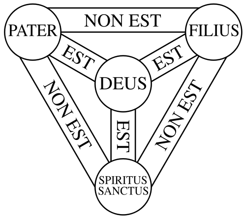
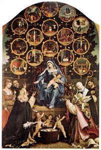
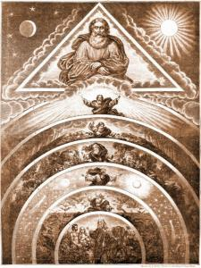
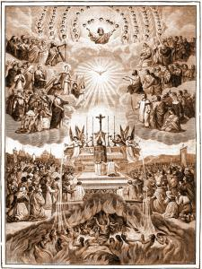
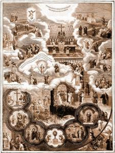
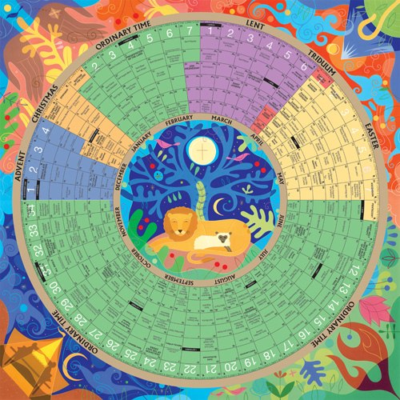

Iedereen kent wel de zogenaamde 'infografieken' uit de kranten. Ze worden naast tekst en foto's gebruikt om gebeurtenissen of concepten aanschouwelijk voor te stellen door middel van schema's, diagrammen en opengewerkte tekeningen. Voor de kranten is dat ideaal, want zo'n infografiek biedt niet alleen veel informatie (een beeld zegt meer dan...), ze oogt ook heel aantrekkelijk (zeker voor de stripliefhebbers), verfraait de bladspiegel en ze vereist weinig werk, tenminste voor de lokale redactie, want je merkt dat infografieken het populairst zijn bij internationale gebeurtenissen, en dat ze dus extern aangekocht worden en het werk beperkt blijft tot de vertaling van de (weinige) tekst.

Infografieken zijn echter niets nieuws, want de katholieke kerk gebruikt ze al eeuwenlang om gelovigen aanschouwelijke informatie over de geloofsleer te bieden. Het voordeel is immers dat je niet moet kunnen lezen om de infografiek te begrijpen, wat in de middeleeuwen geen zeldzaamheid was (en wat misschien ook voor de hedendaagse krantenlezer opgaat?).

Een mooi voorbeeld is het [scutum fidei](http://en.wikipedia.org/wiki/Shield_of_the_Trinity "Wikipedia over het Scutum Fidei") (wapenschild van het geloof) dat in de 12de eeuw ontstond en een grafisch weergeeft hoe de verschillende personen van de Heilige Drie-eenheid zich tot mekaar verhouden.

"Scutum Fidei" over de onderlinge verhouding van de personen in de Heilige Drie-eenheid

 Sobere versie van het Scutum Fidei

De schilderkunst heeft ook heel wat infografieken opgeleverd, zij het meestal beperkt tot het combineren van verschillende taferelen die onderling een logische samenhang hebben. Je hebt ook narratieve werken die in een tafereel verschillende scenes afbeelden.

 

 

 De mysteries van de Rozenkrans

 

 Scenes from the Passion of Christ (Hans Memling, 1470-71, Galleria Sabauda, Turin)

Een recenter voorbeeld van katholieke infografieken is de [Prentencatechismus](http://prentencatechismus.org/ "Prentencatechismus"), die al eerder op deze blog werd besproken. De meeste prenten zijn louter voorstellingen van taferelen uit bijbelverhalen of andere bronnen, maar een aantal prenten zijn duidelijk te catalogeren als infografieken. Het zijn geillustreerde representaties van lijsten, logische concepten, structuren en beslissingsbomen.

 De zeven dagen van de Schepping

 

 De lijdende, strijdende en triomferende Kerk

 

 Katholieke Feestdagen

En hoe zit het vandaag? Hoewel het aanbod (nog) niet zo groot is -- de kerk heeft zoals geweten veel moeite met moderne media -- bestaan er al infografieken die met een meer hedendaagse stijl de geloofsleer of -praktijk trachten weer te geven.

 Liturgische kalender

 Catholics Today - Belief system (Martha Quintero, 2011)

 Het scheppingsplan

Hoog tijd dus om daarin wat meer te investeren. Net zoals de kranten, moet de kerk dat internationaal aanpakken, want de grootste (en niet onaanzienlijke!) kost voor de vervaardiging van een infografiek ligt in het tekenwerk, maar omdat er doorgaans weinig tekst te zien is, ligt de kost voor internationalisering bijzonder laag. De geloofsleer, die is nog altijd universeel is, is bovendien bij uitstek geschikt als onderwerp voor infografieken, want je hebt er soms een hoop 'verbeelding' voor nodig om ze te begrijpen.

Een voorbeeld van zo'n internationaal initiatief is de '3-minute-catechism' of kortweg [3MC](http://www.3mc.me/eng/index_eng.html "3MC"). Die biedt geen infografieken aan, maar filmpjes waarin het geloof aan de hand van tekeningen wordt uitgelegd, beschikbaar in 7 talen, waaronder spijtig genoeg geen Nederlands.



Meer voorbeelden van infografieken vind je op mijn nieuwe Pinterestbord ['Catholic infographics'](http://pinterest.com/vicmortelmans/catholic-infographics/ "Catholic Infographics").
