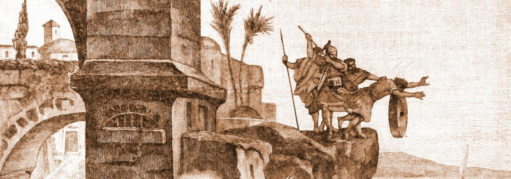
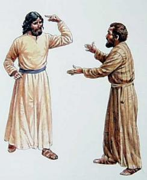

Dit artikel gaat over de begrippen 'ergernis', 'aanstoot' en 'schandaal'. In geloofscontext dekken die een heel andere lading dan in het dagelijks taalgebruik.

### Catechetische ergernis

De definitie van 'ergernis' luidt in de catechismus: _"_[_Ergernis is de houding die of het gedrag dat anderen ertoe brengt om kwaad te begaan_](http://rkdocumenten.nl/rkdocs/index.php?mi=600&doc=1&al=2284-2287)_."_ Het gaat er dus niet zozeer om of we andermans gedrag al dan niet leuk vinden, maar wel of we ons erdoor tot zonde laat verleiden. De een zegt of doet iets (of verzuimt iets te zeggen of te doen), en de anderbegaat als gevolg daarvan een zonde. Dat is catechetische 'ergernis'. De zonde die uit ergernis voortkomt kan velerlei zijn. Typisch is dat boosheid, waarmee meteen de courante context van het begrip 'ergernis' afgedekt wordt (ja, boosheid is ook een van de [zeven hoofdzonden](http://prentencatechismus.org/2011/01/17/twaalfde-artikel-vervolg-ik-geloof-in-het-eeuwig-leven/)!). Maar in geloofszaken kan ergernis ook leiden tot twijfel en ongeloof, wat een nog zwaardere zonde is, want het is een zonde tegen God.

Het lemma over de ergernis in de catechismus is te vinden onder het hoofdstuk over het vijfde van de Tien Geboden: "Gij zult niet doden". Dat mag op het eerste zicht verrassen, want in het verhaal van de uittocht uit Egypte, wanneer Mozes de Tien Geboden ontvangt, gaat het wel degelijk over moord en doodslag, en niet over 'ergernis'. Jezus trekt het gebod echter open: _"Gij hebt gehoord, dat tot de ouden gezegd is: Gij zult niet doden; en wie doodslag begaat, zal schuldig zijn voor het gerecht. Maar Ik zeg u: Wie vertoornd is op zijn broeder, zal schuldig zijn voor het gerecht. Wie tot zijn broeder zegt: Raka, zal schuldig zijn voor de Hoge Raad. En wie zegt: Dwaas, zal strafbaar zijn met het helse vuur. Als ge dus uw offergave brengt naar het altaar, en u daar herinnert, dat uw broeder iets tegen u heeft, laat dan uw offer voor het altaar, en ga u eerst met uw broeder verzoenen; kom dan terug, en draag uw offer op."_ (Mt 5:21-24)

De ergernis, gelijkgeschakeld aan moord en doodslag, blijkt nu een verontrustend zware zonde te zijn! De christen die zich hiervan bewust is, moet voorzichtig zijn: hij mag geen ergernis geven, en hij moet mijden zich te ergeren. Jezus spreekt heel duidelijk over beide gevallen.

### Ergernis geven en zich ergeren

Over het geven van ergernis is Jezus duidelijk wanneer Hij zijn leerlingen waarschuwt: _"Maar wie één van deze kleinen die op Mij vertrouwen ten val brengt, kan beter met een_ [_molensteen_](http://gelovenleren.wordpress.com/2011/04/19/molensteen/) _om zijn nek in volle zee gegooid worden"_ (Mt 18:6). Het geven van ergernis is des te erger als men zich in een gezagspositie bevindt.

Even duidelijk is Jezus als het gaat over ergernis bij jezelf. Op het einde van de bergrede klinkt het onverbiddelijk: _"Maar als je rechteroog je doet struikelen, ruk het dan uit en gooi het weg. Want het is beter voor je dat een van je ledematen verloren gaat, dan dat heel je lichaam in de hel wordt gegooid. En als je rechterhand je doet struikelen, hak haar dan af en gooi haar weg. Want het is beter voor je dat een van je ledematen verloren gaat, dan dat heel je lichaam naar de hel gaat"_ (Mt 5:29-30). Ergernis moet je uit de weg gaan, je eeuwig leven is in het gedrang!

### Hoe ergernis mijden?

Jezus lijkt voorstander van een dubbele aanpak: De eigen ergernis mag je geen kans geven.

Wanneer zijn leerlingen eropuit gaan om te prediken, waarschuwt Jezus hen niet aan te dringen als ze in een huis geen gehoor vinden, en zonder ergernis te vertrekken: _"Als je een huis binnengaat, wens het dan vrede. Als het huis die waard is, moge jullie vrede dan daarop neerdalen, en als het die niet waard is, moge jullie vrede dan naar jullie terugkeren. Als ze je niet ontvangen en niet luisteren naar je woorden, ga dan weg uit dat huis of die stad en stamp het stof van je voeten."_ (Mt 10:12-15)

De ergernis bij anderen is moeilijker in de hand te houden, maar ook die moet je trachten te voorkomen.

Zo zegt Hij: _"maar als jij barmhartig bent, laat dan je linkerhand niet weten wat je rechter doet,  opdat je barmhartigheid in het verborgene gebeurt; en je Vader, die in het verborgene ziet, zal het je lonen"_ (Mt 6:3-4). Zelfs godsdienstige handelingen, zoals bidden of vasten, waarmee je op het eerste zicht toch niemand tot zonde zou kunnen aanzetten, raadt Jezus aan in het verborgene te verrichten, om te vermijden als huichelaar aanstoot te geven (Mt 6:6). Deze passages gaan vergezeld van niet mis te verstane waarschuwingen aan het adres van de farizeeen met hun aanstootgevende hypocrisie.

### De ergernis van het kruis

Het geloof zelf kan een bron van ergernis zijn, en daarvan kon Jezus meespreken, want Hij had zelf aan den lijve ondervonden wat het is een 'steen des aanstoots' te zijn voor wie niet in Hem wilde geloven.

Jezus heeft tot aan de vooravond van zijn dood vaak 'versluierende taal' gebruikt als Hij over zichzelf sprak, want als Hij meteen openlijk de volledige waarheid onomwonden zou uitspreken, zou zijn boodschap een steen des aanstoots worden... (Joh 16:25).

De voorzichtigheid heeft echter haar grenzen, en als Jezus explicieter wordt in zijn uitspraken, keren velen Hem de rug toe (Joh 6:64-66). Wat er ook toe zal leiden dat Hij uiteindelijk als 'schandaal' voor de joden aan het kruis gedood werd.

Zo zegt Hij over zichzelf: "_Gelukkig is degene die aan mij geen aanstoot neemt"_ (Mt 11:6), en maar Hij waarschuwt tegelijk _"Wie over deze steen valt , valt te pletter, en als hij op je valt, word je vermorzeld"_ (Mt 21:44).

 Ergernis over het kruis bij Petrus

Het kruis was ook een bron van ergernis, zelfs bij zijn eigen leerlingen. Wanneer Jezus voor de eerste keer openlijk met de leerlingen over zijn einde praat, en Petrus daaraan aanstoot neemt, antwoordt Jezus met de meest krasse taal _"Weg daar, achter Mij, satan. Je bent een struikelblok voor Mij, want jouw gedachten zijn niet Gods gedachten, maar die van mensen."_ (Mt 16:23) … de ergernis van Petrus, de ergernis van de mens over het offer van de Mensenzoon, is een schandaal voor God.

Uit Jezus' sterven zelf mag blijken dat niets zo aanstootgevend is als geloof, en tegelijk is er niets voor ergernis zo kwetsbaar als geloof. Jezus waarschuwt voor beide gevaren, want het geloof van de mensen, dat is zijn grootste bekommernis, en het misbruik of het kwetsen van het geloof, dat is de grootste zonde.  

Een eentonig verhaal van liefde en mekaar graag zien is Jezus' boodschap dus zeker niet. Eerder is het een voortdurende uitdaging, een uitlokking zelfs van verontwaardiging en... ergernis, waarin je de weg naar de vrede zelf moet zoeken.

### Vijfde gebod

Probleem is dat ergernis meestal ongecontroleerd opkomt. Van alle ondeugden is het wellicht degene die het moeilijkste vanuit persoonlijke wilskracht te onderdrukken is, al is het maar omdat de ergernis voortkomt uit een moreel rechtvaardigheidsgevoel. Het is pas na een diepe confrontatie met het geweten dat je een bepaalde verontwaardiging als 'ergernis' kan herkennen en vervolgens ook bestrijden.

De preventieve aanpak is nog altijd de beste, en de Prentencatechismus is duidelijk en praktisch en reikt een probaat middel aan om ergernis te vermijden, zowel in de catechetische betekenis, als in de courante betekenis:

[Vijfde gebod van God – Dood niet, geef geen ergernis](http://prentencatechismus.org/2011/02/10/de-geboden-vijfde-gebod-van-god-vervolg-dood-niet-geef-geen-ergernis-2/)

Dit gebod gebiedt ons:

- om onze vijanden te vergeven;
- om ons met hen te verzoenen;
- goed te zijn voor hen indien mogelijk

Dat is de boodschap van Jezus, voor de mensen een vat vol tegenstrijdigheden en in het leven van elke gelovige een voortdurend wederkerende [steen des aanstoots](http://nikolaassintobin.blogspot.be/2013/04/een-aanstootgevend-verhaal-van-vergeving.html "Nikolaas Sintobin - Een aanstootgevend verhaal van vergeving").

### Hoe doet-ie-het?

Ondertussen is er wel iemand die er wonderwel in slaagt om geen ergernis te wekken, hoewel zijn boodschap in deze tijd toch schandaal is voor velen. Het is paus Franciscus, die op wonderlijke wijze  erin slaagt te spreken over heikele thema's uit de katholieke leer, zonder heel de pers over zich heen te krijgen.

Bij [Aleteia](http://www.aleteia.org/en/article/the-spell-of-pope-francis-1141001) heeft men opgemerkt dat paus Franciscus met heel wat uitspraken verrassend gemakkelijk wegraakt.

Op 12 april voor de pauselijke bijbelcommissie: "de interpretatie van de heilige schrift is geen zaak van persoonlijke studie, maar moet altijd worden vergeleken met, ingebed in en bevestigd door de levende traditie van de Kerk. Deze norm is essentieel in de juiste verhouding tussen exegese en het magisterium van de Kerk"... Ergert hij moderne exegeten?

Op 20 april: "Lauwe christenen hebben zich afgewend, ze zeggen 'die man is raar, hij zegt dingen die ons te hard zijn... het is riskant om deze weg te volgen, we moeten ons gezond verstand volgen. Laten we een beetje terug gaan en niet te dicht bij Hem komen'. Deze mensen zijn niet verenigd in de Kerk, ze zijn niet op weg in Gods tegenwoordigheid, ze kennen niet de zekerheid van de Heilige Geest, zij zijn niet de Kerk."... Ergert hij randkerkelijken?

Op 22 april: "Jezus is de enige weg om het koninkrijk van God binnen te treden. Alle andere paden zijn bedrieglijk, ze zijn onwaar, ze zijn vals." en op 23 april: "De christelijke identiteit behoort toe aan de Kerk, omdat je Jezus buiten de Kerk niet kan vinden".... Ergert hij de ijveraars voor oecumene?

Ook heb blog [What does the prayer really say](http://wdtprs.com/blog/2013/04/pope-francis-the-devil-and-you/?utm_source=rss&utm_medium=rss&utm_campaign=pope-francis-the-devil-and-you "Pope Francis, the Devil, and You") volgt de soms verrassende uitspraken van paus Franciscus op de voet.

Daargelaten dat het misschien losse flodders zijn waarvan de meeste niet uit publieke optredens geciteerd werden, het stelt toch tot vragen wat het lot van paus Benedictus XVI in de media ware geweest, indien hij zo'n ballonnetjes zou oplaten...

Hopelijk kunnen de leerlingen van Jezus het onderscheid maken tussen ergernis en oprechte verontwaardiging.

* * *

