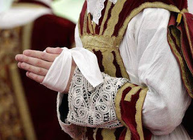

\[caption id="" align="alignright" width="320"\] Manutergium\[/caption\]

[Sublieme eenvoud met een ontroerende schoonheid](http://blog.adw.org/2010/06/lost-liturgies-file-the-maniturgia/ "The Manutergium").

Dat is de kracht van de traditie. Heel eenvoudige dingen die je zelf niet zou bedenken, maar die het mens-zijn systematisch verheffen.

Wanneer was het ook alweer dat we ingezien hadden dat dit allemaal overbodig was? Help me even, want ik herinner het me niet meer zo precies...
