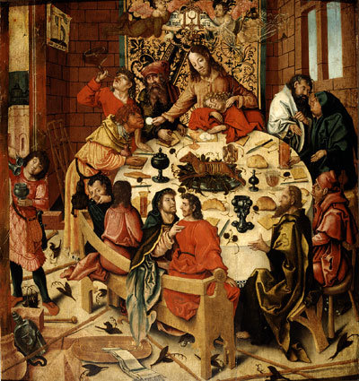

### Zit recht!

Hebt u kinderen? Dan weet u ongetwijfeld hoeveel moeite het kost uw kinderen tafelmanieren te leren. Vanzodra ze zelf met bestek aan de slag kunnen, is het een dagelijkse opdracht te waken over de goede manieren bij de maaltijd. _Niet morsen! Niet zo gulzig eten! Je moet proeven! Niet zomaar van tafel lopen! Je eet wat de pot schaft! Wachten tot iedereen aan tafel zit! Zit recht! Pas na je eten krijg je nog drinken! Laat je zus gerust! Eet met je mond dicht! Vraag dat eens met 'alsjeblieft'! Gebruik je mes en vork! Wachten tot iedereen gedaan heeft! Geen dessert als je bord niet leeg is!..._ Wie herkent deze mantra niet? En wie erkent niet dat het noodzakelijk is om kinderen daaraan te onderwerpen, omdat we het belangrijk vinden om met het gezin minstens eenmaal per dag tijd te maken om samen te eten wat moeder voor ons heeft bereid? Omdat samen eten nu eenmaal meer inhoudt dan het stillen van de honger: het geeft gestalte aan het gezinsleven, door de zorg waarmee de maaltijd wordt bereid en door de manier waarop we tijd maken en met mekaar rekening houden om de maaltijd smakelijk te laten verlopen.

 Tafelmanieren bij de Simpsons

Niettegenstaande worden formele etiquetteregels bekeken als 'iets van vroeger', waar men in de jaren vijftig nog onze ouders en grootouders mee plaagde, maar wat wij intussen ontgroeid zijn, ook al passen we er nog heel wat van toe, omdat onze ouders het ons nu eenmaal zo geleerd hebben, en omdat we het eigenlijk wel goed vinden, zo.

### Willekeurige regels

Wij zijn gewoon alles te rationaliseren, en veel etiquetteregels zijn gewoon maar afspraken waarvoor geen argumentatie bestaat waarom de regels zo zijn en niet anders, kijk maar naar andere culturen, waar er ook etiquetteregels zijn, maar gewoon helemaal andere, en die werken ook. Als we dat zien, voelen we ons in onze keuzevrijheid beperkt en gaan we de boel relativeren.

Waarom doen we dat dan niet bij andere regels die in se ook helemaal willekeurig zijn, zoals rechts rijden met de wagen? In Engeland rijden ze links, en gebeuren er niet meer ongelukken, dus waarom hebben we daarbij niet dat gevoel dat onze keuzevrijheid beperkt wordt? Omdat we wel inzien dat zo'n willekeurige afspraak toch nuttig kan zijn! En dat zijn etiquetteregels natuurlijk ook!

### Nuttige regels

Etiquette is, zoals vele dingen, geen doel op zich. Het is ook geen wondermiddel. Het is niet omdat je je aan tafel netjes gedraagt, dat het eten beter wordt... dat bepaalt nog altijd de kok. Maar met nette manieren kan je wel je respect voor de kok tot uiting brengen en de maaltijd voor je tafelgenoten smakelijker maken. Het gedrag verandert niks aan het eten, maar wel aan de smaak. Het kan de smaak versterken, maar ook verbrodden. Onze goede manieren helpen om de maaltijd te maken tot wat het behoort te zijn: de gestalte van ons gezinsleven.

Je bent een hele stap voor in het leven, als je beschikt over vaardigheden om op een spontane maar fatsoenlijke manier met andere mensen om te gaan. Dat gaat over tafelmanieren, maar ook over manieren om een gast of een gastheer te begroeten, om iemand voor te stellen, om een gelegenheidsbrief, e-mail of ander soort van bericht op te stellen, om het woord te vragen en te voeren, om lichaamshouding, om zich te kleden voor een gelegenheid, om begrip en respect voor ceremoniele handelingen, om beleefdheidsvormen in de publieke ruimte (bv. op de tram, in het verkeer, op school, in een winkel,...) en waarom niet, op rijpere leeftijd: voor omgang met het andere geslacht.

Wie zijn omgangsvormen beheerst, is slagvaardiger zonder daarbij de waardigheid van zichzelf of van anderen te schaden. Een goede omgang is een bliksemafleider voor tal van kleine ergernissen en het is de olie in het raderwerk van je sociale leven... en zo eenvoudig: hoeveel kan een simpel woordje als 'sorry', 'alsjeblieft' of 'dankjewel' niet bewerkstelligen!

### Geloofsetiquette

Over naar geloof echter. Ervan uitgaande dat het belang van omgangsvormen in het dagelijks leven aangetoond is, is het belangrijk ook het belang van omgangsvormen in het geloof te erkennen.

Onze (groot)ouders zullen het getuigen dat in hun tijd de gedragsregels in het geloof heel streng waren. _Elke morgen naar de mis! Pet af als je de kerk binnenkomt! Kruisje maken met wijwater! Knielen voor je gaat zitten! Niet praten met je buur! Niet rennen in de kerk! Maak een mooi kruisteken! Geen korte mouwen of rokken! Altijd bidden voor en na het eten! Elke dag je tientje bidden! Voor het slapengaan een kruisje vragen! Bid een schietgebedje als je hoort vloeken!_

Ook hier is de vorm slechts een middel, en geen wondermiddel. Pedagogisch liep er in (groot)moeders tijd ongetwijfeld een en ander mis, als met hel en verdoemenis gedreigd werd wanneer je een van deze gedragsregels overtrad. En dat verklaart waarom ook in de kerk de etiquette overboord is gekieperd, met als argument dat de vorm ondergeschikt is aan de inhoud... Het is niet door je in de kerk netjes te gedragen dat je je plaats in de hemel zal verdienen. Je moet geen groot bijbelkenner zijn om te weten dat Jezus walgt van farizeeen die strenge gedragsregels opleggen, maar in hun levenspraktijk Gods wil niet volgen.

Merk op dat Jezus niet de vorm als dusdanig veroordeelt, maar de leegte ervan. Het is vorm zonder inhoud. Door de leegte van de vorm te veroordelen, bevestigt Jezus juist het belang van de vorm, want Hij erkent dat de vorm gestalte kan geven aan de geest van Gods wil... of aan de leugen. Jezus pleit voor een mooie omgang met God die onlosmakelijk samenhangt met een mooie omgang met onze naaste. Vorm en inhoud gaan hand in hand, en de een kan de ander niet vervangen. De vorm ondersteunt de inhoud, en neem je de vorm weg, dan kalft ook de inhoud af. De stelling dat vorm ondergeschikt is aan inhoud, is twijfelachtig en zeker geen voldoende argument om de vorm te verlaten.

Ook ons rationaliseren en onze liefde voor keuzemogelijkheden doet er natuurlijk geen goed aan. Theologisch valt het allemaal niet zo eenvoudig te rationaliseren waarom liturgische handelingen zijn wat ze zijn, en als er al een verklaring bestaat komt het me voor dat die negen keer van de tien achteraf uitgevonden is om het zaakje te doen kloppen. Maar ook dat is natuurlijk geen reden om alle 'ongefundeerde' godsdienstige handelingen links te laten liggen of ermee te gaan experimenteren tot we iets geknutseld hebben dat we wel 'begrijpen'. We gaan met de auto ook niet links rijden, omdat rechts rijden 'ongefundeerd' is of. Rechts rijden is ook maar een traditie die ontstaan is in omstandigheden waarin de keuze voor een bepaalde regel zich om praktische redenen opgedrongen heeft, maar die we achteraf niet zonder kleerscheuren kunnen herroepen, ook al weten we dat de keuze willekeurig was en ons voor altijd de vrijheid ontzegt om het linkerbaanvak te kiezen.

Toch is er nog een verschil. Verkeersetiquette regelt de omgang tussen mensen onderling. Geloofsetiquette regelt de omgang tussen gelovigen (en ongelovigen) onderling, maar tegelijk ook tussen een gelovige en God. Daarom nemen we aan dat God, als deelnemende partij, ook een rol speelt in de vormgeving van de etiquetteregels waarmee we ons geloof gestalte geven, waardoor die niet zomaar tot een historisch of cultureel fenomeen gereduceerd kunnen worden.

### Katalysator

Net als de smaak bevorderd wordt door goede tafelmanieren, wordt de genadewerking van de Heilige Geest gekatalyseerd door fijngemanierde liturgische handelingen. Daar staat tegenover dat evenmin als goede tafelmanieren de kwaliteit van de kok bepalen, de kwaliteit van ons geloof bepaald is door de vroomheid waarmee we godsdienstige handelingen verrichten. Net als tafeletiquette is vrome godsdienstigheid een heel nuttig middel om een gelovig leven in gemeenschap met andere gelovigen te beleven, te ondersteunen en te verdiepen.

Etiquette geeft gestalte aan een respect. Bij de gezinsmaaltijd is dat respect voor mekaar als gezinsleden en voor de gerechten die door moeder zijn bereid. In het geloof is dat respect voor Christus, die tegelijk onze gastheer en ons verlossend voedsel is, en voor de andere gelovigen, die onze broeders en zusters zijn.

Hoe moeilijk het is om een kind zich fijne tafelmanieren eigen te laten maken, ervaart een ouder elke dag. Even moeilijk is het als gelovige om zich de fijne manieren van het geloof eigen te maken, zoniet moeilijker. Ook dat vergt (zelf-)opvoeding, vaak tegen heug en meug. Niet 'omdat het zo moet' of 'omdat je zo in de hemel komt', maar omdat het ons geloof noodzakelijke gestalte geeft: alleen al de nederigheid en de zelfgave van dit opvoedingsproces geeft sterkte aan het karakter waarin de ziel zich tot God kan verheffen.

 Jerg Ratgeb, Het Laatste Avondmaal, ca. 1505/10, Museum Boijmans van Beuningen, Rotterdam

### Mismanieren

Laat ons de heilige Mis bijwonen zoals we aan tafel zouden gaan bij een goeie vriend, die van heel veel mensen het leven wil redden en zoveel van zijn vrienden houdt dat Hij hen elke week bij zich thuis uitnodigt. Het enige rare is: we kunnen onze gastheer niet de hand schudden, maar Hij zal ons voeden met zijn eigen lichaam en bloed! Daaraan moeten we onze tafelmanieren natuurlijk enigszins aanpassen, maar voor de rest is het heel gepast op zijn uitnodiging in te gaan en zijn zelfgave alle eer aan te doen, door ons op ons netst te kleden en onze vrome dankbaarheid en eerbied voor onze gastheer te tonen, en door jegens Hem geen onbeleefdheden te begaan die bij een ontvangst door een 'gewone' goeie vriend nog niet eens bij ons zouden opkomen. Zo zouden we op bij een gewone ontvangst toch nooit iemands huis binnengaan zonder onze voeten te vegen (kruisje met wijwater) of zonder een begroeting (knieling voor het tabernakel) of zouden we in afwachting van de maaltijd toch niet onder mekaar wat zitten babbelen en de gastheer straal negeren en het verder verloop van het feestje naar onze hand zetten. Laat ons niet alleen de heilige Mis, maar elke dag beleven in gezelschap van deze goeie vriend, die we 's morgen en 's avonds groeten omdat Hij altijd bij ons is en wiens hulp we kunnen inroepen waar nodig.

Samen in geloof leven is niet minder belangrijk dan samen een dagelijkse gezinsmaaltijd te nemen. Het is dus logisch, als (gelovige) ouder, niet minder belang te hechten aan geloofsetiquette dan aan tafelmanieren. De vruchten van moeders kookkunst willen we graag tot hun recht laten komen, en evenzo willen we de genadegaven van ons geloof in Christus ten volle beleven.

Denk je dat het toeval is dat Jezus gekozen heeft voor een maaltijd om gestalte te geven aan zijn voortdurende aanwezigheid in zijn geloofsgemeenschap?

Dit artikel werd gepbuliceerd in Catholica nr. 8, oktober 2013.
