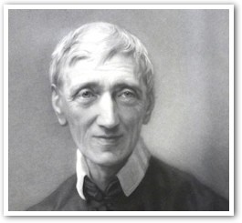

Twijfel en geloof… ik heb er in mijn blogje al vaker over geschreven. Ik kan de twijfel en de relativiteit van de filosofie onmogelijk verzoenen met de zekerheid en het vertrouwen van het geloof. In de cursus 'Christelijke Literatuur' prijkte vanmorgen op het eerste blad van de syllabus volgend citaat van de zalige kardinaal John Henry Newman, waaraan ik vanzelfsprekend niks heb toe te voegen:

 John Henry Newman

_"Ik wil natuurlijk in de verste verte niet beweren dat ieder artikel van de christelijke belijdenis, zowel bij katholieken als bij protestanten, niet van allerlei intellectuele moeilijkheden is omringd en ik geef direct toe, dat ik voor mij die moeilijkheden niet kan beantwoorden. Vele mensen voelen die moeilijkheden van de religie zeer levendig aan. Ik voel ze zo levendig aan als wie ook, maar ik heb nooit enig verband kunnen zien tussen het besef van die moeilijkheden, boe levendig en talrijk die ook mogen zijn, en twijfel aan de leerstellingen waarmee ze samenhangen. **Tienduizend moeilijkheden vormen samen nog niet één twijfel**, zoals ik de zaak begrijp; moeilijkheid en twijfel zijn niet met elkaar te vergelijken."_ (John Henry Newman, uit _Apologia pro vita sua_)

Met deze uitspraak is Newman zelfs geciteerd in [artikel 157](http://www.rkdocumenten.nl/rkdocs/index.php?mi=600&doc=1&id=1009) van de Catechismus van de Katholieke Kerk, in het hoofdstuk dat handelt over geloof en rede.

Newman leefde in de eeuw na de Verlichting. In zijn spiritualiteit vertrouwt hij op de individuele voorzienigheid van een personlijke God die elke mens roept en genade geeft naargelang zijn noden, om telkens nieuwe stappen te zetten in de weg naar heiligheid,  zonder de menselijke onvolkomenheden te negeren. Leerstellige moeilijkheden zijn een teken van onze geestelijke onvolmaaktheid, maar hoeven geen reden te zijn tot twijfel bij de belijdenis van Gods openbaring.

 Op mijn mobiel toonde '[Augustinus voor elke dag](https://play.google.com/store/apps/details?id=patristicpublishing.aug "Augustinus voor elke dag")' me een quote die hier ook niet mag ontbreken:

_Het geloof daalt in ons hart neer. Het komt van boven. De twijfel is niet van boven neergedaald, maar de twijfel schiet in je hart op als onkruid. Het geloof verdwijnt niet uit het hart. Het geloof roeit het onkruid uit, het wiedt de akker en het zaait het goede zaad._
