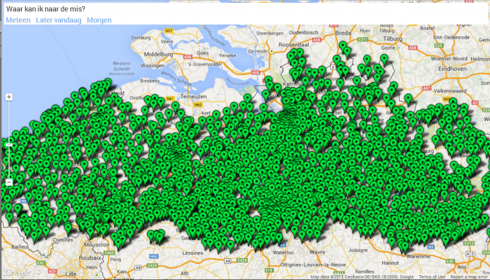

Nu denk ik niet dat je je dagelijks afvraagt waar je in de buurt naar de mis kan gaan, maar af en toe zou het toch handig zijn als je zoiets kon opzoeken… de vraag is alleen: hoe? De gegevens die je nodig hebt staan allemaal op internet, maar niet in een formaat dat bruikbaar is om deze vraag te beantwoorden.

Op [Kerknet](http://kerknet.be/zoek_parochie.php?allbisdom=1) kan je voor alle parochies vinden wanneer er eucharistievieringen plaatsvinden, maar je moet handmatig een voor een de pagina's van de parochies aflopen in een bepaalde stad of postcode… en wat met de buurgemeentes? Niet erg handig. Daar komt nog bij dat je niet eens het adres van de kerk kan vinden! Wel een contactadres, dat meestal de pastorij is van de kerk, maar tegenwoordig ook vaker een centraal adres van de federatie. Vind je een misviering, dan zou je nog niet eens de kerk kunnen vinden… Websites als deze komen niet verder dan het aanbieden van een veredelde fichebak, terwijl de technische mogelijkheden van het internet informatie zoveel bruikbaarder kan maken als je bij het ontwerp niet vertrekt vanuit de structuur van de gegevens, maar vanuit het oogpunt van de gebruiker. Wat een zonde!

Als bij wonder vinden we op Kerken In Vlaanderen de ontbrekende informatie: elke kerk in Vlaanderen wordt er op de kaart aangeduid. Een beetje data-mining laat nu toe de gegevens van de twee sites te combineren. Dapper, [Google Spreadhseets](https://developers.google.com/chart/interactive/docs/spreadsheets), [Fusion Tables](http://www.google.com/drive/apps.html#fusiontables), [OpenRefine](http://openrefine.org/), Pilatus, Pas en klaar is kees! Een Fusion table met alle gegevens over misvieringen in de Vlaamse parochies. Het knappe aan Fusion Tables is dat er een sterke link is met Google Maps, waardoor je geografische data heel snel bruikbaar kan maken.

Er zijn trouwens nog online databanken met gegevens over Vlaamse kerken: [Inventaris Onroerend Erfgoed](https://inventaris.onroerenderfgoed.be/erfgoedobjecten?discipline=1&discipline=2&discipline=3&discipline=4&typologie=https%3A%2F%2Fid.erfgoed.net%2Fthesauri%2Ferfgoedtypes%2F338), [Wikipedia](http://nl.wikipedia.org/wiki/Lijst_van_parochies_in_Belgi%C3%AB), maar die heb ik niet gebruikt. [MassTimes](http://masstimes.org/) is een internationale databank van parochies en misvieringen, die bevat misschien binnenkort de Vlaamse gegevens.

Erg veel [HTML, CSS en JAVASCRIPT](https://github.com/vicmortelmans/masses) was er niet nodig om een website te maken waar je **[op een kaart kan kijken waar je naar de mis kan gaan](http://vicmortelmans.github.io/masses/)**. Je kan ook specifiek zoeken naar misvieringen die meteen beginnen of die later vandaag plaatsvinden, of morgen. Als je een kerk selecteert, krijg je het overzicht van alle misvieringen in die kerk.

Wie website zegt, zegt mobiele app. Met [Phonegap](http://phonegap.com/) is dat in 1 klik geregeld, en de **[Android-versie van "Naar de mis"](https://play.google.com/store/apps/details?id=net.credomobiel.masses)** ligt al in de store. ****

Zo ziet het plaatje er vandaag nog uit in het katholieke Vlaanderen… benieuwd waar we [over 10 jaar](http://www.standaard.be/cnt/dmf20131129_050) zullen staan.

 Parochiekerken in Vlaanderen
