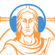

 Katholieke Radio

Er is een nieuwe versie van de Android-app [Katholieke Radio](https://play.google.com/store/apps/details?id=net.credomobiel.katholiekeradio "Katholieke Radio"). 

Die lost een aantal problemen op. Zo is een domme programmeerfout opgelost waardoor de luisteraar nu langer dan 1 minuut kan blijven luisteren naar de eucharistieviering op VRT zonder dat de verbinding wegvalt.

Er zijn ook twee radiostations toegevoegd:

Radio Spes, zendt al bijna 25 jaar uit vanuit de Basiliek van Koekelberg.

[Braambos-KTRO](https://nl-nl.facebook.com/KTROBraambos), uitzendingen door derden op de openbare omroep. Hier vind je geen live-uitzending, maar kan je het laatst gepubliceerde programma herbeluisteren.

Samen met Radio Maria Nederland en Vlaanderen en het live-getijdengebed in novus en vetus ordo en een vleugje Gregoriaanse achtergrondmuziek biedt deze app voor elk wat wils.

Je kan de app ook gebruiken in je browser, als een [gewone website](http://radio.gelovenleren.net/ "Katholieke Radio").

 Nog een zender toegevoegd. RKK publiceert vier podcasts, die nu ook elk te beluisteren zijn: Katholiek Nederland, Kruispunt, Wat Blijft en Platenparadijs. Veel luistergenot!

_Ken je nog andere nederlandstalige katholieke uitzendingen of podcasts, geef gerust een seintje! Ken je iemand met een Apple Developer Account die deze (of andere) katholieke apps kan publiceren op iStore, gelieve contact op te nemen!_
