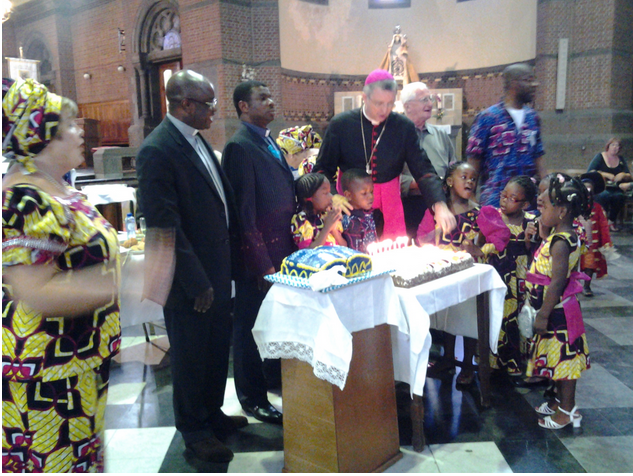
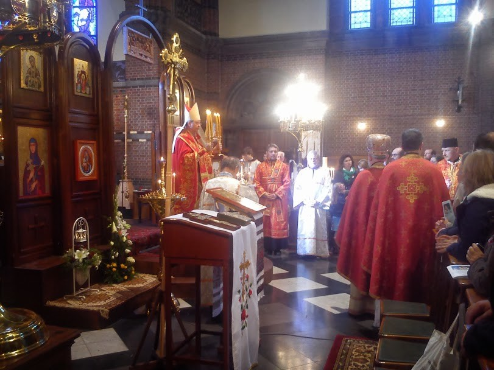

Zaterdag had ik een onthutsende ervaring. Niet met een verschijnsel dat me onbekend was, of zelfs niet met iets dat ik nog nooit had meegemaakt, maar met iets dat je blijkbaar pas werkelijk treft als het zo nabij komt: liturgische creativiteit. Natuurlijk ben ik al eens op een huwelijk geweest of op een andere parochie, waar alle liturgische vormen met de voeten getreden worden. Je vindt het jammer en je denkt bij jezelf: gelukkig is het bij ons niet zo. En dan lees je op internet her en der gekanker en vuilbekkerij over liturgische wanpraktijken waarbij je denkt: zo erg zal het wel niet zijn, en: dan ga je gewoon elders, niet?

Maar dan plotsklaps zit je er middenin, in je eigen parochiekerk. Zaterdag voltrok zich de feestelijke aanstelling van de nieuwe bestuursploeg van onze parochiefederatie. Toevallig werd onze kerk uitgekozen als plaats van gebeuren, en toevallig (of niet helemaal) had onze pastoor-op-rust-die-nog-met-de-moed-der-wanhoop-enkele-jaren-verderdeed juist vorige week finaal afscheid genomen van _zijn_ parochie. Middenin een multiculturele wijk zorgde hij dat onze liturgie altijd sober, maar correct was, zodat ze ook voor nederlandsonkundige vreemdelingen herkenbaar bleef.

### Spektakel

Zaterdag voltrok zich een ander heel ander spektakel. Alternatieve, zoetsappige teksten in de plaats van geloofsbelijdenis en canon. Het gebruik van Turkse broden van de bakker achter de hoek in de plaats van hosties. Een zelf uitgevonden aanstellingsritus voor de leden van de bestuursploeg, inclusief houten bisschopsstaffen en een luid applaus uit de kerk. Kortom: de hele jaren-zestig-santenboetiek, waarvan ik meende dat de kerk in Vlaanderen (of zeg ik beter: de Vlaamse kerk) die stilaan aan het ontgroeien was, keek me levendiger dan ooit pal in de ogen aan.

Ik zal het aan andere blogs laten om met grote ijver banvloeken af te roepen over alle vernieuwing in de kerk en over dit gebeuren, maar dit artikel moet de gewillige lezer aanvaarden als een uitlaatklep van iemand die wekelijks probeert de eucharistie bij te wonen en ter communie te gaan, maar die zich omwille van het overrompelende gebeuren ditmaal innerlijk niet 'in staat van genade' bevond op het ogenblik dat de hompen corpus christi werden aan de man gebracht.

Daarom probeer ik een kleine verdere beschouwing te maken, die niet nieuw is, maar nuttig voor de eigen gemoedsrust... of misschien ook niet.

### Ik ben niet onverdraagzaam, maar...

Het is niet dat ik onverdraagzaam ben tegenover andere vormen van liturgie. Nog maar enkele weken geleden vonden in onze kerk de feestelijke vieringen plaats van twee allochtone katholieke gemeenschappen bij de gelegenheid van hun tienjarige aanwezigheid in onze kerk. En die houden er ook wel heel bijzondere gewoontes op na!

Wanneer de anglo-Afrikanen vieren, staat de kerk helemaal op stelten, met opzwepende muziek, tribale klederdracht en rituele dansen. Dat heb ik allemaal doorstaan en ik herinner me niet me ook maar één ogenblik daaraan te hebben geërgerd, maar ik voel nog wel wel hoe mijn hart meermaals opsprong van ontzag, bijvoorbeeld wanneer het evangelieboek op onbeschrijflijk imponerende wijze werd aangebracht.

\[caption id="attachment\_619" align="aligncenter" width="450"\] Mgr. Bonny snijdt de taart aan na de viering van de anglo-Afrikaanse gemeenschap\[/caption\]

Wanneer de grieks-katholieke Witrussen vieren ben je helemaal het noorden kwijt, want hun ritus is orthodox en alles gebeurt achter hun nieuwe iconostase en zelfs met een de volledige tekst van de liturgie in de hand is het haast onmogelijk te volgen wat er gebeurt. Zij gebruiken trouwens ook geen gewoon hostiebrood, wist je dat? En rode wijn in plaast van witte. Opnieuw dezelfde ervaring: geen spiertje ergernis tijdens een dienst van bijna twee uur lang, en talrijke ogenblikken van diep ontzag.

\[caption id="attachment\_618" align="aligncenter" width="450"\] Mgr. Bonny gaat voor in de liturgie van de Grieks-katholieke Witrussische gemeenschap, of beter: hij celebreert de goddelijke liturgie van de heilige Johannes Chrysostomus\[/caption\]

Maar tijdens de 'gewone' Vlaamse viering van vorige zaterdag heb ik van begin tot einde 'mijn kas zitten opfretten', zoals ze hier zeggen… Wat loopt er mis?

### Te moeilijk

Voor zover ik op mijn vertwijfelde vragen antwoord krijg, lijkt het dat men andere teksten wil dan die uit het missaal, omdat die te moeilijk te begrijpen zijn. Vindt men het missaal moeilijk omdat het woorden gebruikt als 'ootmoed' of 'lankmoedigheid', die niet meer in ons alledaags taalregister zitten? Of wegens zinsconstructies die net iets complexer zijn dan wat we in het VRT-journaal te horen krijgen? Dat kan, geloof ik, toch geen voldoende reden zijn om een gans missaal bij het oud papier te zetten? Zou niet, eerder dan de taal, de inhoud het probleem zijn? De inhoud van het missaal is de uitdrukking van het geloof, dus dat die woorden "moeilijk te begrijpen zijn", zou toch niet mogen verbazen.

\[caption id="attachment\_622" align="alignright" width="300"\] Het missaal: een 'moeilijk' boek\[/caption\]

In tegenstelling tot de andere aanwezigen, die dankzij de nieuwe teksten "de mis goed konden begrijpen", begreep ik er niks van en ging met veel vertwijfeling naar huis. Ik heb immers nooit dat gevoel het allemaal goed te begrijpen, wanneer ik uit de kerk kom. Het geloof is zo vol van mysterie, en de eucharistie als sacrament niet in het minst. Moet ik dan blij zijn voor de anderen die het hele mysterie wel blijken te begrijpen, dankzij hun "eigen" mis, netjes ontdaan van alles wat tot onbegrip aanleiding kan geven en aangevuld met een handvol eigen symbolen, ook allemaal klip en klaar uitgelegd, zodat we ze allemaal goed begrijpen? Ik snap er niks meer van.

Zou ik vragen dat ze het mij dan ook eens uitleggen, zodat ik ook 'de mis' kan begrijpen? Ik ben echter bang dat het antwoord schraal zal zijn. Dat het zou gaan over 'symboliek' van mensen die mekaar in gemeenschap ondersteunen en samen maaltijd houden, zoals Jezus dat ook gedaan heeft. Vandaar ook de Turkse broden, dat was een ad hoc uitgevonden symbool voor onze verbondenheid met de allochtone gemeenschappen in onze buurt. Goed, dat begrijp ik. En dat was het dan?

### Reconstructie

Nee, er moet ergens iets zijn misgelopen. Een poging tot reconstructie… In de tijd van onze grootouders was Christus een godheid die ergens ver weg in de Hemel woonde, die als een almachtige en onpersoonlijke God aanbeden werd in een onverstaanbare liturgie en met Wie het dus moeilijk was een persoonlijke relatie te ontwikkelen, tenzij via de bemiddeling van de sacramenten en de devotie tot de heiligen en tot onze-lieve-vrouw. Dat is het beeld dat we vandaag althans ingelepeld krijgen over die periode. Daar moest iets aan worden gedaan! Jezus moest benaderbaar worden zonder al die bemiddeling. Om de mensen nabij te komen, kreeg Hij een plaats in de wereld, onder ons. Had Hij niet gezegd: "waar er twee of drie in mijn naam bijeen zijn, daar ben Ik in hun midden" en "alles wat je voor één van deze minste broeders van Mij hebt gedaan, heb je voor Mij gedaan"? Midden onder ons, daar woont Jezus voortaan. Als we in relatie met Jezus willen treden, hebben we geen hocus-pocus meer nodig en hebben we geen bovennatuurlijk geloof meer nodig, het enige dat nodig is voor geloof is onze relatie tot onze naaste af te stemmen op hetgeen Jezus ons leerde en voordeed, en automatisch zijn we met Hem in relatie. Daarmee kunnen we dus een hoop ballast van ons afschudden, die in tijden van rationalisme en secularisatie wel heel zwaar begon te wegen. Sacramenten zoals de eucharistie zijn niet langer noodzakelijk om God te ontmoeten, maar worden bijeenkomsten met als voornaamste doel andere mensen te ontmoeten, omdat het samen-zijn de nieuwe essentie van het geloof is.

Aan dit beeld van geloof beantwoordde de viering van zaterdag perfect. Ik heb Christus op talloze wijzen aanwezig gezien in de vreugde en de hoop die de aanwezigen uitstraalden. Wat ik zag en meemaakte was een spektakel voor en door mensen, waarin mensen centraal stonden. Mensen die het goed menen, en die door Jezus geinspireerd worden en die er samen iets van willen maken. Het was een heel dynamisch en vrolijk gebeuren, de installatieviering, en ze steunde op Jezus als leraar en voorbeeld.

### Eenzijdige Jezus

Jezus als goddelijke persoon, schepper en verlosser heb ik echter niet ontmoet. Op geen enkel ogenblik heb ik me uitgenodigd gevoeld mijn persoonlijke relatie tot een Christus-die-God-is uit te spreken. Een Christus die niet alleen maar symbool staat voor een koninkrijk van vrede op aarde, maar die ook werkelijk koning is van een koninkrijk dat hemel en aarde en tijd en ruimte  overspant. Een Christus die niet bestaat bij de gratie van de relatie die ik met mijn naaste heb, maar een Christus door wiens genade ik die relatie mag hebben.

In liturgie verwacht ik de Christus te ontmoeten die wel ontzagwekkend veel meer is dan het gebaar van liefde dat ik -altijd te laat en altijd te weinig- stel tegenover mijn naaste. De Christus die het mysterie bevat van God die zichzelf opoffert voor de mens. De Christus die verlossing belooft van zonde, en opstanding in een eeuwig leven bij God. En om die ontmoeting gestalte te geven, zijn de teksten van het missaal met de nodige zorg verzameld en opgesteld, hoewel het best kan zijn de de aard van de inhoud niet meteen van die strekking is dat je het allemaal zomaar direct zal "begrijpen".

### Bedenking

Ik heb bewondering voor die mensen met hun "eigen" mis, die een zelfverzekerd christendom belichamen dat pal midden onder de mensen staat, en voor de goeie werken die ze doen vanuit hun gemeenschap. En ik wil hen hun "eigen" mis niet misgunnen, want het lijkt wel aan te slaan, hoewel ze voor mijn geloof een uitdaging en een beproeving is. Onbezonnen kritiek levert [christelijke woorden die verdeling brengen](http://www.rkdocumenten.nl/rkdocs/index.php?mi=680&nws=2302). Toch is een bedenking op haar plaats. Daarvoor laat ik dus veiligheidshalve mgr. Eijk aan het woord, op de [ledendag](http://vwhll.romanliturgy.org/2013.html) van de V_ereniging voor Latijnse Liturgie_:

_"In de laatste halve eeuw probeerde men nog een zo groot mogelijk aantal personen aan te trekken door middel van een vage verkondiging van het geloof met weglating van die elementen die omstreden waren. Het gebeurde vaak dat men de geloofsverkondiging reduceerde tot een uiteenzetting over waarden vanwege een zekere verlegenheid om de echte inhoud van het geloof ter sprake te brengen. Het is de algemene ervaring dat parochies waarin populaire en zogeheten progressieve ideeën en gebruiken uit de tijd van na het Concilie zijn gebleven, leeglopen en sterven.  We zien een analoge ontwikkeling in de protestantse wereld: de vrijzinnige kerken zijn leeg, terwijl de orthodox-protestantse naar verhouding bloeien."_

Ik heb het gevoel dat in deze context volgende evangelieverzen ter bezinning nuttigzijn. Ze zijn minstens zo 'onbegrijpelijk' als de gemiddelde missaaltekst, maar ze zijn een uitdaging voor wie zich aan deze of gene zijde van deze discussie bevindt, hoewel voor hun werkelijke betekenis de 'onderscheiding der geesten' noodzakelijk is,  en daar ben ik nog niet uit:

_Wie niet met Mij is, is tegen Mij, en wie niet met Mij bijeenbrengt, verstrooit. Daarom zeg Ik u: elke zonde en elke godslastering zal de mensen vergeven worden, maar de lastering tegen de Geest zal niet vergeven worden. Als iemand de Mensenzoon weerspreekt, zal het hem vergeven worden. Maar als iemand de heilige Geest weerspreekt, zal het hem niet vergeven worden, niet in deze tijd en niet in de komende. Stel dat de boom goed is, dan is ook zijn vrucht goed; stel dat de boom ziek is, dan is ook zijn vrucht rot. Want aan de vrucht kent men de boom. Addergebroed, hoe kunt u iets goeds zeggen terwijl u slecht bent? Want waar het hart vol van is, loopt de mond van over. Een goed mens haalt uit zijn goede voorraad goede dingen tevoorschijn, en een slecht mens haalt uit zijn slechte voorraad slechte dingen tevoorschijn. Ik zeg u: over ieder zinloos woord dat de mensen spreken, zullen ze verantwoording moeten afleggen op de dag van het oordeel. Want op grond van uw woorden zult u rechtvaardig bevonden worden en op grond van uw woorden zult u veroordeeld worden._ (Mt 12,30-37)
