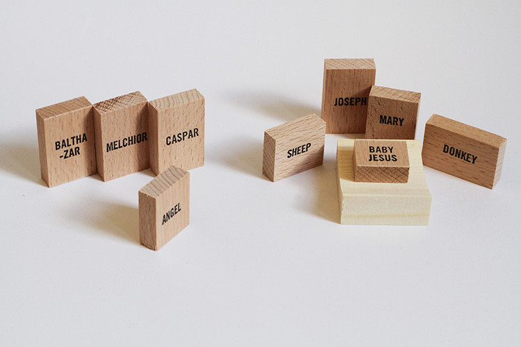

Staat jullie kerststalletje er al? Bij ons staan er twee. Eentje van karton waarin een setje stenen beeldjes staan die een beetje aan de Barapapa's doen denken, en een ander dat een cadeau is van een tante uit Afrika, met zwarte popjes. O ja, en dan nog een derde, een piepklein, eigenlijk een luciferdoosje dat in een kerststalletje verandert als je het openschuift.

Maar wat vind je van dit stalletje? Het summum van minimalistisch design. Of voor wie er problemen van zou maken of kindje Jezus al dan niet blauwe ogen heeft, maar dat vind ik zelf nogal vergezocht:

 De eenvoudigste kerststal ter wereld
