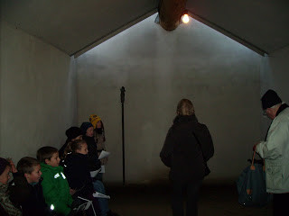
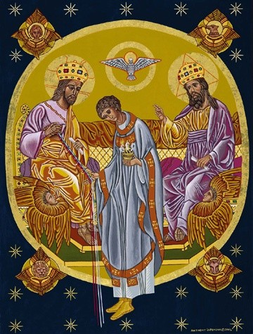

Groeien in geestelijk leven, daar moeten gelovigen dagelijks aan werken. Stilstaan is achteruitgaan, ook in het geloof. Elke dag opnieuw de oude mens versterven en de nieuwe mens laten geboren worden, met vallen en opstaan, al is het maar door elke dag een kleine ergernis te voorkomen, hetzij in je relatie tot je naaste, hetzij in je relatie tot God. Het doel: de vereniging met Christus: ons hart eenvormig aan het zijne, onze wil afgestemd op de zijne.

Het resultaat van deze symbiose is de 'nieuwe mens', hij is vereend met zijn Verlosser, hij leeft reeds in het koninkrijk van God, hij voelt al de eeuwigheid van het leven en de warme gloed van Gods aanschouwen. De nieuwe mens herkent God, eender waar hij is, eender op welk tijdstip, eender in wiens gezelschap. Wat een uitdaging! Enkele weken geleden maakten we een wandeling in Westvleteren. De abdij en haar kerk is niet toegankelijk, maar we vonden wel de nieuwe 'pelgrimskapel'. Het piepkleine gebouwtje zou niet misstaan in het openluchtpark Middelheim. Schaarse lichtinval door een opening in het dak, dat rust op een overgedimensioneerde boomstam als nokbalk, een tafeltje voor offerkaarsen en een klein mariabeeldje op een staak en bladeren en ander natuurlijk vuil over de vloer.

Ik vond op internet een [interview](http://kerknet.be/admin/files/assets/subsites/5/documenten/Brugge_20_16_mei.pdf) met de abt, die over de nieuwe kapel sprak:

> 'De architectuur in de pelgrimskapel is bewust zeer sober gehouden. Materialen zijn zoveel mogelijk in hun oorspronkelijke staat behouden: een boomstam voor het dak, een andere boomstam als bank, een gestampte aarden vloer en een soliede inkomdeur. Vader abt Manu Vanhecke merkt op dat de vier elementen in deze nieuwe kapel voluit kunnen spelen: licht, water, vuur en lucht. „Hier vind je de schepping in haar totaliteit. Hier kan het contact met de aarde, met de ander en met God worden hersteld. De Moeder Gods is voor ons op die weg een vaste hulp en toevlucht”'

 Pelgrimskapel in Westvleteren gevuld met 'nieuwe mensen'

Al die elementen 'betekenen' dus iets, en die betekenissen zijn op zich zeer waardevol, maar bij de werkzaamheid ervan in de geest van een gewone katholiek die niet reeds volledig getransformeerd is in 'nieuwe mens' (of die dit artikeltje uit het parochieblad niet had gelezen), stel ik me vragen.

Die 'nieuwe mens' kan zich spontaan in dit soort van kapel terugtrekken om in stilte zijn godservaring te beleven. Voor hem is deze gebedsomgeving wellicht nog vanzelfsprekender dan een barokke kerk, waar de overvloed van beelden en andere indrukken hem slechts de blik zouden afleiden van zijn zuivere, geestelijke godsbesef. Hij komt in die kapel tot waarachtig gebed, met hetzelfde gemak waarmee hij zijn dagelijkse leven op christelijke leest schoeit. Ik kan me voorstellen dat een pater van de strenge trappistenorde, die -mag ik hopen- zich in het geestelijk leven zeer bekwaamd heeft, zo'n nieuwe mens is.

Maar voor mij, die in het geestelijk leven nog een lange weg af te leggen heb, bood de lourdesgrot achter het hoekje toch meer inspiratie voor mijn gebrekkig gebed. Ze verdient in Middelheim geen plaats, er stonden meer offerkaarsen, en een paar kitscherige heiligenbeeldjes: een Pater Pio, een Onze-Lieve-Vrouw-van-Vlaanderen en een heilig-Grafbeeld onder het altaartje. Maar al die knullige postuurtjes tonen me hoe tastbaar en persoonlijk het grote mysterie van de heiligheid kan zijn en op slag en stoot voel ik me meer op de hemel betrokken, wat me in de pelgrimskapel niet overkwam.

Ben ik deze nieuwe beeldtaal nog niet machtig? Of is mijn geestelijk leven te onvolmaakt? Wie maakt van mij zo'n nieuwe mens, die God kan schouwen in de leegte? Zoals onze Paus het  zegt in zijn exhortatie: "We must be bold enough to discover new signs and new symbols, new flesh to embody and communicate the word, and different forms of beauty which are valued in different cultural settings, including those unconventional modes of beauty which may mean little to the evangelizers, yet prove particularly attractive for others." In de schaduw van de lourdesgrot keek Onze-Lieve-Vrouw me liefdevol aan bij het besef van de vele hindernissen die me nog in het leven te wachten staan. In de pelgrimskapel zweeg zij als vermoord. Maar wat betekent mijn persoonlijke _'sense of beauty'_ in het licht van de nieuwe evangelisatie?

Grossouw noteerde in "[Innerlijk Leven](/page/e-boeken/)" op de octaafdag van het feest van de onnozele kinderen een mogelijke oorzaak van mijn probleem: je moet geloven als een kind.

> "Wat belet ons, wanneer wij over een stille landweg gaan en zelfs wanneer wij ons door een drukke straat haasten, tegelijkertijd te weten dat God met ons is en in dat bewustzijn gelukkig te wezen? Alleen de bloedarmoede van ons geloof, de zwakheid van onze „overtuiging aangaande de dingen die men niet ziet”. Iedereen die zijn  katechismus kent zal desgewenst antwoorden dat de heilige Drieëenheid door de genade woont in de ziel van de rechtvaardige, dat God alomtegenwoordig is, dat zijn macht, wijsheid en liefde werkzaam zijn in alle schepselen. Maar alleen hij die kinderlijk gelooft en zich in de geestelijke strijd heldhaftig inspant, zal kinderlijk verwonderd en dankbaar verrukt blijven over al deze allerhoogste werkelijkheid, en hij zal  ervaren dat deze inwoning Gods wil zeggen: liefde van voorkeur, vergeestelijking, rust en zekerheid, zaligheid en smart, en opname in het licht des Heren."

Toch hou ik ook van de stilte en de eenvoud. In de mis bijvoorbeeld. Wanneer ik 's zondags niet in de eigen parochie naar de mis kan, ga ik 's avonds naar de Sint-Michielskerk. Één van de priesters daar heeft een akkoordje met de (overigens uitmuntende) organist: die laat tijdens de consecratie, traag en plechtig uitgesproken, een ijle melodie door de kerk zweven. Die vormelijke onderlijning, samen met het lokale gebruik van de gelovigen te knielen op de nog aanwezige knielbanken, helpt me enorm om werkelijk te participeren aan het mysterie van de eucharistie. Die stijgt immers zover uit boven wat de aanblik van de priester of de woorden die hij in Christus' en ons aller naam uitspreekt, kunnen bieden. Meer nog: het brengt me tot de gewoonte tijdens de consecratie de ogen neer te slaan en de leegte van de zintuigelijke wereld binnen te treden, en pas op te kijken als het belletje klinkt en de hostie wordt opgeheven ter aanbidding.

Zo werkt trouwens ook de buitengewone ritus: je neemt er niet deel aan de eucharistie door de aanblik van de priesterlijke handelingen of het beluisteren van de woorden die hij uitspreekt, die aspecten worden zelfs onderdrukt door de houding van de priester en door de stilte van zijn stem. Dat schept ruimte voor de ervaring dat iets wezenlijk belangrijkers plaatsgrijpt, dat tijd en ruimte overstijgt, ruimte voor een innerlijke vervoering door Christus' werkelijke aanwezigheid.

In andere kerken staren de gelovigen zich blind op de priester en zijn 'alleenrecht' (ik zou zeggen: zware plicht) om de canon uit te spreken. Ze murmelen mee met geimproviseerde canongebeden uit losbladige dankgebedenboekjes om tot een 'volwaardige participatie' van de mis te komen. Mij leidt dat enkel af. Als je niet de ruimte krijgt om zelf even stil te worden en je even aanwezig te weten in de bovenzaal van het laatste avondmaal, als je niet het gevoel hebt gehad even onder het kruis te staan, hoe haal je uit de eucharistie dan die kracht die je nodig hebt om 'nieuwe mens' te worden naar Christus' beeld?

Geloof heeft verbeelding nodig (geen fantasie, da's iets anders), want wat we geloven is niet zomaar vast te grijpen. Het beeld wordt pas werkzaam in de stilte van de verering, wanneer het verinnerlijkt wordt. Beelden en stilte, ze vullen mekaar aan en hebben mekaar nodig. Krachtiger dan een beeld is de eucharistie, omdat de werkelijke Christus er vorm krijgt en niet alleen geestelijk, maar ook lichamelijk verinnerlijkt wordt. Grossouw noteert op de Tweede Zondag na Driekoningen een beschrijving van de eucharistie in een naar hedendaagse normen ietwat hoogdravende stijl:

>  
> 
>  Journeying toward God in the barque of Peter
> 
>  
> 
> "De grote functie van de liturgie is op aarde tot stand brengen de voorafbeelding van, de reeds vol heimwee begerende deelname „in schaduwen en spiegelbeelden” aan de hemelse eredienst, de aanbidding van de Vader en het Lam. Het lichaam van Christus op aarde wordt in en door de liturgie een smekende en aanbiddende gemeenschap, die in geloof en verlangen samensmelt met de volmaakte gemeenschap der heiligen. Dan vooral moet de christen zich zijn eigen en innerlijkst zijn bewust worden, hemels voelen en denken, zich met de Bruid van het Lam aan de aarde onttogen weten, opgeheven in de sferen van het ongeschapen Licht en instemmen met het nieuwe lied van de onzichtbare koren. „Als gij met Christus verrezen zijt, zoekt wat in den hoge is”."

 

Nummer 1326 van de Catechismus van de Katholieke Kerk zegt het zo: _"Tenslotte verenigen wij ons door de Eucharistieviering nu reeds met de hemelse liturgie en lopen wij vooruit op het eeuwig leven, wanneer God alles in allen zal zijn. (1 Kor. 15, 28)"_.

 The Ministerial Priesthood (Monsignor Anthony La Femina, 2002)

Maar nummer 1327 vervolgt nuchter: _"Kortom, de Eucharistie is de samenvatting van ons geloof: "Onze manier van denken stemt overeen met de Eucharistie, en omgekeerd bevestigt de Eucharistie onze manier van denken"."_
