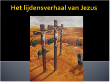

Onze dochter Emma, die een beetje voor is op de rest van de klas, gaat aan haar medeleerlingen het lijdensverhaal vertellen aan de hand van een powerpoint die mijn vrouw voor haar heeft samengesteld. Lijden, verrijzenis, en een beetje duiding op maat van kinderen.

 Het lijdensverhaal van Jezus voor het tweede schooljaar ([begeleidende teksten](https://drive.google.com/file/d/0B-659FdpCliwU1hjaDdMQWFMXzQ/view?usp=sharing "Het lijdensverhaal van Jezus voor het tweede schooljaar"))

Een andere manier om bijbelteksten met kinderen te beleven, is ze te lezen in dialoogvorm of er zelfs een echt toneeltje mee te spelen. Daarvoor vind je verschillende scripts op [deze website](/page/bijbeltoneel/).
