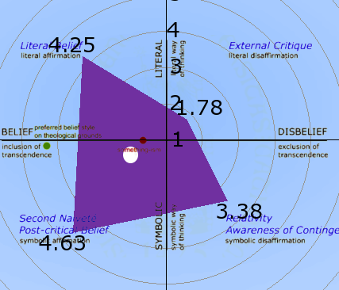

_And now for something completely [different](/2014/05/16/stem-ethisch/ "Stem ethisch!"):_ meer grafiekjes !

Vroeger had je de inquisitie om je op het rooster te leggen als je van ketterij verdacht werd. Dankzij de moderne theologie --- correctie: technologie --- kan je nu jezelf digitaal op het rooster leggen. Het fysieke gehalte van de proef is daarmee teruggebracht tot interactie met muis en klavier. Inhoudelijk worden enkele tientallen meerkeuzevragen voorgelegd die niet eens veel voorkennis vereisen, dus hoewel ik geen idee heb wat vroeger de norm was, lijkt de kans me klein dat de intellectuele moeilijkheidsgraad van de test gestegen is. Het verloop van de ondervraging is bovendien een pak menselijker geworden, want na elke reeks vragen mag je zelf evalueren of je de vraagstelling pijnlijk --- correctie: aangenaam --- vond of niet (sic!). En het resultaat blijft hetzelfde: je eindigt op het rooster, althans jouw geloofsprofiel, met een kleiner risico tot publieke terechtstelling, dankzij de belofte dat informatie vertrouwelijk en statistisch behandeld wordt.

Ik heb het over de vragenlijst die je vindt op de nieuwe webstek [www.dialoogschool.be](http://www.dialoogschool.be), meerbepaald de vragenlijst getiteld PKG ("post-kritisch geloof"). Het is een onderdeel van de Thomas-website en de bevraging loopt internationaal blijkbaar al meerdere jaren onder de naam [ECSIP](http://www.schoolidentity.net/introduction/) ("enhancing catholic school identity project"). Je [meldt je aan](http://www.identiteitsonderzoek.be/createmyecsip/) met een nieuwe registratie, vult de vragenlijsten in en krijgt de resultaten, waaronder dit rooster dat jouw positie in het PKG-veld weergeeft:

 Mijn PKG-schaal

Flauw zeg!, hoor ik je denken, dit wetenschappelijk onderzoek zomaar te vergelijken met de inquisitie. Toch gaat de vergelijking verder op dan je van een louter wetenschappelijk onderzoek zou verwachten. Als je de [begeleidende documentie](http://www.schoolidentity.net/docs/The%20Post-Critical%20Belief%20Scale%20for%20dummies%20(EN)%20v1.21.pdf) doorneemt ("PKG for dummies", maar dit vereist toch iets meer voorkennis dan de vragenlijsten zelf!) blijkt immers dat de verschillende posities op het PKG-veld niet neutraal gepeild worden. Er wordt niet alleen getoetst op \*welke manier\* je gelooft --- dat is best interessant ---, maar ook of je wel op de \*juiste manier\* gelooft. De titel van de tool geeft het antwoord reeds aan: het ideale geloofsprofiel is het 'post-kritische geloof'.

Op dit rooster vind je de normatief 'ideale' geloofspositie voorgesteld als een groene bol:

> ![Preferred belief style on theological grounds: normative viewpoint based on theological arguments. Situated far inside transcendent belief (the inclusion of transcendence is maximal), in the quadrant of second naiveté, just below the boundary with literal belief (though never touching it). This is the symbolic position where the ontological referent is present the most, without ever being presented directly. The authentic believer tries to build a relationship with God as intensely as possible, but continuously withstands the temptation to cross the boundary, to grasp God. He’s standing in the fullest mediation between God and man. Here, believing is an ongoing process of symbol interpretation, whereby God never allows himself to be presented directly, but breaks through from ‘the other side’. ](images/normatievepositie.png?w=525) Preferred belief style on theological grounds: normative viewpoint based on theological arguments. Situated far inside transcendent belief (the inclusion of transcendence is maximal), in the quadrant of second naiveté, just below the boundary with literal belief (though never touching it). This is the symbolic position where the ontological referent is present the most, without ever being presented directly. The authentic believer tries to build a relationship with God as intensely as possible, but continuously withstands the temptation to cross the boundary, to grasp God. He’s standing in the fullest mediation between God and man. Here, believing is an ongoing process of symbol interpretation, whereby God never allows himself to be presented directly, but breaks through from ‘the other side’.

Als ik nu de normatieve schaal bovenop mijn persoonlijk resultaat leg en daarop ook mijn zwaartepunt aanduid (de witte bol), scoor ik (volgens de normatieve schaal) wel goed op de as symbolisch-letterlijk, namelijk precies onder de scheidingslijn, maar op de schaal geloof-ongeloof heb ik nog een lange weg af te leggen! Ik kom nauwelijks boven het 'iets-isme' uit!

 Mijn PKG-schaal met normatieve overlay

Maar er zal nog wel meer schorten aan mijn inroostering, want ik had mezelf een flink eind boven de horizontale as ingeschat…

Zoals al eerder op mijn blogje mocht duidelijk worden, heb ik immers een broertje dood aan het uitgangspunt dat bijbelverhalen [niet letterlijk](/?s=letterlijk) gebeurd hoeven te zijn zoals ze zijn opgetekend. Dat is het uitgangspunt in het linkerbenedenvak van de grafiek, de speeltuin van de moderne theologie, waar gewerkt wordt om --- ik parafraseer --- vanuit de deconstructie van een letterlijk geloof door externe kritiek, een nieuwe 'post-kritische' geloofsvorm te construeren. De normatieve schaal is dan nog zo 'behoudend' dat ze de ideale geloofspositie zo dicht mogelijk bij het veld van het letterlijke geloof plaatst, maar dan ook weer zodanig dat de grens zeker niet overschreden wordt.

Anderzijds mag je de zaken niet voorstellen alsof het louter tegenstellingen betreft. Deze grafiek geeft heel mooi weer dat enkel het totaalbeeld telt. Je kan op dezelfde as in beide richtingen scoren en je kan dus pas de ideale geloofspositie bereiken door in de twee richtingen, letterlijk geloof EN symbolisch geloof evenwichtig te scoren: zo geraakt je zwaartepunt in het midden.

Voor zover deze analyse onder theologen vandaag gemeengoed is, vraag ik me wel af hoeveel van hen het over hun lippen kunnen krijgen dat de ideale geloofspositie inderdaad een stevige component letterlijk geloof moet inhouden om niet te verglijden in symbolisme. De angst voor de externe kritiek (rechts boven, de speeltuin van de 'publieke opinie') --- of is het misschien voor hun eigen schaduw? --- zit er nog stevig in.

Mijn stelling is: het letterlijk geloof is en blijft het vertrekpunt, zonder echter de rijke symboliek van het geloof te ontkennen: wie die verwerft verrijkt zijn geloof en doet aan de letterlijke geloofsbasis niets af. Dat vind ik heel logisch. Je zou bijvoorbeeld kunnen stellen dat een van de wonderverhalen van Jezus, bijvoorbeeld hoe Hij over het water liep, niet letterlijk zo gebeurd is, omdat dat nu eenmaal niet kan, maar dat die bijbeltekst wel een heel diepe symbolische betekenis heeft. Dat is dus de deconstructie van het letterlijke geloof en een reconstructie van dezelfde tekst in een veel diepere interpretatie. Dat lijkt een heel mooi compromis, maar het zet wel het hele christelijke geloof op de helling. Als Jezus immers zo'n 'klein' wonder niet kon verrichten, hoe zou zich dan het 'grote' wonder van zijn verrijzenis hebben kunnen voltrekken? En als Jezus niet echt verrezen is, in wat voor een circus draaien we dan mee? Dus ja, je kan die verhalen letterlijk geloven EN de [rijke symboliek](http://blog.adw.org/2014/01/why-did-jesus-mean-to-pass-by-his-disciples-when-he-walking-on-the-water/ "Why Did Jesus “mean to pass by” his Disciples when He was walking on the water?") krijg je er gratis bij!

Die redenering gaat natuurlijk ook op in de andere richting. Verhalen uit het oude testament, zelfs als die --- in tegenstelling tot het nieuwe testament --- niet als getuigenverslag zijn opgesteld, kunnen letterlijk geloofd worden, tot de schepping en de zondvloed toe, echter zonder de strijd aan te gaan met natuurwetenschap of geschiedkunde en zonder ook hun symbolische waarde te onderschatten. Dat is noodzakelijk omdat deze bijbelverhalen deel uitmaken van dezelfde waarheid als die waarover Christus spreekt en waarin Hij leeft. Een waarheid die voor mijn geloof dus relevanter is dan wat die andere wetenschappen leren, waarover ik in een andere context graag meer te weten kom.

Wat is nu de conclusie? Want eigenlijk gaat het over het project om scholen, of opvoeding in het algemeen, een katholieke identiteit te geven.

#### Over opvoeding

In de conclusies van het [begeleidend document](http://www.schoolidentity.net/docs/The%20Post-Critical%20Belief%20Scale%20for%20dummies%20(EN)%20v1.21.pdf) lees ik _"Believing parents are often tempted to raise their children with a literal belief: believing in God like believing in Santa Claus. They presume that their children – through a necessary crisis – will deepen their faith in a symbolic direction at a later age. Perhaps it is wiser – theologically speaking – to have children participate in the symbolic faith attitude of adults from an early age? Are children already able to personally integrate a symbolic religious coping style? Is this a legitimate educational approach, pedagogically speaking?"_

Daarop antwoord ik volmondig: Ja! Letterlijk geloof kan van jongsaf verrijkt worden met de symbolische dimensie. Er is geen enkele reden waarom kinderen het uitsluitend met een letterlijke interpretatie zouden moeten stellen.

#### Over onderwijs

Over onderwijs zegt het [begeleidend document](http://www.schoolidentity.net/docs/The%20Post-Critical%20Belief%20Scale%20for%20dummies%20(EN)%20v1.21.pdf) _"Usually, courses of Catholic religious education in Flemish schools are caught in the dynamic between relativism (that scores high among students) and second naiveté (the ambition of the course). If teachers, while being engaged in a dialogue with plurality, hesitate to talk about God and the Christian faith explicitly, then religious education in schools risks getting stuck within a relativistic discourse."_

Hier wordt het probleem wel juist gesteld, maar de de oplossing wordt niet (volledig) aangereikt, alhoewel die vanuit de analyse heel logisch is. Om de ideale geloofspositie te bereiken moet inderdaad komaf worden gemaakt met het relativisme, echter niet door alles in te zetten op de 'second naiveté'! Zonder letterlijke geloofscomponent biedt die geen pad dat naar de ideale geloofspositie leidt, want het zwaartepunt zal altijd veel te laag uitvallen. Zoals de conclusies zelf verwoorden: _"this belief style could degenerate into a ‘religious’ attitude with a very general and non-specific content without a clear point of reference, in which any interpretation is possible."_ Een andere insteek wordt wel in de conclusies gegeven: het is gemakkelijker om de ideale geloofspositie te bereiken vanuit een letterlijk geloof dan vanuit de positie van het symbolisch ongeloof… dus soms is het misschien de moeite waard een omweg te maken?

Mijn conclusie is dat het PKG-model wel een goeie analyse maakt van de geloofshoudingen en de punten waarin ze verschillen van mekaar, maar dan ook blijft steken in die verdeling. Door de ideale geloofspositie op de (niet te overschrijden!) grenslijn tussen de letterlijke en symbolische geloofshouding te zetten blijft de indruk bestaan dat het om een compromis gaat tussen tegenstrijdige visies, terwijl in wezen juist de synthese van beide visies (de hoge score in beide richtingen van de vertikale as) moet worden nagestreefd, zonder dat de een iets van de ander afdoet. Beide visies kunnen mekaar versterken. Dat idee zit wel vervat in het PKG-model, maar komt niet uit de verf: de manier waarop de conclusies worden geformuleerd doet me denken aan de witte kalklaag waarmee in zoveel van onze kerken het verleden en de 'achterhaalde' geloofsbeelden zijn weggeschilderd, vanuit een misplaatste euforie nu eindelijk het 'ware inzicht' te hebben bereikt, ook al gaat dat er --- o, ironie --- prat op wars te zijn van elke absolute waarheid.

 Pre-Kritisch-Geloofsrooster
