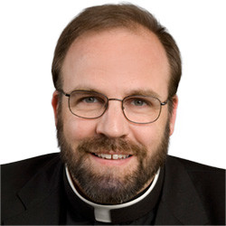

Kan jij ook zo'n deugd hebben van een goed onderbouwd, vlot geschreven, scherp opinierend artikel over geloof? Ben je ook dat onderhuidse weg-met-ons en alles-is-even-goed-relativisme zo beu als koude pap? Het katholieke geloof is geen koude pap, maar de inlandse bereiding heeft er spijtig genoeg veel van weg...

Gelukkig is ons geloof bij uitstek universeel en kunnen we dus zonder probleem over de grenzen kijken. Er zijn honderden goeie internationale blogs, waarvan ik er enkele tientallen Engelstalige in mijn nieuwslezer heb geprogrammeerd. Een daarvan steekt met kop en schouders boven de rest uit: de [blog van msgr. Charles Pope](http://blog.adw.org/), een priester uit het bisdom Washington DC in de VS.

\[caption id="attachment\_741" align="alignright" width="250"\] Msgr. Charles Pope\[/caption\]

Msgr. Pope is priester in een parochie van afro-americans die [getuigt](https://www.youtube.com/watch?v=krvI50aYfEc&app=desktop) dat nieuwe evangelisatie een kwestie is van de dagelijkse en praktische verwezenlijking van het geloof in kleine dingen, maar zijn teksten tonen aan dat deze praktische orientatie wel degelijk berust op een oerdegelijk inhoudelijk fundament! De [website van zijn parochie](http://hcscchurch.org/) bevat veel teksten van msgr. Pope, zelfs geluidsopnames van al zijn homilieen!

Zijn artikelen getuigen van een heldere kijk op de katholieke kerk en haar geloof. Veel blogs kan je leuk vinden omdat ze op ietwat provocatieve wijze een mening ventileren waarin je je kan vinden. Pope's blog geeft dat 'vertrouwde' gevoel ook, maar gaat toch een stapje verder. Van zijn blog kan je regelmatig ook nog wat opsteken. Hij schotelt zeker niet altijd dezelfde herkauwde kost voor.

Een artikel is pas echt goed als het niet alleen de waarheid zegt, maar tegelijk ook een uitdaging oplegt voor je eigen geloofsleven. Uit een goed artikel moet je enkele aandachtspunten kunnen halen waarvan je beseft dat je er in je geloofsontwikkeling nog verder aan moet werken. Niet om schuldbesef op te roepen, maar om te groeien. Als je dat gevoel hebt, dan is de lectuur en de tijd die je eraan besteedt tenminste geen nutteloos tijdverdrijf...

Hetzelfde gevoel heb ik bij de dagelijkse homilieen van die andere _Pope_, Franciscus. Die worden nog altijd ijverig naar het Nederlands vertaald en hebben sinds de website van het Vaticaan herwerkt werd, een [volwaardige plaats](http://www.rkdocumenten.nl/rkdocs/index.php?mi=680&nws=2524) gekregen in de rubrieken van RKDocumenten. Het oude [overzicht](http://rkdocumenten.nl/rkdocs/index.php?mi=650&dos=383) is ook nog steeds beschikbaar.

Als afsluiter krijg je een stevige greep uit de verscheiden onderwerpen die msgr. Pope de jongste maand behandelde. Het is haast onvoorstelbaar hoe hij het voor mekaar krijgt… veel slapen doet hij niet, denk ik.

- [Some Good Common Sense on Marriage, Sexuality, and the Family](http://blog.adw.org/2014/05/some-good-common-sense-on-marriage-sexuality-and-family/)
- [Viva Christo Rey! Titles and Teachings on Jesus from the Opening Vision of the Book of Revelation](http://blog.adw.org/2014/05/viva-christo-rey-titles-and-teachings-on-jesus-from-the-opening-vision-of-the-book-of-revelation/)
- [The Story of Hosea and What It Says About God and Holy Matrimony](http://blog.adw.org/2014/05/the-story-of-hosea-and-what-it-says-about-god-and-holy-matrimony/)
- [“Just a little while longer…” A Meditation on the brevity and urgency of life](http://blog.adw.org/2014/05/just-a-little-while-longer-a-mediation-on-the-brevity-and-urgency-of-life/)
- [Pope Francis Unfiltered! A Recent Column Describes an Area in which the “Modern” Pope is definitely “Old School.”](http://blog.adw.org/2014/05/pope-francis-unfiltered-a-recent-post-column-describes-an-area-where-the-modern-pope-is-definitely-old-school/)
- [How NOT to do Eucharistic Adoration](http://blog.adw.org/2014/05/how-not-to-do-eucharistic-adoration/)
- [Saying No to Divorce is Just Another Way of Saying Yes to the Glory of True Marriage](http://blog.adw.org/2014/05/saying-no-to-divorce-is-just-another-way-of-saying-yes-to-the-glory-of-true-marriage/)
- [The Church Cannot Change Her Doctrine on Marriage and Divorce. Concerns for the Upcoming Synod](http://blog.adw.org/2014/05/the-church-cannot-change-her-doctrine-on-marriage-and-divorce-concerns-for-the-upcoming-synod/)
- [On the Power of Personal Witness in Priestly Ministry](http://blog.adw.org/2014/04/on-the-power-of-personal-witness-in-priestly-ministry/)
- [Why Was the Resurrection Such a Hidden Event?](http://blog.adw.org/2014/04/why-was-the-resurrection-such-a-hidden-event/)
- [The Normal Christian Life – A Meditation on what the Resurrection does to change our lives](http://blog.adw.org/2014/04/the-normal-christian-life-a-meditation-on-what-the-resurrection-does-to-change-our-lives/)
- [“For Worldly Sorrow Brings Death.” A Meditation on the Sad End of Judas and What Might Have Been](http://blog.adw.org/2014/04/for-worldly-sorrow-brings-death-a-meditation-on-the-sad-end-of-judas-and-what-might-have-been/)
- [What Does Jesus Mean When He Says He is Coming on the Clouds?](http://blog.adw.org/2014/04/what-does-jesus-mean-when-he-says-he-is-coming-on-the-clouds/)
- [“How Long O Lord!” A Meditation on the role of anger in prayer](http://blog.adw.org/2014/04/how-long-o-lord-a-meditation-on-the-role-of-anger-in-prayer/)
- [Hyper-stimulation is an increasing evil about which we should be aware, learn its moves, and then rebuke its influence.](http://blog.adw.org/2014/03/hyper-stimulation-is-an-increasing-evil-about-which-we-should-be-aware-learn-its-moves-and-then-rebuke-its-influnence/)
