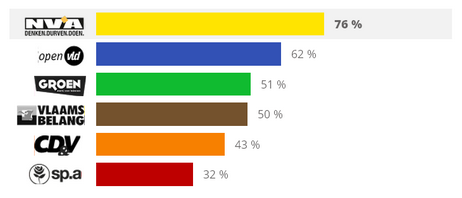
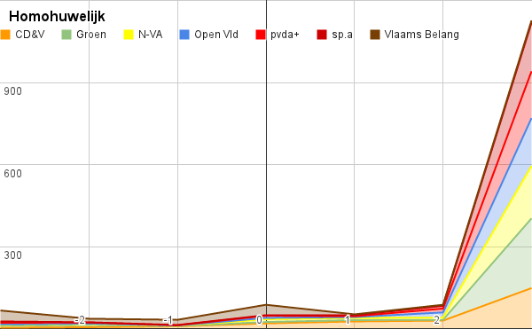
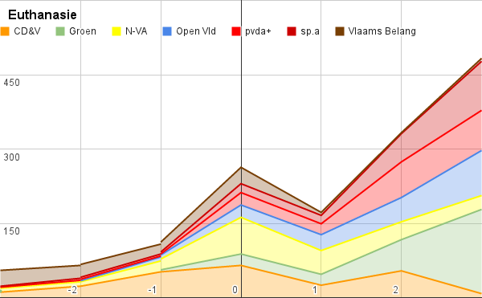
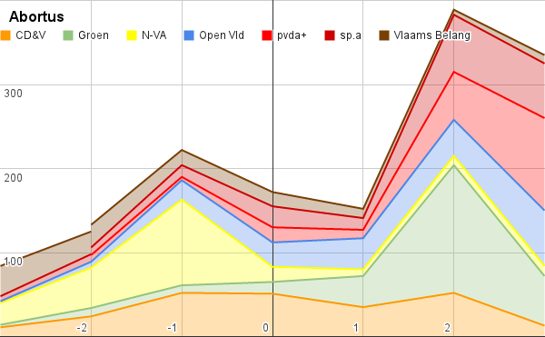
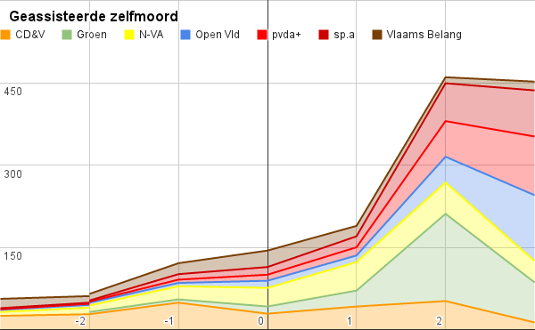
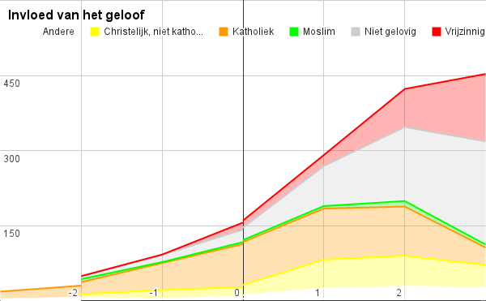

Ben je er al uit hoe je gaat stemmen op 25 mei? Ik heb er toch wat moeite mee gehad. Niet dat ik de illusie koester dat de uitslagen werkelijk een verschil maken, tenzij er fantastische doorbraken komen. Maar goed, misschien is die hoop reden genoeg om de N-VA de kans te geven de vastgeroeste stellingen te doorbreken. De stemtest bevestigt trouwens mijn strategische keuze:

 Resultaat van de stemtest

Alleen spijtig dat er, ook bij de N-VA, exemplaren rondlopen die er niet beter op vinden dan [wisselmeerderheden](http://www.nieuwsblad.be/article/detail.aspx?articleid=DMF20140213_00977609) te leveren in ethisch zeer bedenkelijke dossiers. De tijd dat stemmen op zo'n partij als een doodzonde beschouwd werd is voorbij, maar dat wil niet zeggen dat ik me op mijn gemak zou voelen om dat soort bolletjes rood te gaan kleuren... je weet immers maar nooit ;).

Gelukkig presteren ze bij De Morgen ook af en toe eens iets nuttigs, en onlangs maakten ze resultaten bekend van een enquete waarin de kandidaten op ethische vragen getoetst werden. Het is natuurlijk allemaal nogal simplistisch om hierop voort te gaan, maar vermits ik nu toch al partij heb gekozen, lijkt het me nuttig op basis van die resultaten kopstemmen te bepalen.

Op de website [Stem ethisch!](https://sites.google.com/site/stemethisch/) vind je de resultaten in een grote tabel. De oproep om daarmee aan de slag te gaan sloeg ik niet in de wind, en alvorens mijn eigen stemgedrag te bepalen maakte ik enkele grafiekjes.

Grosso modo komt het hierop neer: wie links op de grafiek staat is 'conservatief' en wie rechts staat is 'progressief'. Afhankelijk van de vraagstelling is dat 'helemaal eens' of 'helemaal oneens' met de stelling.

_"Een huwelijk moet enkel mogelijk zijn tussen een man en een vrouw"_

 Homohuwelijk

Het homohuwelijk mag gerust een 'instituut' genoemd worden. Tegenstanders zijn absoluut marginaal, iedereen is 'helemaal voor'.

_"De overheid moet strengere regels opleggen over euthanasie"_

 Euthanasie

Euthanasie behoort ook tot de verworven rechten van onze staat. Er is nog een zekere tegenstand, maar niet van die aard dat de beweging naar verdere uitbreidingen kan worden gestopt, zoals ook in de vorige legislatuur is gebleken.

_"Een vrouw mag altijd kiezen om de zwangerschap te onderbreken"_

 Abortus

De grafiek over abortus verrast wel. Dat het overwicht aan de 'progressieve' zijde ligt was natuurlijk te verwachten, maar er is een stevige piek van tegenstand, met name bij de N-VA. Op de vraag "Een vrouw mag altijd kiezen om de zwangerschap te onderbreken" geldt bij N-VA een negatief partijbreed standpunt (en bij Groen net omgekeerd, trouwens). Maar gelet op de manier waarop de vraag is gesteld betekent dat natuurlijk niet veel, want die polst enkel met zekerheid naar de optie de wet _uit te breiden_, en zegt niks over de mogelijkheid _ze terug te schroeven_, want wie 'tegen' is, kan evengoed het status quo willen bevestigen. Het echte standpunt van N-VA blijft dus in het ongewisse.

_"Je mag altijd zelf beschikken over je levenseinde"_

 Geassisteerde zelfmoord

Maar dan komt de klap op de vuurpijl. Misschien volg ik de actualiteit niet genoeg, maar ik dacht toch niet dat hulp bij zelfmoord een _hot issue_ was? Of hoe moet je de vraag "Je mag altijd zelf beschikken over je levenseinde" anders interpreteren? Toch blijkt daarvoor een breed draagvlak te bestaan onder onze politici, breder dan voor euthanasie of abortus, en manifest over de partijgrenzen heen!

Toon me alsjeblieft dat de cijfers verkeerd zijn gekopieerd of geinterpreteerd, want hier val ik van omver! Lees de grafiek, en je kan er prat op gaan dat dit het paradepaardje zal worden van de volgende regering, welke coalitie er ook aan komt.

Ik heb nog een grafiek, waarin wordt gekeken naar de verhouding tussen de geloofsovertuiging van onze kandidaten en hun globaal standpunt tegenover de vier ethische themas.

 Invloed van geloof

Je kan dat nu op twee manieren bekijken:

1. de katholieken zijn de sterkhouders van de linkerzijde van de grafiek, zonder hen was de weerstand tegen het ethisch progressisme onbestaande, dus zij zijn de enige rem die ons rest
2. als groep zijn de katholieken het sterkst vertegenwoordigd aan de rechterzijde van de grafiek, dus hun globale gewicht draagt bij tot het versnellen van de ethische 'vernieuwing'

Een typisch katholiek verschijnsel, deze dualiteit? Hoewel de toestand hopeloos is, blijft er altijd een sprankeltje hoop?

Nu even weer wat praktischer: op wie moet ik nu eigenlijk stemmen? De partij is al vastgelegd, dus dan rest enkel de vraag welke kopstemmen ik uitbreng. [Deze tabel](https://docs.google.com/spreadsheets/d/1RqRhHb7xn4Per9o2hGsreaC0MTFGcOTSmQvej4knoL0/pubhtml#) geeft per partij en per stemming de 'koplopers' op ethisch vlak, die in een globaal resultaat aan de linkerzijde van de grafiek zaten (laten we coulant zijn). De webiste [Stem ethisch!](https://sites.google.com/site/stemethisch/) geeft een analoge [evaluatie](https://sites.google.com/site/stemethisch/topkandidaten-per-partij "Topkandidaten per partij").

Voor NV-A in Antwerpen geeft dit:

<table><tbody><tr><td><b>Europese verkiezingen</b></td><td><b>11e Plaats</b></td><td><b>Matthias Storme</b></td></tr><tr><td></td><td><b>9e Plaats</b></td><td><b>Simonne Vanoppen</b></td></tr></tbody></table>

 

<table><tbody><tr><td><b>Federale verkiezingen - Provincie Antwerpen</b></td><td><b>22e Plaats</b></td><td><b>Carine Leys</b></td></tr><tr><td></td><td><b>3e Opvolger</b></td><td><b>Wim Van Der Donckt</b></td></tr><tr><td></td><td><b>9e Opvolger</b></td><td><b>Liesbeth Verstreken</b></td></tr></tbody></table>

 

<table><tbody><tr><td><b>Vlaamse verkiezingen - Provincie Antwerpen</b></td><td><b>16e Opvolger</b></td><td><b>Frank Boogaerts</b></td></tr><tr><td></td><td><b>21e Plaats</b></td><td><b>Melikan Kucam</b></td></tr><tr><td></td><td><b>2e Opvolger</b></td><td><b>Jan Hofkens</b></td></tr><tr><td></td><td><b>4e Opvolger</b></td><td><b>Paul Cordy</b></td></tr></tbody></table>

Veel geluk ermee!
