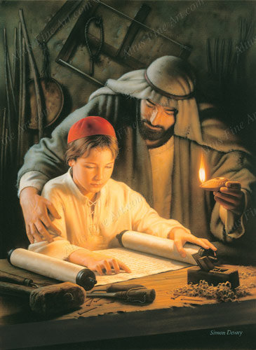

Hoe kreeg Jezus zoveel kennis en wijsheid op zo'n jonge leeftijd? Kreeg Hij die van bij de geboorte ingegoten door de Heilige Geest? Is Hij vanuit zijn goddelijke natuur alwetend? Of moest Hij zoals elk mens kennis met mondjesmaat vergaren en verwerken?

\[caption id="attachment\_920" align="aligncenter" width="365"\] Growing in wisdom, Simon Dewey\[/caption\]

# Growing in wisdom

Onlangs kreeg ik op [Pinterest](http://www.pinterest.com/pin/373517362818357691/) het schilderij _"Growing in wisdom"_ onder ogen, van Simon Dewey. Het is artistiek zeker geen hoogvlieger en behoort eerder tot de melige Saint-Sulpicestijl. Het onderwerp daarentegen is bijzonder origineel. De jonge Jezus, waarschijnlijk rond de leeftijd waarop Hij met zijn ouders ook de tempel in Jeruzalem bezocht, zit te studeren in de Thora, aan de werkbank van zijn wereldlijke vader, sint Jozef, die Hem met een olielampje bijlicht. Ik kan me geen enkele andere afbeelding voor de geest halen die een soortgelijk tafereel weergeeft. De meeste afbeeldingen van Jezus' jonge jaren tonen [Jezus die Jozef helpt](https://www.google.be/search?espv=2&biw=1236&bih=707&tbm=isch&sa=1&q=jesus+carpenter+shop&oq=jesus+carpenter+shop&gs_l=img.3...3657.7158.0.7576.18.16.2.0.0.0.115.897.14j2.16.0....0...1c.1.46.img..5.13.573.OTCFHhUm1oU) bij het schrijnwerken.

In de heilige Schrift staat heel weinig opgetekend over Jezus' jeugd. Enkel Lucas beschrijft in twee verzen hoe Jezus' jeugd verliep: _"Hij ging met hen \[Jozef en Maria\] mee naar Nazaret, en schikte zich naar hen. Zijn moeder bewaarde alles in haar hart. Jezus werd een wijs en volwassen man, die steeds meer in de gunst kwam bij God en de mensen."_

We weten dat Jezus eigenlijk een heel gewone jeugd had, want dat getuigen de joden van Nazareth, die niet snappen hoe zo'n gewone jongen zich plots durft openbaren als 'uit de hemel neergedaald' (Joh 6:42: _"‘Dit is toch Jezus, de zoon van Jozef?’ zeiden ze. ‘En zijn vader en moeder zijn hier toch bekend? Hoe kan Hij dan beweren: “Ik ben uit de hemel neergedaald”"_). We weten ook dat Jezus heel goed bekend was met de joodse schriftteksten, zelfs op jonge leeftijd, zoals blijkt wanner Hij zich als twaalfjarige in de tempel bij de schriftgeleerden ophoudt (Lc 2:47: _"Allen die Hem hoorden, stonden versteld van zijn inzicht en zijn antwoorden."_) Dus is de vraag: hoe komt een gewone jongen aan zoveel kennis van de Schrift?

# Groeien in wijsheid

Hoe vergaren _wij_  kennis? Door studie en aandacht voor wat er om ons heen gebeurt. En hoe laten wij ons geloof groeien? Door gebed en door overweging hoe de Bijbel en de Traditie spreken over het mysterie van het leven.

Waarom zou dat voor Jezus anders zijn? Ook Jezus was eens een kind, dat heeft leren spreken en lezen en schrijven... en bidden. Het schilderij toont hoe Jezus door studie opgroeit tot de dertigjarige die we kennen uit de evangeliën: Jezus studeert, tot in de nacht, en zijn (wereldlijke) vader staat Hem daarin bij. Gewone tieners hebben nog een schop onder hun broek nodig eer ze achter hun boeken kruipen, maar daarvoor zorgt Jezus' hemelse Vader; Hij wordt immers volledig gedreven door de Geest.

Jezus is zich ongetwijfeld bewust van zijn bijzondere relatie met God, maar dat wil nog niet zeggen dat Hij geestelijk als mens het volledige bewustzijn van God deelt. Voor zover Hij al deelgenoot is van Gods bewustzijn, moet Hij dat bewustzijn zelf voeden door studie en gebed.  De Heilige Geest bevestigt bij Jezus' doop slechts wat zich eigenlijk al voltrokken heeft: de zoon van God heeft zich met wijsheid gevoed en verkrijgt de autoriteit om Gods wil te verkondigen ("Luister naar Hem!").

# Denken en leren op menselijke wijze

\[caption id="attachment\_924" align="alignleft" width="120"\] Paus Benedictus XVI\[/caption\]

Paus Benedictus XVI raakt in de proloog van zijn Jezustrilogie ook heel even Jezus' "groeien in wijsheid" aan, helemaal aan het einde van het boek: _"Johannes zegt dat Jezus de enige is die rust aan het hart van de Vader en Hem heeft doen kennen (Joh. 1:18). Dat precies wordt duidelijk in het antwoord van de twaalfjarige: Hij is bij de Vader, Hij ziet de dingen en de mensen in Gods licht. Anderzijds is het ook waar dat zijn wijsheid_ toeneemt_. Als mens leeft Hij niet in de abstracte alwetendheid, maar is Hij geworteld in een concrete  geschiedenis, in plaats en tijd, in menselijke levensfasen, en daaraan ontleent Hij wat Hij concreet weet. Hier blijkt duidelijk dat Hij op menselijke wijze heeft gedacht en geleerd."_

# Kinderen van God

Waar ik nu toe wil komen is het volgende: als Jezus, die tenslotte Zoon van God is, zo hard moet studeren om zijn geloof vorm te geven, vanuit de joodse traditie waarin Hij geboren is, moeten wij dan niet minstens dezelfde ijver aan boord leggen om ons geloof te verdiepen vanuit de bronnen die ons gegeven zijn?

Of gaan wij ervan uit dat het voor ons, eenentwintigste-eeuwse stervelingen, gemakkelijker is om tot geestelijke volwassenheid te komen dan voor de Verlosser zelf, die de meest persoonlijke relatie met God heeft? Verwachten wij dat de geestelijke fundamenten van het geloof zomaar uit de hemel over ons zullen neerdalen? Dat de Heilige Geest alle kennis die noodzakelijk is voor de verdieping van ons geloof, in onze geest zal komen inplanten, zonder dat we daarvoor enige moeite moeten doen?

# Schoolkinderen

Schoolkinderen leggen deze dagen hun laatste examens af. Leerlingen die niet menen te moeten studeren en verwachten dat een of andere _deus ex machina_ hen wel zal helpen op het examen, komen er bekaaid vanaf. Dat vinden we maar normaal, want op school krijgen onze kinderen kennis en vaardigheden waar ze in het leven wat mee zijn. Maar waar krijgen onze kinderen kennis en vaardigheden waarmee ze in het _eeuwige_ leven wat zijn?

# De Heilige Geest

\[caption id="attachment\_931" align="alignleft" width="300"\] Let him ask of God, Jon McNaughton\[/caption\]

Kennis _alleen_ is niet zaligmakend. We hebben de Geest nodig, en mogen we op Hem vertrouwen, om ons te helpen doorzetten, om ons inzicht te geven in de betekenis van onze kennis, om ons het onderscheid te helpen zien tussen waarheid en leugen, om ons de moed te geven ook een eigen mening te vormen en ze te verdedigen. De Geest is onze helper in al die zaken, wanneer we tot Hem bidden, maar als we zelf geen enkele moeite doen om bronnen van geloof te openen, om kennis te vergaren en om dat allemaal een plaats te geven in ons geloofsleven, dan staat de Geest machteloos.

Laat ons het voorbeeld van Jezus volgen, en de bronnen van ons geloof bestuderen en bidden dat ze ons geloof vorm mogen geven.
