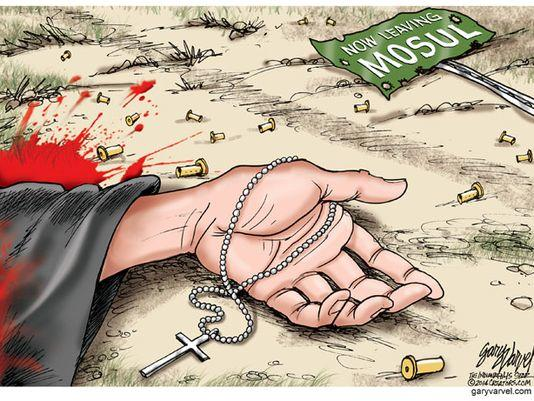

Persoonlijk volg ik de gebeurtenissen in Syrie, Irak en de Gazastrook niet in detail. Het zijn conflicten die al jarenlang aanslepen, en dat ongetwijfeld nog jarenlang zullen blijven. De kinderen zaten deze week toevallig te lezen in het Mini-mierennest van Suske en Wiske, waarin de Israelische kwestie gepersifleerd wordt… een strip van 1967 nog steeds brandend actueel. Dat ontneemt mij de illusie dat de moeite die ik erin zou steken om deze actualiteit op de voet te volgen nuttig kan zijn.

\[caption id="attachment\_971" align="aligncenter" width="525"\] uit "Het mini-mierennest" (Willy Vandersteen)\[/caption\]

Niettemin lijkt er toch één factor te zijn die vandaag meer en meer de hoofdrol krijgt: godsdienst. De oorsprong van de joodse staat is niet zozeer religieus, maar veeleer etnisch en nationalistisch. De Israelische kwestie is er een van grond, niet van geloof. Maar de jongste decennia is in de politiek, zowel in Israel als in de buurlanden, religie een factor van belang geworden.

Dat maakt het voor het Westen een pak moeilijker om in te grijpen. In een territoriale kwestie kan je op basis van tamelijk objectieve criteria een positie kiezen of onderhandelen en het risico dat het conflict wordt 'geïmporteerd' is klein. Net omgekeerd als het om godsdienst gaat! In het Westen is godsdienst geen politieke factor van belang dus een basis om te onderhandelen of positie te kiezen is er niet. Onze politici zouden niet liever willen dan de factor godsdienst te kunnen negeren, maar dat is net zo dom als in een territoriaal conflict te doen alsof grenzen irrelevant zijn. En daarbij komt dan nog de angst dat inmenging een binnenlandse terugslag krijgt, in onze steden waar dezelfde religies sterk vertegenwoordigd zijn.

Dus evenmin als ikzelf behoefte voel om het conflict te analyseren, lijkt de politiek geneigd om zich erg met de zaken in te laten. Als buitenlandminister neemt Didier Reynders in het religieuze conflict zelf geen positie in, maar [doet beroep op de religieuze gemeenschappen](http://www.standaard.be/cnt/dmf20140731_01198841) om vanuit België een veroordeling te laten weerklinken, onder het motto: die het schoentje past, hij trekke het aan. Zelfs de paus, herder van de vervolgde gemeenschap, [blijft voorzichtig op de vlakte](http://www.news.va/en/news/pope-calls-for-dialogue-in-iraq). Is dan de enige troost voor vervolgde christenen de belofte die Christus in de [bergrede](http://www.willibrordbijbel.nl/index.php?p=page&i=64073,64088) jegens hen uitsprak?

\[caption id="attachment\_973" align="aligncenter" width="525"\] Now leaving Mosul (Gary Varvel, @varvel)\[/caption\]

Het enige verschil dat we kunnen maken, is oog te hebben voor de voornaamste slachtoffers: de burgers. Maar ook daar wordt het een beetje moeilijk het juiste evenwicht te zoeken in de verdeling van de aandacht. Bloggers Anton de Wit en Mark van de Voorde winden zich terecht op omdat de systematisch vervolging van christenen in de conflictgebieden een blinde vlek lijkt in het oog van het Westen. Frankrijk neemt gelukkig de voorhoede door [asiel aan te bieden voor gevluchte christenen](http://www.redstate.com/2014/07/30/france-offers-asylum-iraqi-christians-obama-turns-back/).

Toch moeten zoals vaak u en ik het verschil maken, en dat kan concreet op verscheidene manieren:

- **Gebed.** Bid voor vervolgde christenen en voor vrede in hun landen. Op woensdag 6 augustus, feest van de Gedaanteverandering van de Heer, is er een internationale gebedsdag voor vrede in Irak.
- **Solidair.** Toon je [solidariteit met vervolgde christenen in Irak](http://www.kerkinnood.be/) door je [sociaal profiel](https://twitter.com/hashtag/%D9%86?src=hash) te voorzien van een '**ﻥ**' (de arabische letter waarmee huizen van christenen getagd worden)
- **Stem.** Teken een [petitie](http://www.citizengo.org/en/9810-save-iraqi-christian-community?m=5&tcid=5769237) om in de internationale politiek aandacht op te eisen voor de systematische christenvervolgingen.
- **Steun.** Doneer aan een organisatie die vluchtelingen helpt of sociale of pastorale projecten in de regio steunt. ([Caritas](http://www.caritas.org/where-we-are/middle-east-north-africa/iraq/) - [Catholic Near East Welfare Association](http://www.cnewa.org/donations.aspx?ID=1526&sitecode=HQ&pageno=1) - Christian Aid - [Help Iraq](http://www.helpiraq.org/ "Help Iraq") - [Kerk in Nood](http://www.kerkinnood.nl/index.php?option=com_content&view=article&id=4082:noodhulp-voor-christenen-uit-mosoel-irak&catid=37:midden-oosten&Itemid=57) - [Rescue Christians](http://rescuechristians.org/))

> _Toen Jesus de menigte zag, besteeg Hij de berg; en nadat Hij Zich had neergezet, naderden zijn leerlingen tot Hem.  En Hij opende de mond, om hen te onderrichten, en sprak:  Zalig de armen van geest; want hun behoort het rijk der hemelen.  Zalig de zachtmoedigen; want ze zullen het Land bezitten.  Zalig, die wenen; want ze zullen worden getroost.  Zalig, die hongeren en dorsten naar de gerechtigheid; want ze zullen worden verzadigd.  Zalig de barmhartigen; want ze zullen barmhartigheid ondervinden.  Zalig de zuiveren van hart; want ze zullen God zien.  Zalig de vreedzamen; want ze zullen kinderen Gods worden genoemd._  **_Zalig, die vervolging lijden om de gerechtigheid_**_; want hun behoort het rijk der hemelen._ (Mattheus 5:1-10, [Canisiusvertaling](http://defensiofidei.wordpress.com/apologetiek-apologetica-welkom-bij-defensio-fidei/download-de-petrus-canisiusbijbel/))
