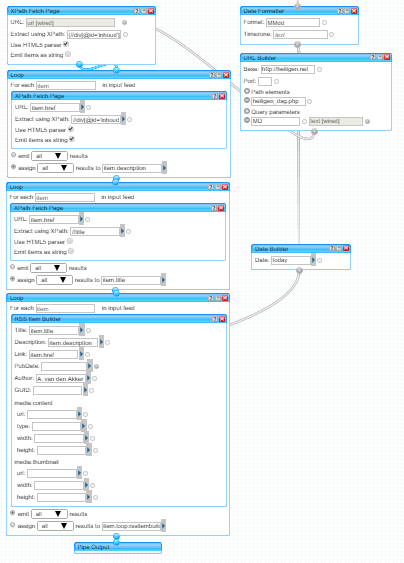
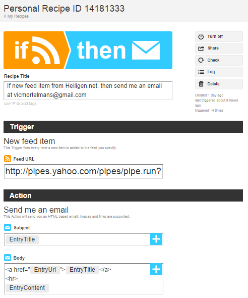

Sta me toe even de technische toer op te gaan. Het gaat over de informatiestroom op internet. Het web is gebaseerd op een _pull_\-model. Dat wil zeggen dat je als gebruiker van het web pas nieuwe informatie krijgt, als je een website gaat bezoeken. Een blogger mag nog zo'n overvloed aan informatie _online_ zetten, zijn informatie zal jou niet bereiken als je niet zelf zijn website gaat bezoeken.

Dat maakt het nogal lastig, want wie gaat nu dagelijks al zijn tientallen favoriete websites bezoeken om te kijken of er nieuwe artikels verschenen zijn? De oplossing is een _push_\-model te gebruiken. Je krijgt dan updates toegestuurd van je favoriete sites, via email of RSS. Wat vaak ook handig is om de updates offline bij de hand te hebben.

Ik vind het altijd erg jammer als ik op een website kom die ik interessant vind, en die geen emaillijst heeft om je op in te schrijven en ook geen RSS-link aanbiedt. Moet ik dan echt elke dag, week of maand onthouden dat ik op die site ga kijken of er nog wat nieuws is?

Neem nu bijvoorbeeld de websites [heiligen.net](http://heiligen.net/) en [beeldmeditaties.nl](http://beeldmeditaties.nl/). Twee sites boordevol informatie, gelinkt aan een kalender. Het zou perfect zijn moest je je kunnen aanmelden om dagelijks per mail de relevante artikelen doorgestuurd te krijgen… quod non!

Ik ga nu beknopt uitleggen hoe je daar een mouw aan kan passen, met gebruik van enkele gratis tools die de informatiestroom op internet kunnen omzetten van een _pull_\-model naar een _push-_model.

De eerste stap is het opzetten van een Yahoo Pipe. Let op: hoewel het op het eerste zicht gemakkelijk zal lijken, is een stevige voorkennis vereist van de structuur van een RSS-bestand, want dat is het concept waarrond Yahoo Pipes is opgebouwd. Wat doet nu zo'n Pipe? Je kan haar bijvoorbeeld programmeren om op een website bepaalde informatie op te halen, en die om te zetten naar een RSS-bestand. Ik heb hier bijvoorbeeld zo'n Pipe die op heiligen.net gaat kijken naar de pagina met de heiligen van vandaag, vervolgens de inhoud van de pagina's met de heiligenlevens overneemt, en dit omzet naar een RSS-bestand. En daar één voor beeldmeditaties.nl. Pipes programmeer je niet met code, maar met grafische instructieblokken die je aan mekaar hangt om stap voor stap de informatie te verwerken.

 Yahoo Pipes

Een RSS-bestand kan je toevoegen aan je nieuwslezer om elke dag de heiligenlevens op een schoteltje te krijgen!

Wat als je geen nieuwslezer gebruikt en de artikels liever per mail krijgt? Je kan [IFTTT](https://ifttt.com) gebruiken. "IFTTT" staat voor "if this then that". In IFTTT kan je inputs aan outputs koppelen. Zo'n input is bijvoorbeeld bovenstaand RSS-bestand, en als output kan je er je email aan koppelen. IFTTT gaat regelmatig naar de input kijken, en zodra er nieuwe informatie is zet hij die op email. De gebruikersomgeving van IFTTT straalt eenvoud uit, met grote visuele blokken en minimale tekst:

 IFTTT

Je zou nog een stap verder kunnen gaan en met [MailChimp](http://mailchimp.com/) een heuse mailing opzetten, ook weer gekoppeld aan hetzelfde RSS-bestand. Dan kan iedereen zich aanmelden om dezelfde emails te ontvangen.

Als slotsom krijg je, zonder één lijn programmacode en zonder één cent extra uit te geven aan serverinfrastructuur, een volledige implementatie van het internet _push_\-model via email en RSS, op basis van een relatief eenvoudige, statische website.

Deze technieken zijn niet weggelegd voor de volslagen leek. Toch tonen ze aan dat internet lang geen statische databank meer is. Niet alleen informatie wordt vrijelijk uitgewisseld, ook de services om die informatiestromen te stroomlijnen worden (binnen bepaalde limieten) vrij aangeboden! Iedereen kan daarop inpikken en zijn steentje bijdragen om het internet gebruiksvriendelijker te maken.
