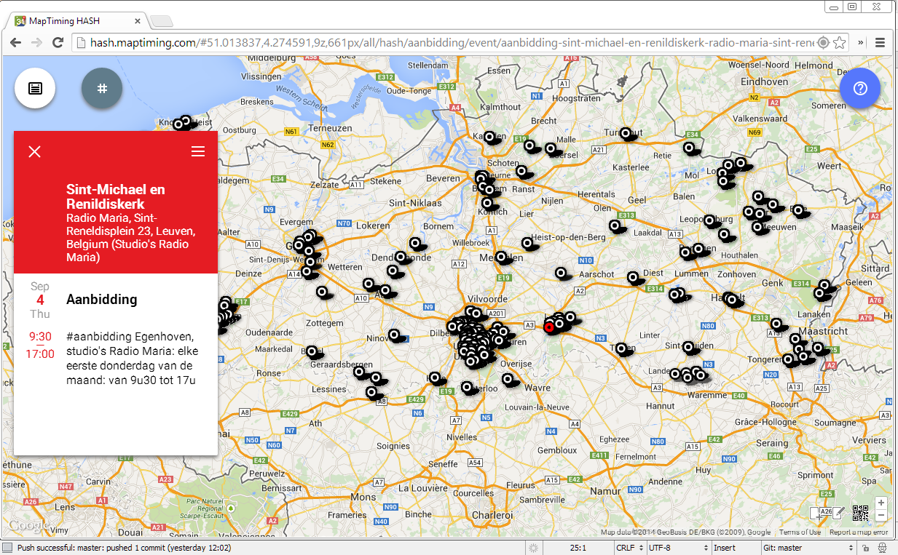

Eucharistische aanbidding is een gebeurtenis die zich in alle stilte voltrekt. Misschien daarom wordt er ook weinig ruchtbaarheid aan gegeven. Weet jij of bij jou in de buurt regelmatig een aanbiddingsuur wordt georganiseerd?

Toch is eucharistische aanbidding een essentiële manifestatie van het katholieke geloof. Ik citeer prof. H. de Dijn (1): _Als sinds voor het Tweede Vaticaans Concilie is ook bij sommige katholieken een tendens aanwezig tot "uitzuivering" en "verinnerlijking" van het geloof. Dit leidde soms zelfs tot nieuwe vormen van beeldenstormerij en tot de afwijzing van eeuwenoude vormen van vroomheid. Zoals uit haar houding, ook tegenover volksvroomheid blijkt, heeft de Roomse Kerk niet aan deze modernistische tendensen toegegeven. Op allerlei fundamentele punten heeft zij voet bij stuk gehouden: de goddelijkheid van Christus; het Middelares zijn van Maria; de heiligenverering; de aanvaarbaarheid ook van sacramentalia. Een sterk voorbeeld is de verering van het heilig Sacrament (en de viering van Sacramentsdag), voor een "puriteinse" mentaliteit onaanvaardbaar. De geconsacreerde hostie is niet gewoon een teken dat momentaan verwijst naar Christus, maar stelt Christus werkelijk aanwezig in het symbool van ht Brood, ook buiten het gebeuren van de Eucharistie. Wat ook de subtiliteiten mogen zijn van de theologische uitleg, dat is wat katholieke gelovigen aanvaarden._

In een kerk waar de goddelijkheid van de liturgie dreigt te verdrinken in een woordenbrij, is de stille aanbidding een unieke vrijplaats!

Bestaat dat dan nog, zo'n aanbidding? Ik was me er tot voor kort ook niet van bewust, maar blijkbaar zijn er in Vlaanderen nog heel wat plaatsen waar op vaste regelmaat, dagelijks, wekelijks of maandelijks, een aanbiddingsuur wordt georganiseerd. Dat kwam ik te weten toen ik de "[Aanbiddingswebsite](http://bloggen.be/aanbiddingswebsite/ "Aanbiddingswebsite")" bezocht. Het vele werk dat de auteur, mevrouw Ann Vlassenbroeck, besteedt aan het verzamelen van de informatie, wordt nu nog meer recht gedaan door de gegevens uit te zetten op de kaart, zodat het nog gemakkelijker wordt om na te gaan waar en wanneer in jouw buurt aanbidding gebeurt.

De website [MapTiming](http://www.maptiming.com/ "MapTiming") geeft de mogelijkheid om eender welke evenementen in te geven en door in de beschrijving een 'hashtag' te  zetten kan je nadien een kaart tonen waarop enkel de evenementen met een specifieke tag zichtbaar zijn. Voor de aanbiddingsuren is de tag "#aanbidding" en de kaart kan je hier tonen:

Gans Vlaanderen:

[http://adoremus.maptiming.com/#50.994825,4.303430,9z,707px/all](http://adoremus.maptiming.com/#50.994825,4.303430,9z,707px/all)

Bij jou in de buurt, in de loop van deze week (werkt alleen als je browser je locatie kent):

[http://adoremus.maptiming.com/#all](http://adoremus.maptiming.com/#all)

Ken je een aanbiddingsuur dat nog niet op de kaart staat, kan dat via dit formulier worden toegevoegd:

[http://adoremus.maptiming.com/new](http://adoremus.maptiming.com/new "Add event")

Je kan ook evenementen toevoegen en zelfs wijzigen, door gebruik te maken van de twee ikoontjes die rechts onderaan het scherm verschijnen.

\[caption id="attachment\_1040" align="aligncenter" width="660"\] Aanbidding in Vlaanderen\[/caption\]

(1) Communio, 2013 nr. 2 "Rituelen: cultuurfilosofisch bekeken"
